## Introduction to the CartoDB interface

This page can always be found at: http://bit.ly/cdb-harvard

* Tour of dashboard
* Common data
* Uploading data
* Tour of table and map view
* Publishing maps
* Public profile

## Creating your accounts

Set you up with accounts here, [https://cartodb.com/signup?plan=academy](https://cartodb.com/signup?plan=academy). This will give you a free upgrade to our **student** plan, since today, we are all students :)

## Your first map in 30 seconds!

Today we are going to make a map of a very exciting topic! The other day I stumbled upon a really fun dataset of this guy,

#### Spencer the cat!


I found this data in [Movebank](https://www.movebank.org/node/6892). The first thing we are going to do is import this dataset into our accounts.

[Download Spencer the Cat](https://dl.dropboxusercontent.com/u/1307405/CartoDB/spencer_the_cat.geojson)

_alternative_:

Cut&paste the url:

https://dl.dropboxusercontent.com/u/1307405/CartoDB/spencer_the_cat.geojson


Now, let's use Spencer to take a look at a few things.

* Table and map view
* Thematic maps!
* Custom styling data

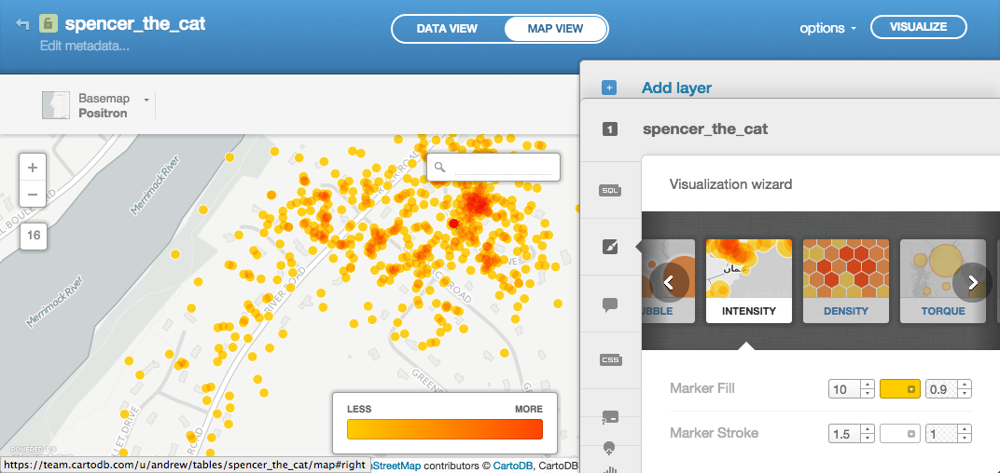

## Introduction to CartoCSS


#spencer_the_cat{
  marker-fill: transparent;
  marker-width:24;
  marker-line-color: #FFFFFF;
  marker-line-width: 2.0;
  marker-line-opacity: 1.5;
  marker-fill-opacity: 0.9;
  marker-comp-op: src;
  marker-type: ellipse;
  marker-placement: point;
  marker-allow-overlap: true;
  marker-clip: false;
}


## Introduction to SQL


SELECT cartodb_id, the_geom, the_geom_webmercator FROM spencer_the_cat



SELECT 'hi' as hello FROM spencer_the_cat



SELECT *, date_part('dow',study_local_timestamp) as d
FROM spencer_the_cat


_dow_ here means 'day of week'. 0-6 Sunday is 0

#### Let's see what Spencer does on Mondays


SELECT *, date_part('dow',study_local_timestamp) as d
FROM spencer_the_cat
WHERE date_part('dow',study_local_timestamp) = 1



SELECT ST_MakeLine(the_geom_webmercator) as the_geom_webmercator
FROM spencer_the_cat



SELECT ST_MakeLine(the_geom_webmercator) as the_geom_webmercator FROM spencer_the_cat
WHERE date_part('dow',study_local_timestamp) = 1


Or! Let's get all days and then use colors to distinguish them


SELECT
  ST_MakeLine(the_geom_webmercator) as the_geom_webmercator,
  date_part('dow',study_local_timestamp) as d
FROM spencer_the_cat
GROUP BY date_part('dow',study_local_timestamp)


#### Writing data


UPDATE spencer_the_cat SET hod = date_part('hour',study_local_timestamp)


## Torque!

#### A quick look at Torque

**Point torque**

[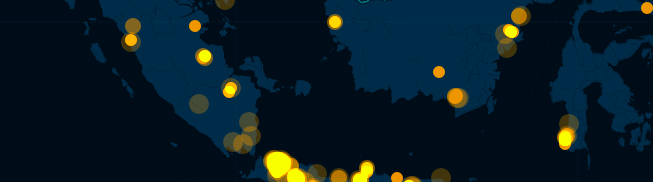](https://team.cartodb.com/u/andrew/viz/cf1cc3e6-3242-11e4-8036-0e230854a1cb/public_map)

**Categorical torque**

[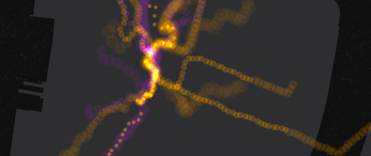](https://team.cartodb.com/u/andrew/viz/508a7508-11e2-11e4-9973-0e73339ffa50/public_map)

**Temporal bubbles**

[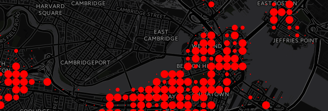](https://team.cartodb.com/u/andrew/viz/32ff4f28-7e51-11e4-9555-0e853d047bba/public_map)

**Cumulative bubbles**

[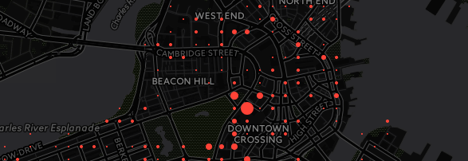](http://team.cartodb.com/u/andrew/viz/a0a551a0-9b41-11e4-856f-0e853d047bba/embed_map)

[Method for creating the last two](http://gis.stackexchange.com/questions/129838/show-change-in-size-over-time/130114#130114)


#### Now our own Torque

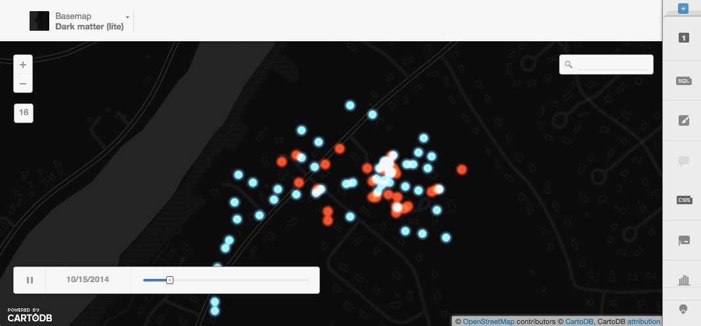

# Guessing Spencer's house

First, let's take a look at one of my favorite datasets from MassGIS, the [Building Structures dataset](http://www.mass.gov/anf/research-and-tech/it-serv-and-support/application-serv/office-of-geographic-information-massgis/datalayers/ftpstructures.html). We can all download Cambridge and upload the file to our accounts.

Let's rename the file, ```cambridge_buildings```

We can do some different things with polygons, let's take a look.

#### More dynamic SQL

**CDB_LatLng**


SELECT
  *, ST_Distance(the_geom, CDB_LatLng(42.374444, -71.116944)) d
FROM cambridge_buildings


**a map from dynamic sql**

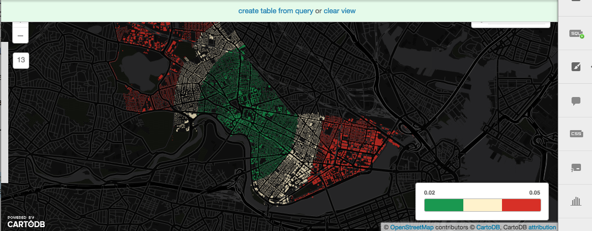

**Order by distance**


SELECT * FROM cambridge_buildings
ORDER BY the_geom <-> CDB_LatLng(42.374444, -71.116944) LIMIT 65


#### A quick side journey into the SQL API

If you are building an application, you can actually do the same request over your API and get CSV, JSON, or GeoJSON results. Lets' look at the default JSON,


http://{username}.cartodb.com/api/v2/sql?q={SQL STATEMENT}


For example,


http://andrew.cartodb.com/api/v2/sql?q=SELECT * FROM cambridge_buildings ORDER BY the_geom <-> CDB_LatLng(42.374444, -71.116944) LIMIT 10


It's awesome. You can do it from JavaScript and it doesn't even need to be about maps. Take a look at this [column search built off a CartoDB table with placenames](http://bl.ocks.org/javisantana/7932459).

## On to Spencer

We'll upload a second dataset now. This time, building footprints from [MassGIS](http://www.mass.gov/anf/research-and-tech/it-serv-and-support/application-serv/office-of-geographic-information-massgis/datalayers/ftpstructures.html) website. Let's download Andover, ```https://gist.github.com/andrewxhill/7c1efd9bdead734010b0```. Now import it into your account.

## Create a two layer visualization

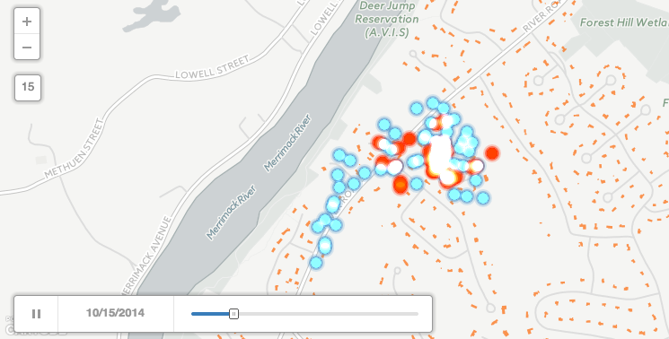

## Delete unneeded buildings


DELETE FROM structures_poly_9
WHERE NOT
  (SELECT ST_Extent(the_geom) FROM spencer_the_cat) && the_geom

## Count spencer visits

Add a new column called ```spencer_n``` of type ```numeric``` in our ```structures_poly_9``` table.

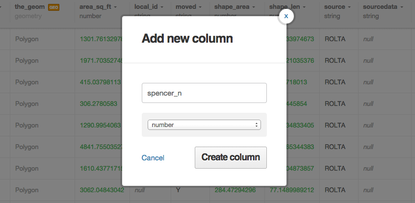

#### Spatial analysis of Spencer :)

Let's count how many times spencer was likely inside each house,


UPDATE structures_poly_9
SET spencer_n =
  (SELECT count(*)
   FROM spencer_the_cat
  WHERE ST_Intersects(the_geom, structures_poly_9.the_geom))


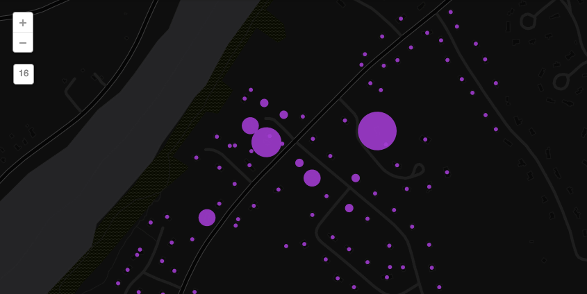

#### Let's look at house 'touches'


SELECT
  cartodb_id,
  ST_MakeLine(
    the_geom_webmercator,
    ST_Centroid((
      SELECT the_geom_webmercator FROM structures_poly_9
      ORDER BY the_geom<->spencer_the_cat.the_geom
      LIMIT 1))
  ) AS the_geom_webmercator,
  hod
FROM
  spencer_the_cat



# CartoDB.js

Let's all start with the same template, you can download an index.html file here,

[index.html](https://gist.github.com/andrewxhill/ae73aa593d9a258f785a/download)

### The simplest CartoDB.js map - createVis

A map in [one line of JavaScript](http://docs.cartodb.com/cartodb-platform/cartodb-js.html#create-a-visualization-from-scratch)


cartodb.createVis('map','http://team.cartodb.com/api/v2/viz/f6b0e824-a2fe-11e4-8f13-0e018d66dc29/viz.json');


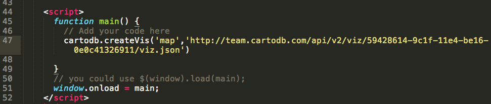

Now, add your own vis.json URL.

### Using an existing Leaflet map

We often want to make layers for maps in CartoDB and add them to our existing maps or projects. In this example, let's create a webpage with a blank leaflet map. We'll use one of the free to use [CartoDB Basemaps](http://cartodb.com/basemaps) for this.

First, make sure you delete the line we added above and create a leaflet map object,


var map = new L.Map('map', {
    zoomControl: false,
    center: [42.67, -71.23],
    zoom: 15
});



Next, add a CartoDB Basemap


var layer = L.tileLayer('http://{s}.basemaps.cartocdn.com/dark_nolabels/{z}/{x}/{y}.png', {
        attribution: '&copy; <a href="http://www.openstreetmap.org/copyright">OpenStreetMap</a> contributors, &copy; <a href="http://cartodb.com/attributions">CartoDB</a>'
    }).addTo(map);


Let's save the file and refresh.

Using the [createLayer](http://docs.cartodb.com/cartodb-platform/cartodb-js.html#adding-cartodb-layers-to-an-existing-map) method, we can now add our map of Spencer. Let's start with just a simple point map of Spencer.


cartodb.createLayer(map, '{your-vis-json-url-here}')
    .done(function(layer) {
        // Do further things here
    })
    .addTo(map);


##### Add interactivity

You can add interactivity in the Editor very easily, but for maps you are creating on the fly in CartoDB.js, you can also add custom interactivity.


var lots = layer.getSubLayer(0);
lots.setInteractivity('cartodb_id, hod');
lots.setInteraction(true);


##### Add custom interaction

You can use cursor events on your polygons (e.g. featureClick, featureOver, featureOut) to create your own actions on your webpage. Let's log the Elevation value for any lot we hover over


lots.on('featureOver', function(e, pos, pixel, data) {
console.log("Hour: " + data.hod);
});



### Integrating interfaces

Using that button, **Do Something**, we can let the user interact with the data on the map in ways that no other service on the web can do it! Let's start with the basics...

#### Create button to set filter

Here, let's create a button so that when a user clicks it, we filter to just Spencer's activities in the evening.


var spencer = layer.getSubLayer(0);
$('#btn li').click(function(){
    var new_sql = "SELECT * FROM spencer_the_cat WHERE hod > 18";
    spencer.setSQL(new_sql);
});


#### Change the button to modify the style

Just like changing the SQL on the fly, we can change the entire style of our map:


var spencer = layer.getSubLayer(0);
$('#btn li').click(function(){
    var new_cartocss = "#spencer_the_cat{marker-fill-opacity: 0.8; marker-line-width: 0; marker-width: 10; marker-fill: #F2D2D3; marker-allow-overlap:true; [hod > 18]{marker-fill: #3232FF;}}";
    spencer.setCartoCSS(new_cartocss);
});


#### Style and SQL at the same time


var spencer = layer.getSubLayer(0);
$('#btn li').click(function(){
    var new_sql = "SELECT * FROM spencer_the_cat WHERE hod > 18";
    var new_cartocss = "#spencer_the_cat{marker-fill-opacity: 0.8; marker-line-width: 0; marker-width: 10; marker-fill: #F2D2D3; marker-allow-overlap:true; [hod > 18]{marker-fill: #3232FF;}}";
    spencer.set({sql: new_sql, cartocss: new_cartocss});
});


#### Add an Undo button

Of course, it would be handy if we let our users return to the default map after they click the button. Let's make that happen.


var spencer = layer.getSubLayer(0);
var state = 0;
$('#btn li').click(function(){
    if (state == 0) {
        state = 1;
        $("#first").text('undo');
        var new_sql = "SELECT * FROM spencer_the_cat WHERE hod > 18";
        var new_cartocss = "#spencer_the_cat{marker-fill-opacity: 0.8; marker-line-width: 0; marker-width: 10; marker-fill: #F2D2D3; marker-allow-overlap:true; [hod > 18]{marker-fill: #3232FF;}}";
        spencer.set({sql: new_sql, cartocss: new_cartocss});
    } else {
        state = 0;
        $("#first").text('Do Something');
        var new_sql = "SELECT * FROM spencer_the_cat";
        var new_cartocss = "#spencer_the_cat{marker-fill-opacity:0.8;marker-line-color:#FFF;marker-line-width:0;marker-line-opacity:1;marker-width:10;marker-fill:#C1373C;marker-allow-overlap:true;}";
        spencer.set({sql: new_sql, cartocss: new_cartocss});
    }
});



