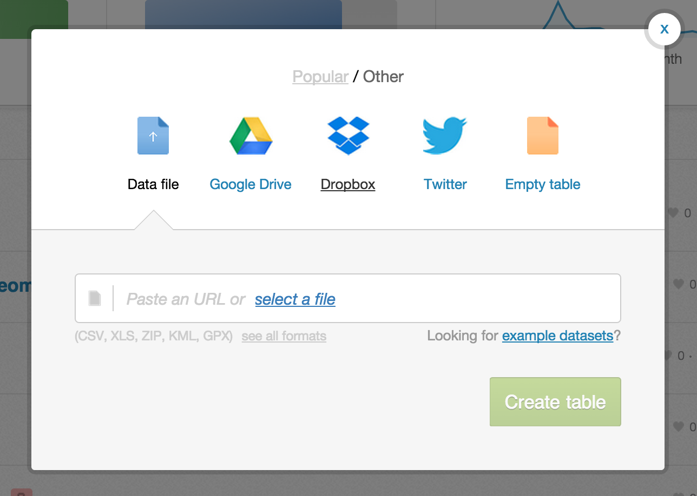
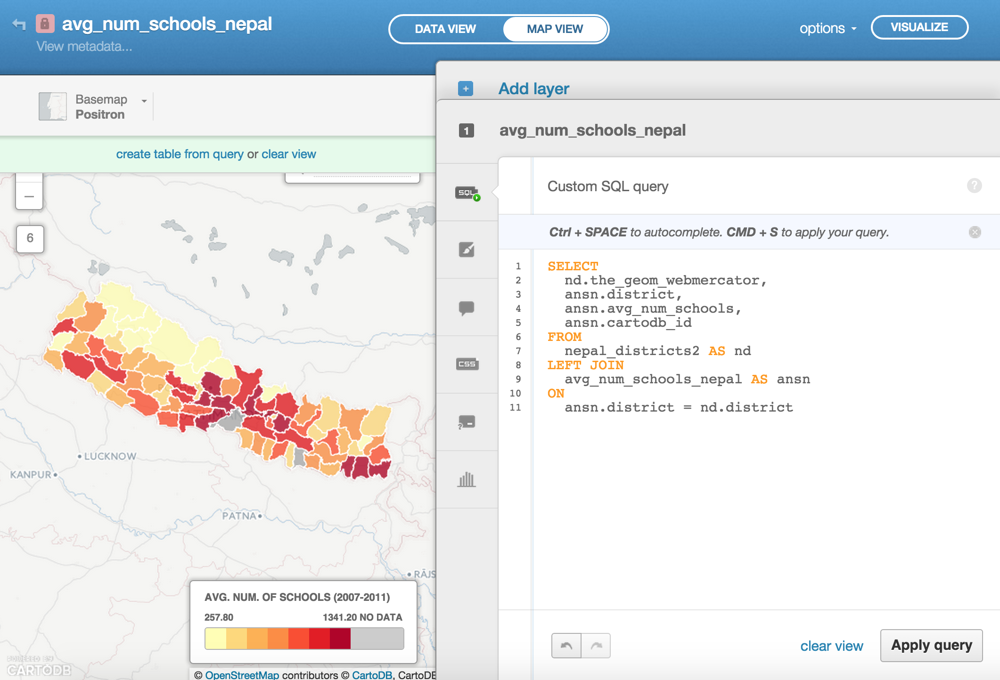
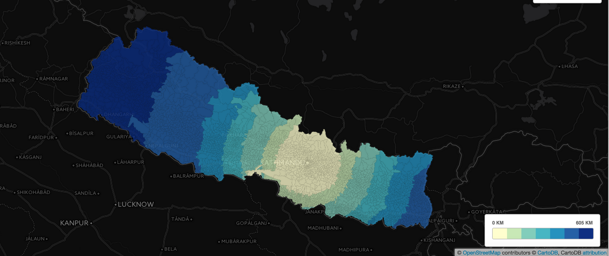
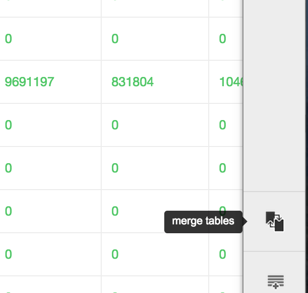
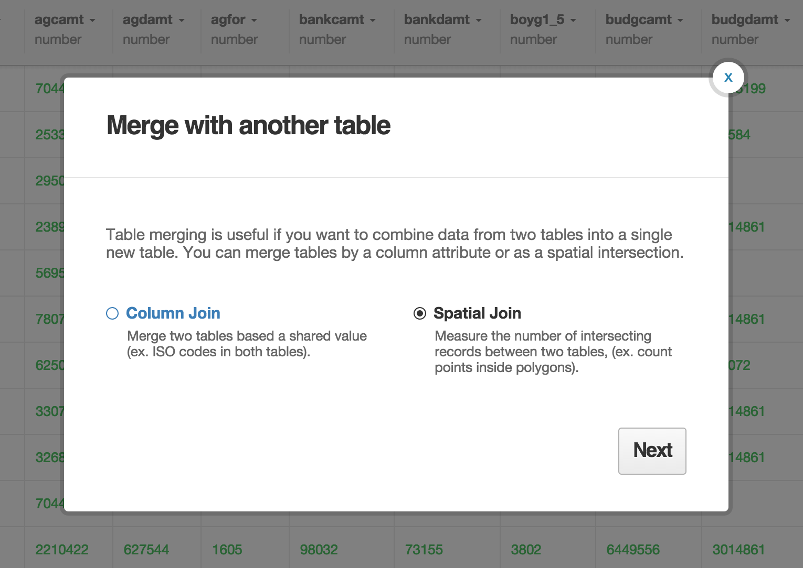
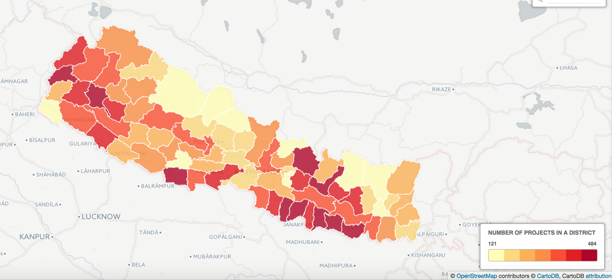

# Spatial Data Analysis with Policy Data

Andy Eschbacher, Map Scientist, [CartoDB](http://cartodb.com)

Workshop, February 3rd, 2015, School of International and Policy Affairs, Columbia University

Find this document here: http://bit.ly/cdb-sipa
([Source code](https://gist.github.com/ohasselblad/6dc39b229c383f6e8c1c))

## Data Import

To make sure we're all on the same page, let's import these two files into your CartoDB account.

**Nepal District Polygons**

http://andye.cartodb.com/api/v2/sql?q=SELECT%20*%20FROM%20nepal_districts2&filename=nepal_districts2&format=geojson


**Number of Schools in Nepal (2007-2011)**

http://andye.cartodb.com/api/v2/sql?q=SELECT%20*%20FROM%20number_of_schools_in_nepal&filename=number_of_schools_in_nepal&format=geojson


To import, copy the URL and paste it into the Import Box in your CartoDB account. Don't worry about downloading--it's more efficient to just import directly through the URL. Like the Himalayas, we're in the cloud!

## SQL -- structured query language

CartoDB is a tool for geospatial data manipulation and visualization.

SQL is a language for data manipulation. It has the power to manipulate geospatial data.

SQL is a language that's easy to learn and get a lot of power from. It might seems strange at the beginning, but once you get a handle on a couple of basic features you'll do amazing things with your data analysis. Yes, SQL connects strongly with mapping!

### Basic Syntax

The most basic statement is:


SELECT * FROM table_name


The * means everything. This means that all rows and columns from the table are given back once the query is run.

A more detailed query is like this:


SELECT
  name,
  height,
  age
FROM
  class_list
WHERE
  name = 'Andy'
  AND (
    height > 1.8
    OR
    height < 1.6
  )


1. `SELECT` is what you're requesting (required)
2. `FROM` is where the data is located (required)
3. `WHERE` is the filter on the data you're requesting (optional)

As a sentence it reads, _Select the name, height, and age from a data table where the name is Andy and the height is greater than 1.8 meters or less than 1.6 meters._

You can optionally add `LIMIT n` (where n is an integer >= 0), which gives you only n entries, and `ORDER BY column_name ASC`, which sorts in ascending order (`DESC` is another option). You can combine them to give you the top 20 largest districts by number of schools.


SELECT
  district,
  year,
  number_of_schools
FROM
  number_of_schools_in_nepal
ORDER BY
  number_of_schools
LIMIT
  20


### the_geom, the_geom_webmercator, and cartodb_id

There are two special columns in CartoDB:

1. `the_geom`
2. `the_geom_webmercator`

The first of these is in the units of standard latitude/longitude, while the second is a projection based on the [original Mercator projection](http://en.wikipedia.org/wiki/Mercator_projection) but [optimized for the web](http://en.wikipedia.org/wiki/Web_Mercator).

If you want to run on-the-fly SQL commands and see your map update, make sure to `SELECT` the `the_geom_webmercator` because this is the column that's used for mapping--the other is more of a convenience column since most datasets use lat/long.

If you want to enable interaction on your maps (click events, hover boxes, etc.), you also need to `SELECT` the column called `cartodb_id`.

For instance, the following statement will produce a map with click features:


SELECT
  the_geom_webmercator,
  district,
  cartodb_id
FROM
  nepal_districts2


### Available functions

Once you become accustomed to the syntax, the sky will seem like the limit when processing data in this way.

+ [Many mathematical functions and constants](http://www.postgresql.org/docs/9.3/static/functions-math.html)
+ [Basic tutorial on using them](http://www.postgresql.org/docs/9.3/static/tutorial-sql.html)

Several are **aggregate functions**, meaning that they need to be grouped by a certain column.

Find the __average__ of the number of schools over all years grouped by __district__:


SELECT
  avg(number_of_schools) AS avg_num_schools,
  district
FROM
  number_of_schools_in_nepal
GROUP BY
  district


Let's __create a table__ from this query. To do so, click on the "create table from query" text. Rename your table to `avg_num_schools_nepal`.

Now take a look at `the_geom` column -- it's empty. We need to find a way to get the geospatial stuff.

### Powerful ways of combining two data sets -- JOIN

We're working with the Nepal data, but we want to visualize it on a map. Not all of the data has explicit geographical information, so we need to find a way to get it.

Oftentimes you want pieces from two different datasets but there's not an obvious way of combining it in a sound way.

Let's look at two of our datasets: `avg_num_schools_nepal` and `nepal_districts2`.

We could try using a geocoding service that gives us polygons based on place names, but accuracy is often a problem, especially for developing countries.

What we can instead do is __combine the needed parts__ from two __different__ data sets into a new data set that's perfect for our use.

1. `nepal_districts2` has the geospatial component
2. `avg_num_schools_nepal` has the information about schools that we need


SELECT
  nd.the_geom_webmercator,
  nd.population,
  ansn.district,
  ansn.avg_num_schools,
  ansn.avg_num_schools * 1000 / nd.population AS schools_per_thousand,
  ansn.cartodb_id
FROM
  nepal_districts2 AS nd,
  avg_num_schools_nepal AS ansn
WHERE
  ansn.district = nd.district


This is called a `JOIN`. It's written more formally as:


SELECT
  nd.the_geom_webmercator,
  nd.population,
  ansn.district,
  ansn.avg_num_schools,
  ansn.avg_num_schools * 1000 / nd.population AS schools_per_thousand,
  ansn.cartodb_id
FROM
  nepal_districts2 AS nd
JOIN
  avg_num_schools_nepal AS ansn
ON
  ansn.district = nd.district


We can represent this as a Venn Diagram (images and inspiration from [this excellent blog post](http://blog.codinghorror.com/a-visual-explanation-of-sql-joins/)):

If we check out our map, though, we'll see some __districts are missing__! These must represent places where no data was taken since there is not a value that corresponds to them in the school data set.

What we want instead is a `JOIN` that keeps all of the district polygons and leaves the school number information empty--that is, lacking a value (`null` value).

We can visualize this with a `LEFT JOIN`. The left is the Nepal district polygons, and the right is the schools data.

All we need to do is update our statement below with a `LEFT` keyword before `JOIN`.


SELECT
  nd.the_geom_webmercator,
  nd.population,
  ansn.district,
  ansn.avg_num_schools,
  ansn.avg_num_schools * 1000 / nd.population AS schools_per_thousand,
  ansn.cartodb_id
FROM
  nepal_districts2 AS nd
LEFT JOIN
  avg_num_schools_nepal AS ansn
ON
  ansn.district = nd.district


Run this statement in your SQL editor and now look at your map. All the district polygons should be present.

Now choose Choropleth to get your map styled as you like it.

Here's the CartoCSS that I used to style my map:


/** choropleth visualization */

#avg_num_schools_nepal{
  polygon-fill: #FFFFB2;
  polygon-opacity: 0.8;
  line-color: #FFF;
  line-width: 1;
  line-opacity: 1;
}
#avg_num_schools_nepal [ schools_per_thousand <= 5.973241260250323] {
   polygon-fill: #B10026;
}
#avg_num_schools_nepal [ schools_per_thousand <= 2.494266917858927] {
   polygon-fill: #E31A1C;
}
#avg_num_schools_nepal [ schools_per_thousand <= 2.176494796872244] {
   polygon-fill: #FC4E2A;
}
#avg_num_schools_nepal [ schools_per_thousand <= 1.886766693516458] {
   polygon-fill: #FD8D3C;
}
#avg_num_schools_nepal [ schools_per_thousand <= 1.7310002460451854] {
   polygon-fill: #FEB24C;
}
#avg_num_schools_nepal [ schools_per_thousand <= 1.3209913257953088] {
   polygon-fill: #FED976;
}
#avg_num_schools_nepal [ schools_per_thousand <= 0.7697060825330803] {
   polygon-fill: #FFFFB2;
}
#avg_num_schools_nepal [ schools_per_thousand = null] {
   polygon-fill: #AAAAAA;
}


## PostGIS -- geospatial analysis in a database

Using the `npl_admn4` shapefile:


http://andye.cartodb.com/api/v2/sql?q=SELECT%20*%20FROM%20npl_adm4&filename=npl_adm4&format=shp


### ST_Distance

Find the distance each adm4-level admin area is from Kathmandu.


SELECT
  the_geom_webmercator,
  ST_Distance(
    ST_Transform(
      CDB_LatLng(
        27.7089603,
        85.3261328),
      3857),
    the_geom_webmercator
    ) / 1000 AS d
FROM
  npl_adm4


There's lots, lots more. New Map Academy lesson going up this week on geospatial data analysis. Watch http://academy.cartodb.com for more.

### Intersect Count

You can do a spatial merge of two tables. A new column called `intersect_count` will be created (if `COUNT` is chosen). This represents the number of items from one table that fall within a geometrical shape.

Let's find out how many items in "Projects_Level4" are within districts in `nepal_districts2`.

First import Projects_Level4:


http://andye.cartodb.com/api/v2/sql?q=SELECT%20*%20FROM%20projects_level4&filename=projects_level4&format=shp


Next, go back to your table view and click on `nepal_districts2`.

Next, click on "Spatial Join".

Finally, choose `projects_level4` on the right side and hit __Merge tables__.

Now you can create a choropleth based on the number of items from Projects_Level4 that occurred within the districts of Nepal. Make sure to select `intersection_count` for the choropleth column.

## Torque -- spatio-temporal maps

Requirements:

1. Info in `the_geom`
2. A time column (numeric or date type)

Data sets we could use:

1. Number of schools
2. Number of voters

Examples in the news:

1. [Super Bowl 49](http://blog.cartodb.com/superbowl-forty-nine/)
2. [Boston Crime](https://team.cartodb.com/u/andrew/viz/32ff4f28-7e51-11e4-9555-0e853d047bba/embed_map)
2. [Beyonce Album Release](https://srogers.cartodb.com/viz/337d9194-6458-11e3-85b5-e5e70547d141/embed_map)

## Odyssey -- telling narratives with your geospatial data

[Home page](http://cartodb.github.io/odyssey.js/index.html)

Huge revamp coming within a week or two.

Example maps:

1. [Tour of Scotland](http://alasdair.cartodb.com/viz/1332c872-a887-11e4-8c45-0e9d821ea90d/embed_map?zoom=14&center_lat=55.948595&center_lon=-3.199913)
2. [HMS Beagle](http://bl.ocks.org/anonymous/raw/7d67c4ef3348192da613/?__hstc=26280290.ab5f76548b8f08714a4e4c6c33f587e7.1421332770627.1422923447351.1422937868002.39&__hssc=26280290.1.1422937868002&__hsfp=144419593)
3. [Tour of Gun Violence in NY](http://www.nydailynews.com/new-york/nyc-crime/bloody-weekend-19-injured-bullets-cops-arrest-2-article-1.1846552)

## Resources

+ [Map Academy](http://academy.cartodb.com)
    + [CartoDB.js](http://academy.cartodb.com/courses/03-cartodbjs-ground-up/lesson-3.html) -- build a web app to visualize your data, allowing for user interaction
	+ [SQL and PostGIS](http://academy.cartodb.com/courses/04-sql-postgis.html)
+ [Tutorials](http://docs.cartodb.com/tutorials.html)
+ [Tips &amp; Tricks](http://docs.cartodb.com/tips-and-tricks.html)
+ [Community help on StackExchange](http://gis.stackexchange.com/questions/tagged/cartodb)

## Stay in contact

If you make a cool map, send it my way! [@MrEPhysics](https://twitter.com/MrEPhysics)

