### March 13, 2015

## Outline

1. Introduction to CartoDB (20 minutes)
    + Brief history
	+ Broad range of use cases
	+ Intro to the interface
2. Hands-on mapping workshop (45 minutes)
	+ Setting up accounts
    + Data import
	+ Choropleth, Category, Intensity Maps
	+ Basic map styling
	+ Column data types
	+ Torque -- temporal maps
	+ Sharing visualizations
3. CartoDB with JavaScript briefly (5 minutes)
4. Odyssey.js (10 minutes)
5. Other Things and Wrap Up (10 minutes)
   + Resources
   + Seeking help

## Goals for today

+ Quickly and easily make meaningful maps from data in minutes
+ Show the breadth of data analysis available to you through CartoDB
+ Prepare data for use in mapping

### Later reference

You can find this document in [my GitHub Account](https://gist.github.com/ohasselblad/1423bb604e891465f914).

## 1. Intro to CartoDB

### 1.1 Overview
I'll show you some slides!

### 1.2 Journalists Using CartoDB

1. [Demonstrations in Brazil](http://blog.cartodb.com/mapping-the-world-ongoing-demonstrations-in-brazil/)
2. [LA Sheriff Election Results](http://graphics.latimes.com/2014-la-sheriff-primary-map/)
3. [Alcatraz Escape revisited](http://www.washingtonpost.com/news/morning-mix/wp/2014/12/15/the-alcatraz-escapees-could-have-survived-and-this-interactive-model-proves-it/)

### 1.3 Tour of the Interface

#### Data Import
Basic Data Import
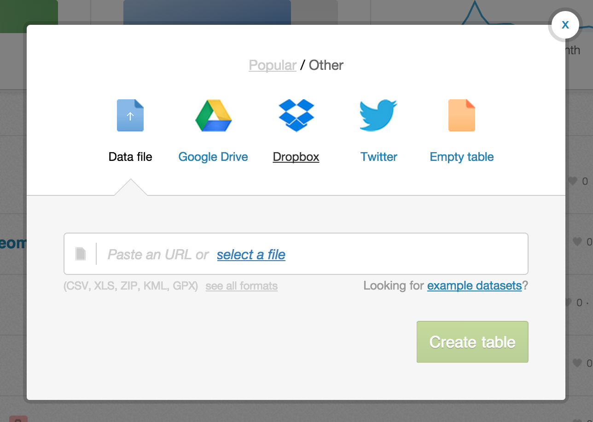
Most major formats for storing data: Excel Spreadsheets, CSV files, Shapefiles, KML (Google Earth), etc. [See complete list here.](http://docs.cartodb.com/cartodb-editor.html#supported-data-formats)

1. Import by URL! Handy when in a workshop and you don't want to overwhelm the bandwidth :)
2. Select file from your computer
3. [Common Data](http://docs.cartodb.com/cartodb-editor.html#common-data) contains useful datasets for everyday use (admin regions, USGS earthquake data, ports and their locations, and many more)

Integration with **Google Drive** and **Dropbox**.

**Twitter** firehose access for [Enterprise](http://cartodb.com/enterprise) accounts.

<iframe src="https://srogers.cartodb.com/viz/337d9194-6458-11e3-85b5-e5e70547d141/embed_map?scrollWheelZoom=false" width="800px" height="600px"></iframe>

#### Data tables in CartoDB

**Column names**

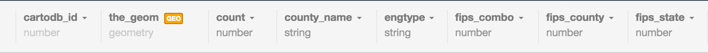

**Editing Data point by point**

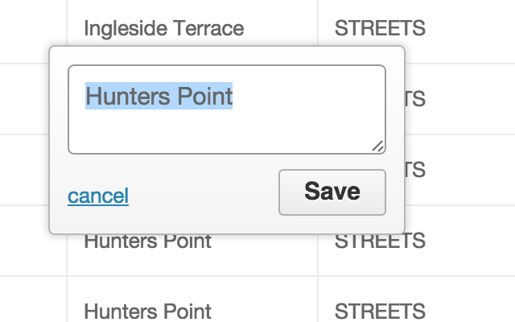

**Filters &amp; SQL**

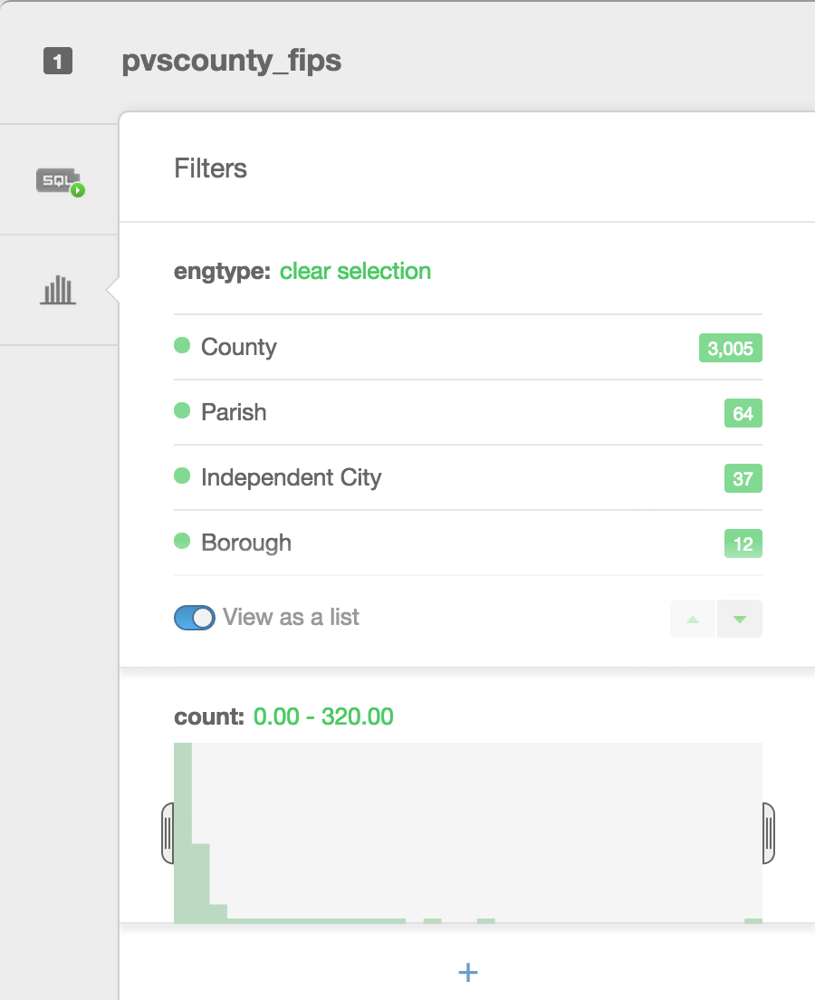

Filters are a great way to explore your data. Besides filtering your data, they allow you to see histograms of the distributions, the number of unique entries, or a search box for columns that have a large number of text entries.

#### Types of visualizations

+ Simple -- most basic visualization
+ Cluster -- counts number of points within a certain binned region
+ Choropleth -- makes a histogram of your data and gives bins different colors depending on the color ramp chosen
+ Category -- color data based on unique category (works best for a handful of unique types)
+ Bubble -- size markers based on column values
+ Intensity -- colors by density
+ Density -- data aggregated by number of points within a hexagon
+ Torque -- temporal visualization of data
+ Heat maps -- greater color intensity indicate greater density of data

Check out [visualization documentation](http://docs.cartodb.com/cartodb-editor.html#wizards) for more.

Data for the following from [DataSF](https://data.sfgov.org/Geographic-Locations-and-Boundaries/Streets-of-San-Francisco-Zipped-Shapefile-Format-/wbm8-ratb).

##### _Simple_ Map
The visualization style _simple_ is the default visualization for all maps.


Styles available in the wizard

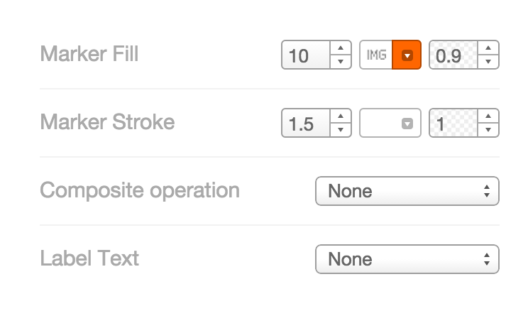

+ **Marker Fill:** change the size, color, and opacity of all markers
+ **Marker Stroke:** change the width, color, and opacity of every marker's border
+ **Composite Operation:** change the color of markers when they overlap
+ **Label Text:** Text appearing by a marker (can be from columns)

##### Category Maps
Color features by discrete elements.

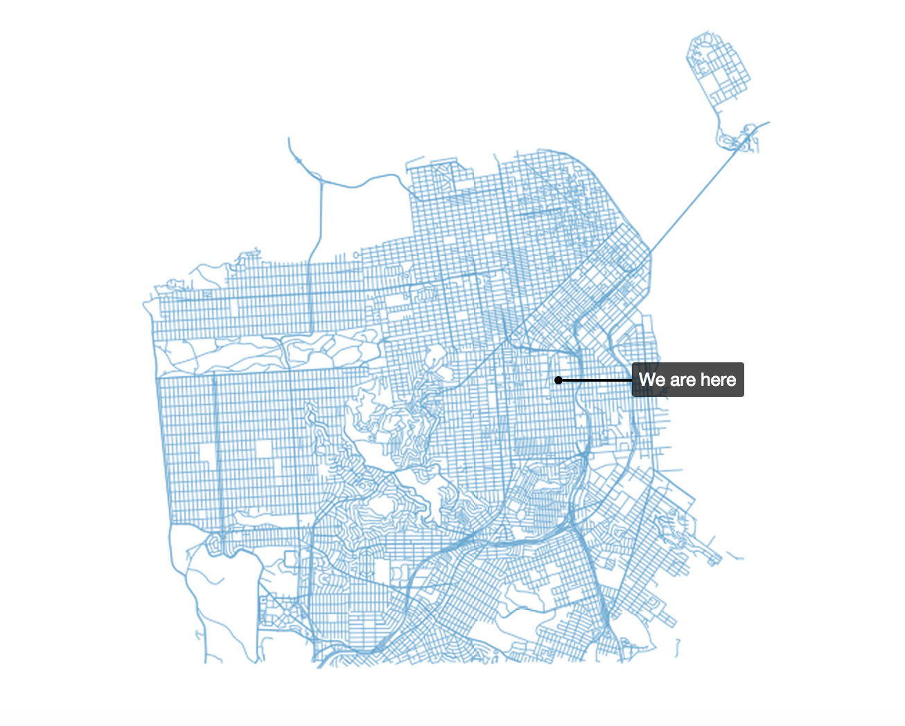

#### Infowindows/hovers


+ Select which column data appear in infowindow by toggling column on
+ Customize further by selecting

#### Change basemap

Select basemaps from different providers, use custom color, NASA data, MapBox tiles, etc.


#### Annotations
Add annotations to your maps:


### Choropleth

Choropleth maps show map elements colored according to where a value associated with the map element falls in a range. It's like a histogram where each bin is colored differently according to a color scale you pick. Notice the CartoCSS screenshot above.


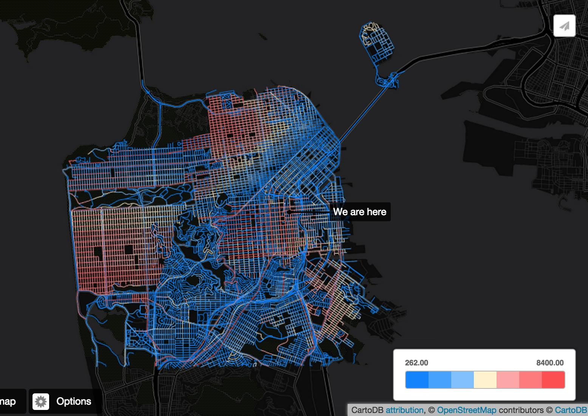

Features to notice:

+ Column choice of how geometry is categorized
+ Number of color bins
+ Color ramp choices

_Quantification_ is an option to pay attention to since it controls how the data is binned into different colors. _Equal interval_ gives bins of equal size across the range, which means that outliers stand out. _Quantile_ bins so that each bin has approximately the same number of values. _Heads/tails_ works well for data that has more of an exponential characteristic. _Jenks_ is best for data that has some clustering to it (i.e., it's multimodal).

#### CartoCSS basics

[CartoCSS](https://github.com/mapbox/carto/blob/master/docs/latest.md) is the styling language for our maps.


#### Legends

Can be easily customized

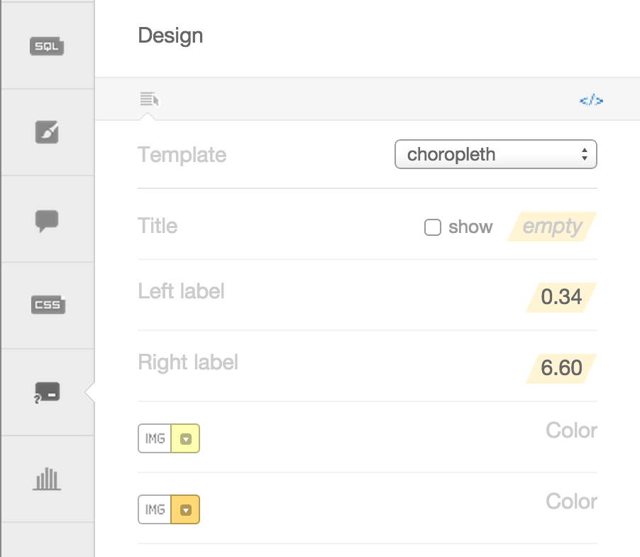

You have the option of giving it a title, and changing the text for the colors. You can also change the colors manually, or, even better, change the color ramp back in the wizard. If you want to explore other color ramps, check out [Color Brewer](http://colorbrewer2.org/) for some very well thought out color schemes.

### Torque maps

CartoDB created a fully zoomable map that changes in time.


**Some examples**

1. World Cup tweets saturate [this map](http://cartodb.com/v/worldcup/match/?TC=x&vis=30acae6a-0a51-11e4-8918-0e73339ffa50&h=t&t=Germany,B40903%7CArgentina,5CA2D1&m=7%2F13%2F2014%2016:00:00%20GMT,7%2F12%2F2014%2018:35:00GMT&g=147%7C#/2/7.7/56.8/0)
2. Tweets that mention [sunrise map](http://cartodb.s3.amazonaws.com/static_vizz/sunrise.html) (captured in an animated gif above)
3. [Animal migration patterns](http://robbykraft.github.io/AnimalTrack/)
4. [Alcatraz Escape revisited](http://www.washingtonpost.com/news/morning-mix/wp/2014/12/15/the-alcatraz-escapees-could-have-survived-and-this-interactive-model-proves-it/)

### Sharing/publishing your maps

You can share your maps by doing this in a visualization:

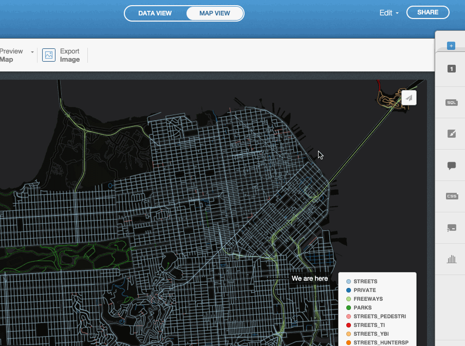

### Last few things

#### Navigating back to your tables or visualization

Click on the 90-degree arrow to get back to view your tables/visualizations

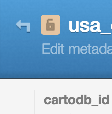

#### Navigating in general


## 2. Hands-on Mapping Workshop

**Let's make maps.**

If you don't have an account setup, go here: https://cartodb.com/signup?plan=academy

Otherwise, login to your account.

### Data Import

Import a new dataset by copying the link (not downloading) and pasting it into the import window in your CartoDB account:

**USGS reported seismic activity (earthquakes)**
http://earthquake.usgs.gov/earthquakes/feed/v1.0/summary/all_month.csv

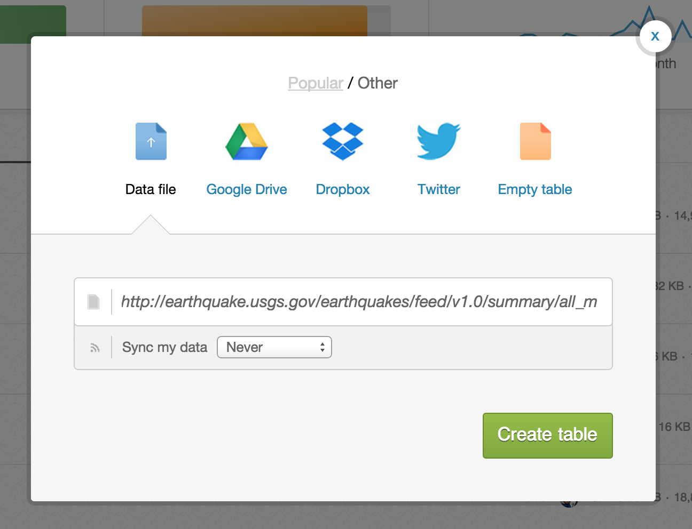

### 2.1 _Simple_ Map

#### Challenge #1

Using the styles in simple, try to recreate the visualization below. It's similar to an intensity map that shows where earthquakes are occurring in largest numbers.

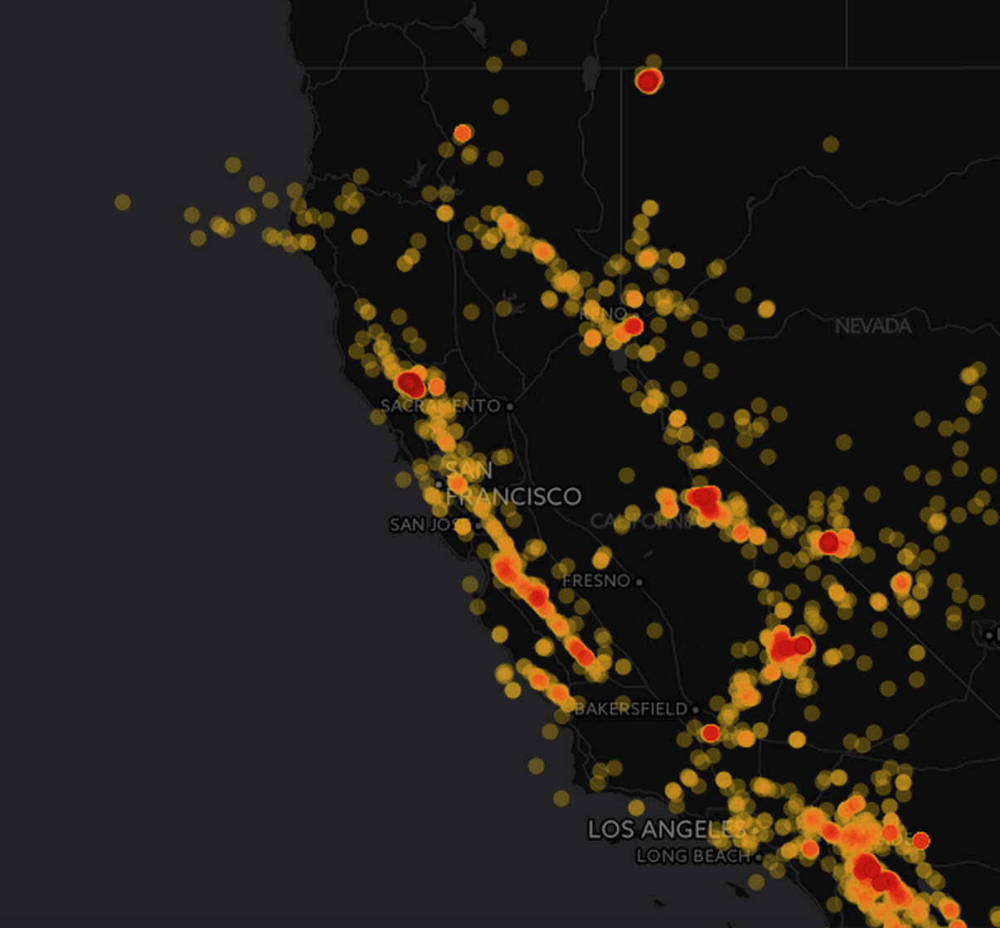

For later reference, here's [more on quantification](http://blog.cartographica.com/blog/2010/8/16/gis-data-classifications-in-cartographica.html).

### 2.2 Choropleth Map

#### Challenge #2

__Make a choropleth map__

Next select _choropleth_ from the Vizualization wizard. By default it will select `depth`. Select the `mag` column (which means magnitude or power of the earthquake).

Notice that there are lots of US-based earthquakes that are fairly weak -- so perhaps filtering for earthquakes above 3.0 will give a better visualization of our data.

_hint_: notice that a filter was used
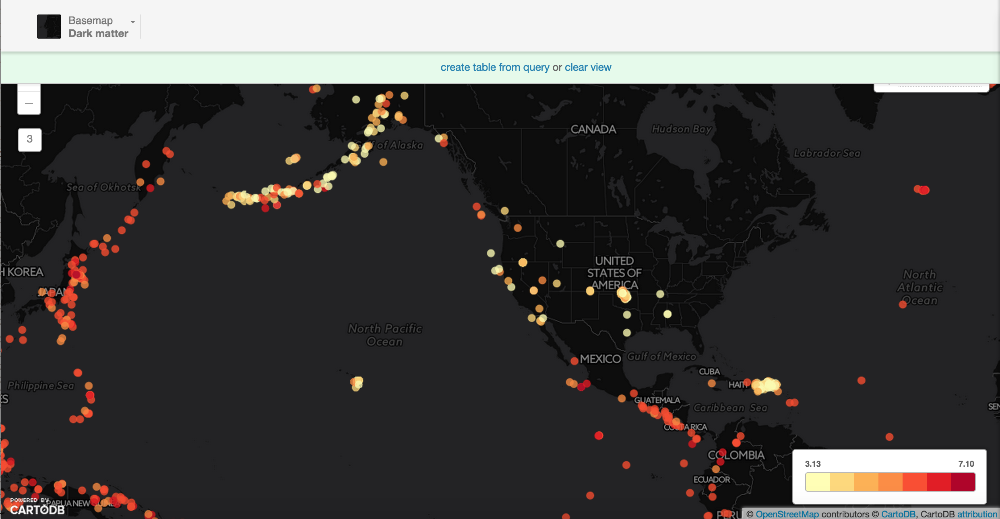

### 2.3 Category Map

#### Challenge #3

Try to recreate this map using *category*. `net` is the column to categorize by...

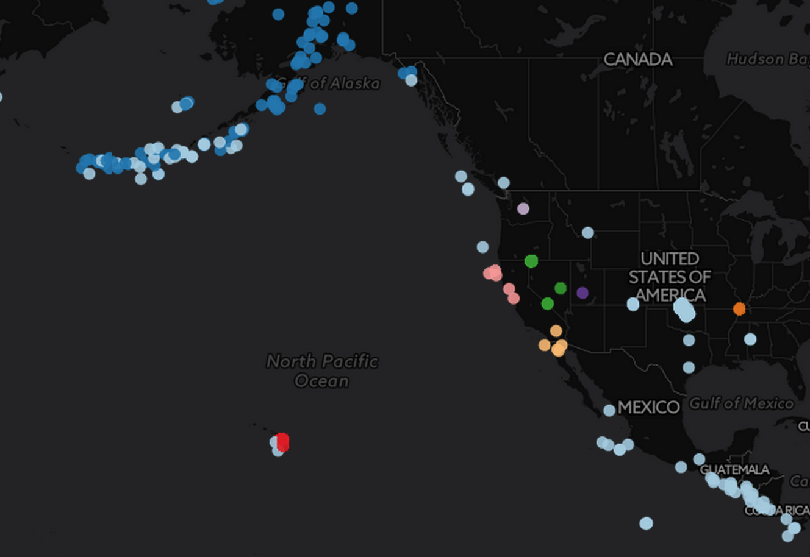

### 2.4 Torque Map

####  Challenge #4 -- Create a basic torque map

Create a torque map that looks like the one below. _Hint:_ Select the `time` column of the earthquake data.

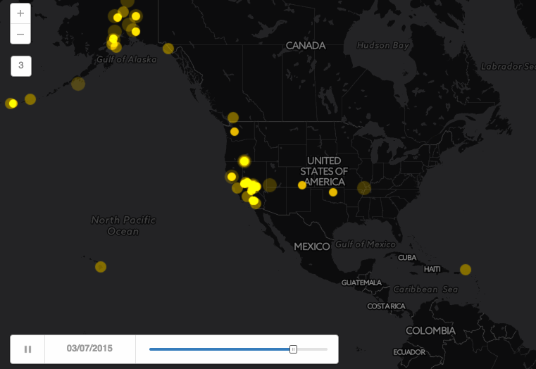

### 2.5 Multilayer map

Three basic types of data appear on a map.

+ Point data -- like we saw for the earthquakes
+ Line data -- like flight paths, can be seen in [this example](http://andye.cartodb.com/viz/93141b9a-784e-11e4-9f55-0e853d047bba/public_map)
+ Polygon data -- like the shapes of states

Go back to your dashboard and click on _Common Data_. Find _Administrative Regions_, then click on _USA States_.

After the data imports into your account, click on the large **+** on the panel on the right side of the page.

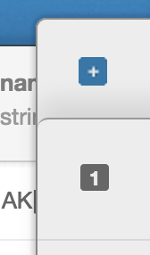

Select the earthquake dataset. It's default name on import is `all_month`. Then hit **Add layer** and you will get this:

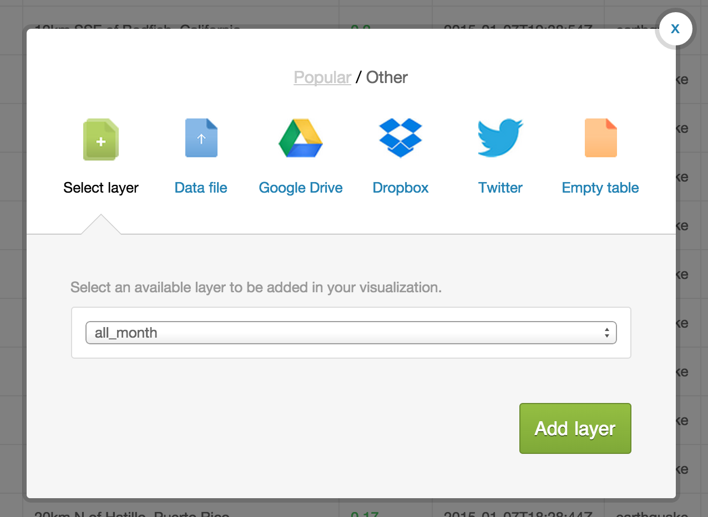

Name your visualization something fancy.

You can customize each layer just as you would customize a single layer.

Try to create a map that looks like this:

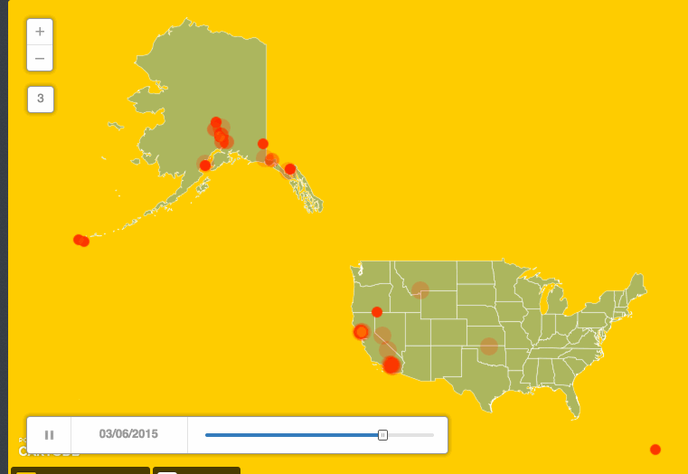

#### Multilayer Resources

+ [CartoDB Map Academy lesson](http://academy.cartodb.com/courses/01-beginners-course/lesson-5.html) on making multilayer maps in the editor
+ [Recent blog post](http://blog.cartodb.com/layer-selector/) about how to create one with layer selectors (legends are responsive to shown layer)

#### Journo examples

+ Multilayer tool developed by The Daily Beast on [Abortion Clinic Access](http://www.thedailybeast.com/articles/2013/01/22/interactive-map-america-s-abortion-clinics.html).


## 3. CartoDB.js

[CartoDB.js](http://docs.cartodb.com/cartodb-platform/cartodb-js.html) is our JavaScript API -- a way to make maps using JavaScript.

### 3.1 What it looks like

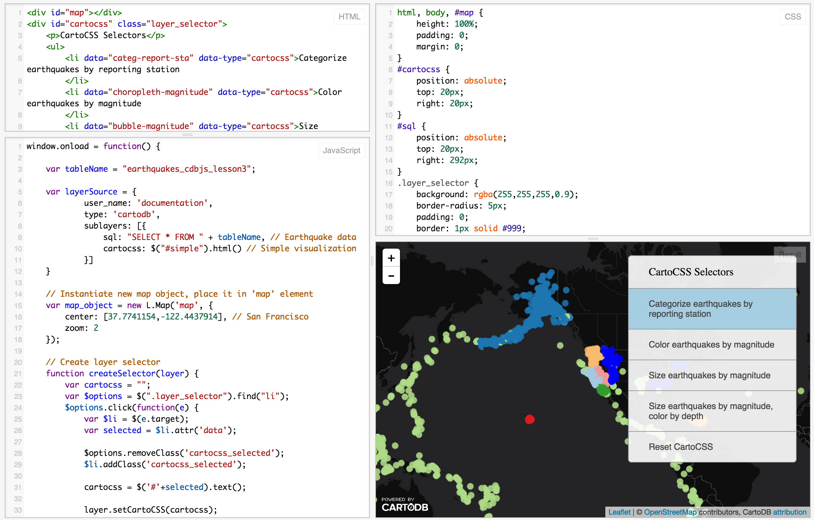

The [example above](http://jsfiddle.net/gh/get/library/pure/CartoDB/academy/tree/master/t/03-cartodbjs-ground-up/lesson-3/jsfiddle_demo_cartocss) uses HTML, CSS, and JavaScript to make a map appear on a webpage.

Check out our [Map Academy course on CartoDB.js](http://academy.cartodb.com/courses/03-cartodbjs-ground-up.html) if you want to learn more.


### 3.2 Extensibility

Use CartoDB.js with other JavaScript libraries to make powerful web map apps.

Check out [Urban Reviewer](http://www.urbanreviewer.org/).

If you take a look at the source code, there are a dozen libraries linked:


### 3.3 Epic Example

[Illustreets](http://illustreets.co.uk/) shows standard of living information across England to amazing detail. There are millions of data points, each can be interacted with to give graphs, summaries, etc.

## 4. Odyssey (if we have time) -- Telling narratives with map visualizations

Odyssey is in the process of being brought to Editor like other visualizations. For now, play in the [sandbox](http://cartodb.github.io/odyssey.js/).

### Examples

+ *NY Daily News*: [48 Hours of Gun Violence](http://www.nydailynews.com/new-york/nyc-crime/bloody-weekend-19-injured-bullets-cops-arrest-2-article-1.1846552)
+ *Cadena Ser (Spanish radio)*: [The Sounds of 11M](http://www.cadenaser.com/sonidos-11m/)
+ *Al Jazeera*: [Israeli-Palestinian Conflict by Tweets](http://stream.aljazeera.com/projects/socialmediaconversation/)

### Getting started!

Go to:
http://cartodb.github.io/odyssey.js/sandbox/sandbox.html

Brief tour of the interface.

Replace the header in the box on the right with this:

```
- baseurl: "http://a.basemaps.cartocdn.com/light_all/{z}/{x}/{y}.png"
- title: "Percent of people that say Coke"
- author: "Your name"
- cartodb_filter: ""
- vizjson: "http://andye.cartodb.com/api/v2/viz/944f113c-95d5-11e4-a3a2-0e4fddd5de28/viz.json"
```

If you want to add your own `vizjson` file for another visualization, go to the visualization you want to use in the CartoDB Editor, click on _Share_ in the upper right hand corner, and copy the link under _CartoDB.js_. You can now paste that link in place of the vizjson link given in the above example.

I'm using a different base map (`baseurl`), changing the title and author, and adding a data layer by adding the `vizjson` and `cartodb_filter` portions.

If you want to add images use the following format:

```

```

Example:
```

```

## 5. Wrap Up
More resources

1. [Map Academy](http://academy.cartodb.com)
2. [CartoDB Tutorials](http://docs.cartodb.com/tutorials.html)
3. [CartoDB Editor Documentation](http://docs.cartodb.com/cartodb-editor.html)
4. [CartoDB APIs](http://docs.cartodb.com/cartodb-platform.html)
5. [Gallery of nice maps](http://cartodb.com/gallery/)

My contact: [eschbacher@cartodb.com](mailto:eschbacher@cartodb.com)

If you make a map you're proud of or just want to say hello, connect with me [@MrEPhysics](https://twitter.com/MrEPhysics).
