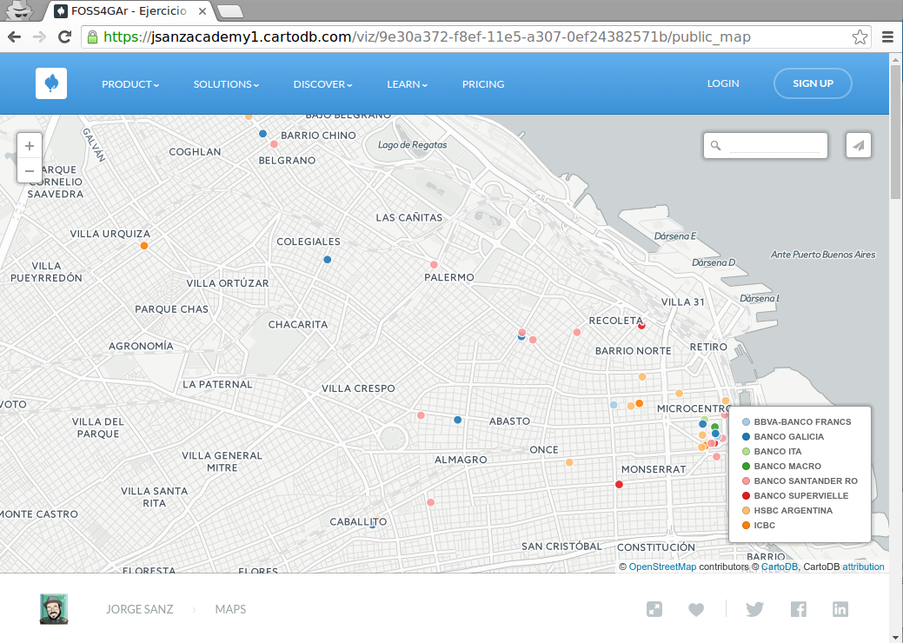
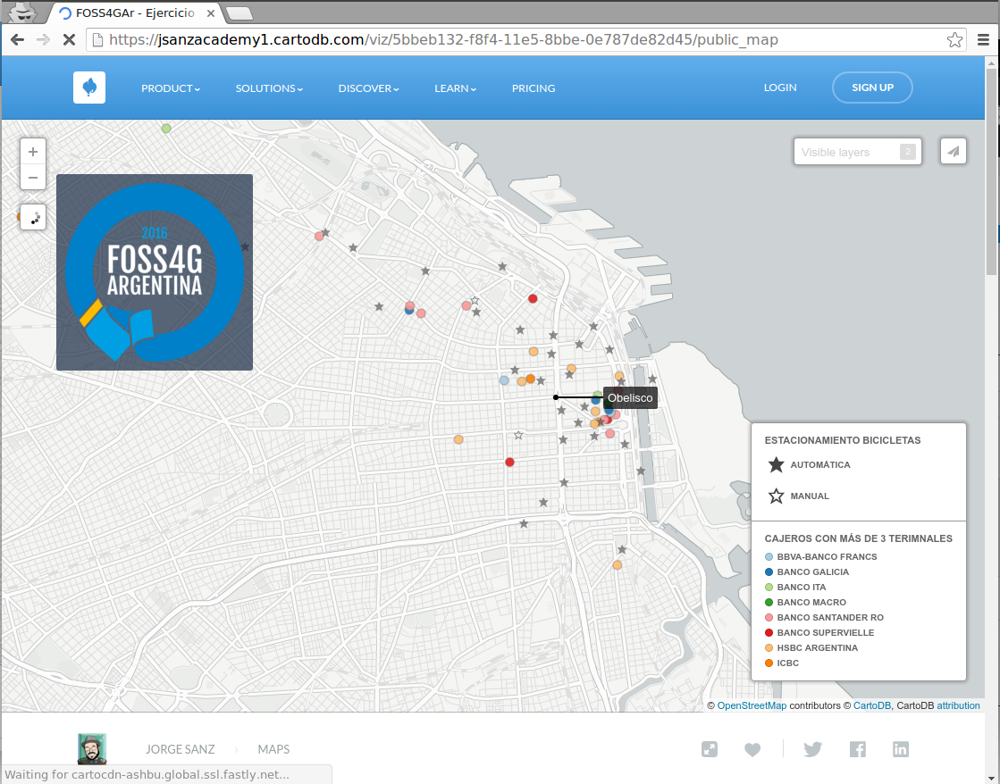
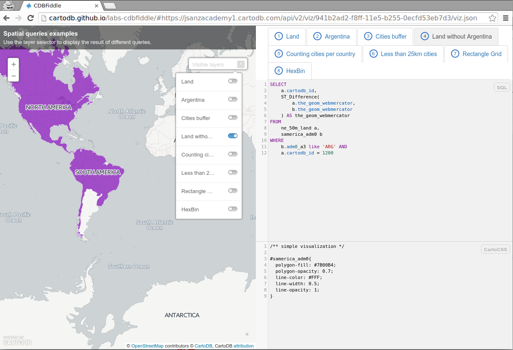

* Facilitador: Jorge Sanz · jsanz@cartodb.com · [@xurxosanz](http://twitter.com/xurxosanz)
* Taller del [FOSS4G Argentina](http://www.foss4g-ar.org/)
* 5 de Abril de 2016 · Instituto Geográfico Nacional · Buenos Aires

## Contenidos


- [Introducción](#intro) \(30m\)
- [CartoDB Editor](#editor) \(45m\): Hello Map · Más características · El *dashboard* de CartoDB
- [Análisis de datos con SQL](#sql) \(1h\): Introducción · PostGIS · Ejemplos de SQL espacial
- [Aplicaciones web con CartoDB.js](#js) \(1h 30m\): Ejemplos · Ejemplos avanzados


----

## Introducción (30m) <a name="intro"></a>

* Qué es CartoDB
* CartoDB es una plataforma: editor + APIs + SDKs
  * [Diapositivas](https://docs.google.com/presentation/d/1k3VdfK8Cf94uNng7ZNRE1fIAyfxYyv8td-DJSLLE4xs/pub?start=false)
* Crear una cuenta nueva en CartoDB

Recursos adicionales

* [Documentación](http://docs.cartodb.com)
* [Academy](http://academy.cartodb.com)
* [Galería](https://cartodb.com/gallery)

## CartoDB Editor (45m) <a name="editor"></a>

### Hello Map

* Acceder a la cuenta
* El _dashboard_
* Crear un mapa nuevo
* Asistente para crear un mapa nuevo
  * Los diferentes tipos de mapas y sus opciones
* Conceptos básicos de CartoCSS
  * Cambiar el estilo de un mapa sencillo

#### Ejercicio:

- Enunciado: *hacer un mapa de los cajeros automáticos de Buenos Aires con más de 3 terminales*
- [Datos](../data/160405-foss4gar/cajeros.zip)
- [Fuente](http://data.buenosaires.gob.ar/dataset/cajeros-automaticos)
  * Shapefile convertido a UTF8

Consideraciones:

- Usar la pestaña de filtros para aplicar la condición por el campo `terminales`
- Usar el tipo de mapa por categoría para mostrar a qué banco pertenece cada cajero

Resultado:

- [Detalles](http://cartodb.github.io/labs-cdbfiddle/#https://jsanzacademy1.cartodb.com/api/v2/viz/9e30a372-f8ef-11e5-a307-0ef24382571b/viz.json)
- [Mapa](https://jsanzacademy1.cartodb.com/viz/9e30a372-f8ef-11e5-a307-0ef24382571b/public_map)



### Más características

* Interactividad: *infowindows* y *tooltips*
* Leyenda de mapa
  * En un mapa simple
  * Leyenda de mapa por categorías
* Otros elementos del mapa
  * Añadir elemento: título, textos, anotaciones e imágenes
  * Previsualización del mapa
  * Exportar imagen: normal y avanzada
* Metadatos del mapa
  * Título, descripción y etiquetas
  * Privacidad
* Opciones del mapa
  * Cambiar el mapa base
  * Otras opciones del mapa
* Añadir nuevas capas
  * Orden de capas
* Opciones de publicación: enlace, *embed* y CartoDB.js

#### Ejercicio 2:

Crea una copia del mapa del ejercicio anterior y añade las siguientes características:

   * Interactividad
   * Título
   * Metadatos completos
   * Añade una capa nueva
   * Añade un selector de capas
   * Publica tu mapa

Nota: Puedes buscar alguna capa en http://data.buenosaires.gob.ar que se encuentre en formato `shp`, obtener la dirección web del fichero de datos (zip) y cargarla directamente en CartoDB.

Resultado:

- [Detalles](http://cartodb.github.io/labs-cdbfiddle/#https://jsanzacademy1.cartodb.com/api/v2/viz/5bbeb132-f8f4-11e5-8bbe-0e787de82d45/viz.json)
- [Mapa](https://jsanzacademy1.cartodb.com/viz/5bbeb132-f8f4-11e5-8bbe-0e787de82d45/public_map)




#### Recursos adicionales:

* CartoDB Map Academy, [Online Mapping for Beginners Lesson](http://academy.cartodb.com/courses/beginners-course/)
* CartoDB Map Academy, [Introduction to Map Design](http://academy.cartodb.com/courses/design-for-beginners/)
* CartoDB Map Academy, [Intermediate Map Design](http://academy.cartodb.com/courses/intermediate-design/)
* CartoDB Documentation, [CartoCSS](http://docs.cartodb.com/cartodb-platform/cartocss/)
* CartoDB Documentation, [Maps](http://docs.cartodb.com/cartodb-editor/maps/)

### El *dashboard* de CartoDB

* Las opciones del *dashboard*
  * Mapas y tablas en CartoDB
  * Listados
  * Operaciones
    * Selección
    * Ordenar
    * Duplicar
    * Borrar

* El editor de tablas
  * Diferencias con el editor de mapas
  * Geocodificación
  * Sincronización
  * Crear un mapa desde la tabla

* Opciones de administración
  * Diferencias entre una cuenta normal y una cuenta en una organización
  * Características corporativas
    * Compartir datasets y mapas con otros miembros y grupos
    * Cuotas de almacenamiento
    * LDAP
  * La *API Key*
  * Perfil público


#### Recursos adicionales:

* CartoDB Documentation, [CartoDB Dashboard](http://docs.cartodb.com/cartodb-editor/dashboard/)
* CartoDB Documentation, [Datasets](http://docs.cartodb.com/cartodb-editor/datasets/)
* CartoDB Documentation, [CartoDB Enterprise](http://docs.cartodb.com/cartodb-enterprise/)
* CartoDB Documentation, [CartoDB account](http://docs.cartodb.com/cartodb-editor/your-account/)


----

## Análisis de datos con SQL (1h) <a name="sql"></a>

### Introducción

En esta sección vamos a cubrir los aspectos más básicos del acceso a información mediante el lenguaje de consulta SQL.

**Nota:** Importar la tabla `ne_10m_populated_places_simple` desde el *Data Library*.

##### Seleccionar datos

Seleccionar todas las columnas:

```sql
SELECT
  *
FROM
  ne_10m_populated_places_simple;
```

Seleccionar solo algunas columnas:

```sql
SELECT
  cartodb_id,
  the_geom,
  adm0name,name
FROM
  ne_10m_populated_places_simple;
```

Seleccionar datos distintos

```sql
SELECT
  DISTINCT adm0name
FROM
  ne_10m_populated_places_simple;
```

#### Filtrar

Añadir una condición por un campo

```sql
SELECT * FROM ne_10m_populated_places_simple
WHERE
  cartodb_id = 1;
```

Filtrar por un valor

```sql
SELECT * FROM ne_10m_populated_places_simple
WHERE
  cartodb_id IN (1,3,5,7,9);
```

Filtrar por cadena de texto

```sql
SELECT * FROM ne_10m_populated_places_simple
WHERE
  adm0_a3 LIKE 'URY';
```

Filtro que no tiene en cuenta mayúsculas

```sql
SELECT * FROM ne_10m_populated_places_simple
WHERE
  adm0_a3 ILIKE 'ury';
```

Comodines

```sql
SELECT * FROM ne_10m_populated_places_simple
WHERE
  name ILIKE 'San%';

SELECT * FROM ne_10m_populated_places_simple
WHERE
  name ILIKE 'San%';

SELECT * FROM ne_10m_populated_places_simple
WHERE
  name ILIKE '%ao';

SELECT * FROM ne_10m_populated_places_simple
WHERE
  name ILIKE '%ori%';
```

#### Combinar condiciones

```sql
SELECT * FROM ne_10m_populated_places_simple
WHERE
  name ILIKE '%ori%' AND
  cartodb_id < 1000;

SELECT * FROM ne_10m_populated_places_simple
WHERE
  name ILIKE '%ori%'
  OR cartodb_id < 10;
```

#### Otras

Ordenar los resultados

```sql
SELECT * FROM ne_10m_populated_places_simple
WHERE name ILIKE '%ori%' AND cartodb_id < 1000
ORDER BY name ASC;
```

Limitar el número de resultados

```sql
SELECT * FROM ne_10m_populated_places_simple
WHERE name ILIKE '%ori%' AND cartodb_id < 1000
ORDER BY name
LIMIT 5;
```

Contar el número de resultados

```sql
SELECT count(*) as conteo
FROM ne_10m_populated_places_simple
WHERE name ILIKE '%ori%';
```


#### Lecturas adicionales:

* [SQL Lesson of W3Schools](http://www.w3schools.com/sql/default.asp)
* CartoDB Map Academy, [SQL Lesson 1](http://academy.cartodb.com/courses/sql-postgis/intro-to-sql-and-postgis/)

#### Ejercicio 4: extraer información mediante SQL

* Encontrar las columnas en `ne_10m_populated_places_simple` que informan sobre:
  * Nombre de la ciudad
  * Población máxima
  * Nombre del país
* ¿Qué ciudades encontramos de Argentina? ¿Cuál es su población máxima?
* ¿Qué ciudades de Argentina tienen más de 500.000 habitantes?
* ¿Cuántas ciudades son *megacities* y su nombre acaba por `a`?
* ¿Cuáles son las cinco ciudades más pobladas de Argentina?


### PostGIS

#### `geometry` vs `geography`

En Postgis existen dos tipos de datos geográficos

* `geometry`: coordenadas cartesianas, la línea más corta entre dos puntos es una recta. Tienen sistema de coordenadas
* `geography`: coordenadas polares sobre una esfera o un elipsoide. Siempre en geográficas. Útiles para algunas operaciones. La distancia más corta entre dos puntos es una curva *ortodrómica*.


*Fuente: [Boundless Postgis intro](http://workshops.boundlessgeo.com/postgis-intro)*

Un par de recursos:

* [Sobre el tipo `geography`](http://workshops.boundlessgeo.com/postgis-intro/geography.html)
* [Documentación oficial](http://postgis.net/docs/manual-1.5/ch04.html#PostGIS_Geography)

----

Un detalle a tener en cuenta al trabajar con CartoDB:

> En CartoDB **SIEMPRE** visualizamos una consulta a la base de datos.

----

#### Los campos `the_geom` y `the_geom_webmercator`

Las tablas de CartoDB tienen **dos** campos de tipo `geometry`:

* `the_geom`: `EPSG:4326`. Coordenadas geográficas sin proyectas en WGS84
* `the_geom_webmercator: `EPSG:3857`. Coordenadas proyectadas en el sistema esférico de Mercator, un estándar de facto en *webmapping*.

En CartoDB, `the_geom_webmercator` es la columna que se renderiza en el mapa. Este campo se genera automáticamente desde el campo `the_geom`. En una consulta, podemos sustituir ese campo por cualquier otra geometría que generemos, siempre y cuando cumpla las condiciones de ser de tipo `geometry` y estar en el sistema de coordenadas `EPSG:3857`.

Un par de recursos adicionales:

* [Proyecciones cartográficas en Wikipedia](https://en.wikipedia.org/wiki/Map_projection)
* [Tutorial](http://docs.cartodb.com/tutorials/projections/) sobre proyecciones
* [Blog post](http://blog.cartodb.com/free-your-maps-web-mercator/) sobre como usar otras proyecciones en CartoDB.

### Ejemplos de SQL espacial

Las consultas que se muestran a continuación se pueden aplicar directamente sobre la consola SQL del editor. En [este enlace](http://cartodb.github.io/labs-cdbfiddle/#https://jsanzacademy1.cartodb.com/api/v2/viz/941b2ad2-f8ff-11e5-b255-0ecfd53eb7d3/viz.json) se puede visualizar el resultado de las consultas.



#### Generar un *buffer* dado un radio determinado

Para poder usar metros en nuestra medida tenemos que convertir nuestra geometría al tipo `geography` y luego de vuelta a `geometry` y finalmente transformar el resultado al sistema de coordenadas `EPSG:3857` para poder verlo en nuestro mapa.

```sql
SELECT
  cartodb_id,
  name,
  ST_Transform(
    ST_Buffer(the_geom::geography, 50000)::geometry
    ,3857
  ) AS the_geom_webmercator
FROM
  ne_10m_populated_places_simple
```

* [ST_Transform](http://postgis.net/docs/ST_Transform.html)
* [ST_Buffer](http://postgis.net/docs/ST_Buffer.html)

#### Calcular la diferencia entre dos geometrías

Importar las tablas `samerica_adm0` y `ne_50m_lakes` para obtener la geometría correspondiente a Argentina sin sus lagos.

```sql
SELECT
  a.cartodb_id,
    ST_Difference(
        a.the_geom_webmercator,
        b.the_geom_webmercator
  ) AS the_geom_webmercator
FROM
  ne_50m_land a,
  samerica_adm0 b
WHERE
  b.adm0_a3 like 'ARG' AND
  a.cartodb_id = 1200
```

* [ST_Difference](http://postgis.net/docs/ST_Difference.html)

#### Intersectar dos geometrías

Obtener las ciudades de Sudamérica

```sql
SELECT
  a.*
FROM
  ne_10m_populated_places_simple a,
  samerica_adm0 b
WHERE
  ST_Intersects(
    b.the_geom_webmercator,
    a.the_geom_webmercator
  )
```

* [ST_Intersects](http://postgis.net/docs/ST_Intersects.html)

#### Contar puntos contenidos en cada polígono

Número de ciudades en `ne_10m_populated_places_simple` por país de Sudamérica. Usando `GROUP BY`:


```sql
SELECT
  b.cartodb_id,
  b.name,
  b.the_geom_webmercator,
  count(*) AS pp_count,
  sum(a.pop_max) as sum_pop
FROM
  ne_10m_populated_places_simple a,
  samerica_adm0 b
WHERE
  ST_Intersects(a.the_geom, b.the_geom)
GROUP BY
  b.cartodb_id,
  b.name,
  b.the_geom_webmercator
```

Una forma más correcta de hacerlo usando `LATERAL`:

```sql
SELECT
  a.cartodb_id,
  a.name,
  a.the_geom_webmercator,
  counts.number_cities,
  to_char(counts.sum_pop,'999,999,999') as sum_pop --con separador de decimales
FROM
  samerica_adm0 a
CROSS JOIN LATERAL
  (
    SELECT
      count(*) as number_cities,
      sum(pop_max) as sum_pop
    FROM
      ne_10m_populated_places_simple b
    WHERE
      ST_Intersects(a.the_geom, b.the_geom)
  ) AS counts
```

#### Obtener las ciudades argentinas que están a menos de 25 km una de otra

```sql
SELECT
  a.*
FROM
  ne_10m_populated_places_simple a,
    ne_10m_populated_places_simple b
WHERE
    a.cartodb_id != b.cartodb_id
  AND ST_DWithin(
        a.the_geom::geography,
        b.the_geom::geography,
        25000
    )
  AND a.adm0name = 'Argentina'
  AND b.adm0name = 'Argentina'
```

* [ST_DWithin](http://postgis.net/docs/ST_DWithin.html)

#### Generar cuadrículas

Cudarícula rectangular de 250km de lado para Argentina

```sql
SELECT
  row_number() over () as cartodb_id, -- campo generado
  CDB_RectangleGrid(
    ST_Envelope(the_geom_webmercator), -- caja de la geometría
    250000,
    250000
  ) AS the_geom_webmercator
FROM samerica_adm0
WHERE adm0_a3 like 'ARG'
```

* [CDB_RectangleGrid](http://docs.cartodb.com/tips-and-tricks/cartodb-functions/#a-rectangle-grid)
* [ST_Envelolpe](http://postgis.net/docs/ST_Envelolpe.html)

Cuadrícula hexagonal de 250km de lado para Argentina

```sql
SELECT
  row_number() over () as cartodb_id,
  CDB_HexagonGrid(
    ST_Envelope (the_geom_webmercator),
    250000
  ) AS the_geom_webmercator
FROM samerica_adm0
WHERE adm0_a3 like 'ARG'
```

* [CDB_HexagonGrid](http://docs.cartodb.com/tips-and-tricks/cartodb-functions/#a-hexagon-grid)

#### Recursos adicionales

* [CartoDB Map Academy - SQL and PostGIS](http://academy.cartodb.com/courses/sql-postgis/)

Algunos artículos sobre SQL espacial en el blog de CartoDB

* [Generando líneas de círculos máximos cruzando la línea de la fecha](http://blog.cartodb.com/jets-and-datelines/)
* [Buscando las geometrías más cercanas](http://blog.cartodb.com/lateral-joins/)
* [Sobre ST_Subdivide](http://blog.cartodb.com/subdivide-all-things/)


----

## Aplicaciones web con CartoDB.js (1h 30m) <a name="js"></a>

[CartoDB.js](http://docs.cartodb.com/cartodb-platform/cartodb-js/) es la librería JavaScript que permite crear aplicaciones de *webmapping* usando los servicios de CartoDB de forma rápida y eficiente.

La librería está basada en los siguientes componentes:

* [jQuery](http://jquery.com)
* [Underscore.js](http://underscorejs.org)
* [Backbone.js](http://backbonejs.org/)
* Puede utilizar indistintamente [Google Maps API](https://developers.google.com/maps/) o [Leaflet](http://leafletjs.com/)

### Ejemplos

Puedes copiar el código de los siguientes ejemplos y ejecutarlos en tu computadora. También puedes usar los enlaces al editor en línea y hacer ahí tus cambios. Prueba a visualizar tus mapas, consultar tus tablas, cambiar estilos y comportamientos para crear visores de la información que existe en tu cuenta de CartoDB.

* Cargar una visualización con `createVis`: [ejemplo](http://bl.ocks.org/ernesmb/80490597ad592a1ce0bd), [editor](http://plnkr.co/edit/VzZmMh)

* Cargar una SQL y CartoCSS sobre un mapa con `createLayer`: [ejemplo](http://bl.ocks.org/jsanz/8ea2c5ef8422c9f9881e2f5132e2f645), [editor](http://plnkr.co/edit/aBFGbAGNwC51U3wOPd70?p=info)

* Eventos. Acción al hacer clic: [ejemplo](http://bl.ocks.org/jsanz/1881f68fd76546eda08cafd8fdcf480c), [editor](http://plnkr.co/edit/rLjESjaFzr4m9qrvl4pj?p=preview)

* Ventana (*infowindow*) personalizada: [ejemplo](http://bl.ocks.org/jsanz/a0f606c08ec854df3f5e982b3890e188), [editor](http://plnkr.co/edit/CQZL48I1QDfdMZUSH9ve?p=info)

* Custom Tooltip: [ejemplo](http://bl.ocks.org/jsanz/cd541c5a61f72e19c1e50c06fb688f40), [editor](http://plnkr.co/edit/3loqq6?p=preview)

* Cambiar la consulta SQL y el CartoCSS: [ejemplo](http://bl.ocks.org/jsanz/b454ed94c8ab9131dc823166226c18ef), [editor](http://plnkr.co/edit/xqpP5J?p=preview)

* Cambiar la consulta SQL con un deslizador: [ejemplo](http://bl.ocks.org/jsanz/8e3195f2606a22fbfcdd0a117e109fb4), [editor](http://plnkr.co/edit/8HX6Yq?p=preview)

### Ejemplos avanzados

* [Playing with Torque time](http://bl.ocks.org/ernesmb/4939b3751d3be0cdd64b)
* [Aggregating content from clustered features with SQL](http://bl.ocks.org/ernesmb/348b9eed9ee4c7038fd7)
* [Creating a simple layer selector](http://bl.ocks.org/jsanz/6a83dbae9d6e984ca938)


