* Trainers:
  * Jorge Sanz · jorge@cartodb.com · [@xurxosanz](http://twitter.com/xurxosanz)
  * Oriol Boix · oboix@cartodb.com · [@oriolbx](http://twitter.com/oriolbx)
* Collaborators:
  * Ernesto Martínez · ernesto@cartodb.com · [@ernesmb](http://twitter.com/ernesmb)
  * Ramiro Aznar · ramiroaznar@cartodb.com · [@ramiroaznar](http://twitter.com/ramiroaznar)
* May 28th 2016
* 10as Jornadas de SIG Libre

### [Intro Slides](https://docs.google.com/presentation/d/1ZlAfAD44BI-r1PArEPAK7FWq6UuA7-a0cPttWhu1amA/edit?usp=sharing)

### [http://cartodb.github.io/training/intermediate/siglibre10-workshop.html]()

#### Further questions and troubleshooting

* **[GIS Stack Exchange](http://gis.stackexchange.com/questions/tagged/cartodb)** `cartodb` tag
* email to **support@cartodb.com**

## Contents
- [Importing datasets](#import)
- [Getting your data ready](#dataset)
- [Making a map](#map)
- [Going spatial with PostGIS](#postgis)
- [Webmapping apps with CartoDB.js](#cartodbjs)

----

## 0. Before we start...

**CartoDB as a platform:**

* __Import API__ allows to upload new data to CartoDB.
* __SQL API__ allows to interact with CartoDB tables. Query and modify CartoDB tables.
* __Maps API__ allows to visualize the underlying data.

----

>The CartoDB Editor **is a client** of the platform

----

## 1. Importing datasets <a name="import"></a>

### 1.1 Supported Geospatial Data Files
CartoDB supports the following geospatial data formats to upload vector data*:

* **`Shapefile`**
* **`KML`**
* **`KMZ`**
* **`GeoJSON`***
* **`CSV`**
* **`Spreadsheets`**
* **`GPX`**
* **`OSM`**

_Importing **different geometry types** in the same layer or in a FeatureCollection element (GeoJSON) is not supported. More detailed information [here](http://docs.cartodb.com/cartodb-platform/import-api/geospatial-data-formats/#supported-geospatial-data-formats)._

[*] More detailed information about GeoJSON format [here](http://geojson.org/geojson-spec.html), [here](http://geojsonlint.com/) and [here](http://geojson.io/#map=2/20.0/0.0).

### 1.2 Common importing errors
* **Dataset too large**:
  * File size limit: 150 Mb (free).
  * Import row limit: 500,000 rows (free).
  * *Solution*: split your dataset into smaller ones, import them into CartoDB and merge them.
* **Malformed CSV**:
  * *Solution*: check termination lines, header...
* **Encoding**:
  * *Solution*: `Save with Encoding` > `UTF-8 with BOM` in [Sublime Text](https://www.sublimetext.com/), any other decent text editor or [iconv](https://en.wikipedia.org/wiki/Iconv).
* **Shapefile missing files**:
  * Missing any of the following files within the compressed file will produce an importing error:
    * `.shp`: contains the geometry. REQUIRED.
    * `.shx`: contains the shape index. REQUIRED.
    * `.prj`: contains the projection. REQUIRED.
    * `.dbf`: contains the attributes. REQUIRED.
  * Other auxiliary files such as `.sbn`, `.sbx` or `.shp.xml` are not REQUIRED.
  * *Solution*: make sure to add all required files.
* **Duplicated id fields**:
  * *Solution*: check your dataset, remove or rename fields containing the `id` keyword.
* **Format not supported**:
  * URLs -that are not points to a file- are not supported by CartoDB.
  * *Solution*: check for missing url parameters or download the file into your local machine, import it into CartoDB.
* **MAYUS extensions not supported**:
  * `example.CSV` is not supported by CartoDB.
  * *Solution*: rename the file.
* **Non supported SRID**:
  * Solution: try to reproject your resources locally to a well known projection like `EPSG:4326`,`EPSG:3857`,`EPSG:25830` and so on.

Other importing errors and their codes can be found [here](http://docs.cartodb.com/cartodb-platform/import-api/import-errors/).

----

## 2. Getting your data ready <a name="dataset"></a>

### 2.1 Geocoding

If you have a column with longitude coordinates and another with latitude coordinates, CartoDB will automatically detect and covert values into `the_geom`. If this is not the case, CartoDB can help you by turning the named places into best guess of latitude-longitude coordinates:

* **By Lon/Lat Columns**.
* **By City Names**.
* **By Admin. Regions**.
* **By Postal Codes**.
* **By IP Addresses**.
* **By Street Addresses**.

Know more about geocoding in CartoDB:

* In [**this tutorial**](http://docs.cartodb.com/tutorials/how_to_georeference/).
* In our [**Location Data Services website**](https://cartodb.com/location-data-services/geocoding/).
* In our [**documentation**](http://docs.cartodb.com/cartodb-platform/dataservices-api/geocoding-functions/).

### 2.2 Datasets

These are the datasets we are going to use on our workshop. You'll find them
all on our [Data Library](https://cartodb.com/data-library) and fit way well
on a free account.

* **Populated Places** [`ne_10m_populated_places_simple`]: City and town points.
* **World Borders** [`world_borders`]: World countries borders.
* **Land** [`ne_50m_land`]: World emerged lands.
* **European countries** [`ne_adm0_europe`]: European countries geometries.

### 2.3 Simple SQL operations

#### Selecting all columns:

```sql
SELECT
  *
FROM
  ne_10m_populated_places_simple;
```

#### Selecting some columns:

```sql
SELECT
  cartodb_id,
  name as city,
  adm1name as region,
  adm0name as country,
  pop_max,
  pop_min
FROM
  ne_10m_populated_places_simple
```

#### Selecting distinct values:

```sql
SELECT DISTINCT
  adm0name as country
FROM
  ne_10m_populated_places_simple
```

### 2.4 Filtering

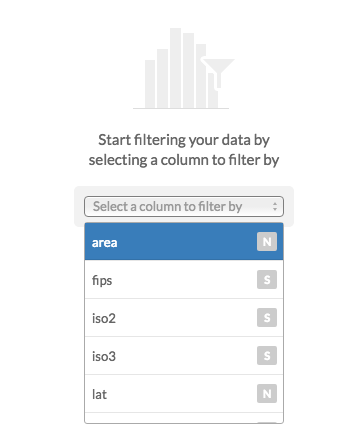

#### Filtering numeric fields:

```sql
SELECT
  *
FROM
  ne_10m_populated_places_simple
WHERE
  pop_max > 5000000;
```

#### Filtering character fields:

```sql
SELECT
  *
FROM
  ne_10m_populated_places_simple
WHERE
  adm0name ilike 'spain'
```

#### Filtering a range:

```sql
SELECT
  *
FROM
  ne_10m_populated_places_simple
WHERE
  name in ('Madrid', 'Barcelona')
AND
  adm0name ilike 'spain'
```

#### Combining character and numeric filters:

```sql
SELECT
  *
FROM
  ne_10m_populated_places_simple
WHERE
  name in ('Madrid', 'Barcelona')
AND
  adm0name ilike 'spain'
AND
  pop_max > 5000000
```

### 2.5 Others:

#### Selecting aggregated values:

**count**

```sql
SELECT
  count(*) as total_rows
FROM
  ne_10m_populated_places_simple
```
**sum**

```sql
SELECT
  sum(pop_max) as total_pop_spain
FROM
  ne_10m_populated_places_simple
WHERE
  adm0name ilike 'spain'
```
**avg**

```sql
SELECT
  avg(pop_max) as avg_pop_spain
FROM
  ne_10m_populated_places_simple
WHERE
  adm0name ilike 'spain'
```

#### Ordering results:

```sql
SELECT
  cartodb_id,
  name as city,
  adm1name as region,
  adm0name as country,
  pop_max
FROM
  ne_10m_populated_places_simple
WHERE
  adm0name ilike 'spain'
ORDER BY
  pop_max DESC
```

#### **Limiting results**:

```sql
SELECT
  cartodb_id,
  name as city,
  adm1name as region,
  adm0name as country,
  pop_max
FROM
  ne_10m_populated_places_simple
WHERE
  adm0name ilike 'spain'
ORDER BY
  pop_max DESC
LIMIT 10
```

----


## 3. Making our first map <a name="map"></a>

### 3.0 Before we start...

----

> CartoDB makes maps using **SQL queries**, not tables!

----

### 3.1 Wizard

[Analyzing your dataset...](http://docs.cartodb.com/cartodb-editor/datasets/#analyzing-your-dataset) In some cases, when you connect a dataset and click on the MAP VIEW for the first time, the Analyzing dataset dialog appears. This analytical tool analyzes the data in each column, predicts how to visualize this data, and offers you snapshots of the visualized maps. You can select one of the possible map styles, or ignore the analyzing dataset suggestions.

* **Simple Map**
* **Cluster Map**
* **Category Map**
* **Bubble Map**
* **Torque Map**
* **Heatmap Map**
* **Torque Cat Map**
* **Intensity Map**
* **Density Map**
* **Choropleth Map**:

Before making a choropleth map, we need to **normalize** our target column. For that, we need to divide the population by the area. More about what that `::geography` means later.

```sql
SELECT
  wb.*,
  pop2005/(ST_Area(the_geom::geography)/1000000) AS pop_norm
FROM
  world_borders wb
```

Click on 'create new dataset from query'.

Rename the new dataset to **`world_borders_norm`**

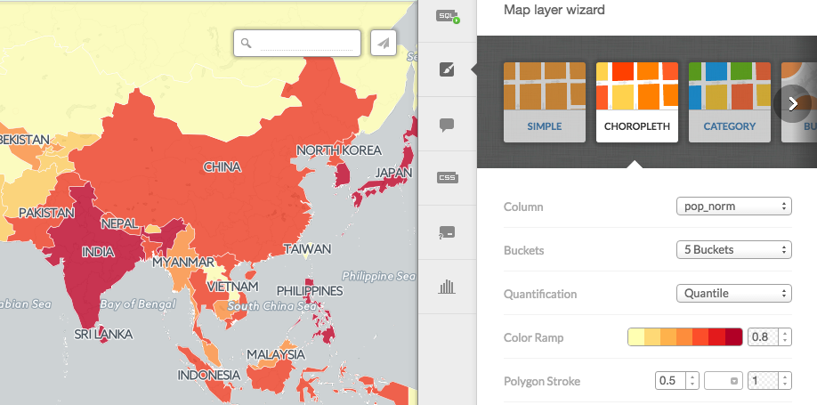

Know more about chosing the right map to make [here](http://academy.cartodb.com/courses/intermediate-design/which-kind-of-map-should-i-make/).

### 3.2 Styles

The last link in the website referenced above is a great discussion about the different maps CartoDB allows to create.

#### **Simple Map**:

```css
/** simple visualization */

#layer{
  polygon-fill: #FF6600;
  polygon-opacity: 0.7;
  line-color: #FFF;
  line-width: 0.5;
  line-opacity: 1;
}
```

#### **Choropleth Map**:

```css
/** choropleth visualization */

#layer{
  polygon-fill: #FFFFB2;
  polygon-opacity: 0.8;
  line-color: #FFF;
  line-width: 0.5;
  line-opacity: 1;
}
#layer [ pop_norm <= 247992435.530086] {
   polygon-fill: #B10026;
}
#layer [ pop_norm <= 4086677.23673585] {
   polygon-fill: #E31A1C;
}
#layer [ pop_norm <= 1538732.3943662] {
   polygon-fill: #FC4E2A;
}
#layer [ pop_norm <= 923491.374542489] {
   polygon-fill: #FD8D3C;
}
#layer [ pop_norm <= 616975.331234902] {
   polygon-fill: #FEB24C;
}
#layer [ pop_norm <= 326396.192958792] {
   polygon-fill: #FED976;
}
#layer [ pop_norm <= 95044.5589361554] {
   polygon-fill: #FFFFB2;
}
```

#### Proportional symbols map

Take a look on this excellent [blog post by Mamata Akella](https://blog.cartodb.com/proportional-symbol-maps/)_ regarding how to produce proportional symbols maps. The easiest ones being buble maps since it's directly supported by CartoDB wizards. The other type, the graduated symbols where you compute the radius of the symbol to be used later on the CartoCSS section needs a bit of SQL computation but nothing hard.

```sql
WITH aux AS(
  SELECT
    max(pop2005) AS max_pop
  FROM
    world_borders
  )
SELECT
  cartodb_id,
  pop2005,
  ST_Centroid(the_geom_webmercator) AS the_geom_webmercator,
  5+30*sqrt(pop2005)/sqrt(aux.max_pop) AS size
FROM
  world_borders,
  aux
```
```css
#layer{
  marker-fill-opacity: 0.8;
  marker-line-color: #FFF;
  marker-line-width: 1;
  marker-line-opacity: 1;
  marker-width: [size];
  marker-fill: #FF9900;
  marker-allow-overlap: true;
}
```

#### Two-variable CartoCSS

It's common practice to use two visual variables, typically color and size to represent one or two variables. To do this easily using CartoDB wizards you start for example with a coropleth map, copy on a separate text file the CartoCSS section where the field is used to color the geometries, then change the wizard to the bubble map and paste the previous code so instead of one color bubbles you get both variables styled.

* **SQL**

```sql
WITH aux AS
  (
  SELECT
    max (pop_max) AS max_population
  FROM
    ne_10m_populated_places_simple
  )
SELECT
  a.*,
  (pop_max*100)/aux.max_population AS pop_norm
FROM
  ne_10m_populated_places_simple a,
  aux
```

* **CartoCSS**

```css
/** bubble visualization */
#ne_10m_populated_places_simple [ pop_norm < 100] {
   marker-width: 25.0;
}
#ne_10m_populated_places_simple [ pop_norm < 90] {
   marker-width: 23.3;
}
#ne_10m_populated_places_simple [ pop_norm < 80] {
   marker-width: 21.7;
}
#ne_10m_populated_places_simple [ pop_norm < 70] {
   marker-width: 20.0;
}
#ne_10m_populated_places_simple [ pop_norm < 60] {
   marker-width: 18.3;
}
#ne_10m_populated_places_simple [ pop_norm < 50] {
   marker-width: 16.7;
}
#ne_10m_populated_places_simple [ pop_norm < 40 {
   marker-width: 15.0;
}
#ne_10m_populated_places_simple [ pop_norm < 30] {
   marker-width: 13.3;
}
#ne_10m_populated_places_simple [ pop_norm < 20] {
   marker-width: 11.7;
}
#ne_10m_populated_places_simple [ pop_norm < 10] {
   marker-width: 10.0;
}

/** category visualization */
#ne_10m_populated_places_simple[megacity=0] {
   marker-fill: #FF9900;
}
#ne_10m_populated_places_simple[megacity=1] {
   marker-fill: #B81609;
}
```

#### A combination of the two methods above

* **SQL**

```sql
WITH aux AS(
  SELECT
    max(pop2005) AS max_pop
  FROM
    world_borders_norm
  )
SELECT
  cartodb_id,
  pop2005,
  ST_Centroid(the_geom_webmercator) AS the_geom_webmercator,
  5+30*sqrt(pop2005)/sqrt(aux.max_pop) AS size
FROM
  world_borders_norm,
  aux
```

* **CartoCSS**

```css
#layer{
  marker-fill-opacity: 0.8;
  marker-line-color: #FFF;
  marker-line-width: 1;
  marker-line-opacity: 1;
  marker-width: [size];
  marker-fill: #FF9900;
  marker-allow-overlap: true;
}

#world_borders [ pop_norm <= 247992435.530086] {
   polygon-fill: #B10026;
}
#world_borders [ pop_norm <= 4086677.23673585] {
   polygon-fill: #E31A1C;
}
#world_borders [ pop_norm <= 1538732.3943662] {
   polygon-fill: #FC4E2A;
}
#world_borders [ pop_norm <= 923491.374542489] {
   polygon-fill: #FD8D3C;
}
#world_borders [ pop_norm <= 616975.331234902] {
   polygon-fill: #FEB24C;
}
#world_borders [ pop_norm <= 326396.192958792] {
   polygon-fill: #FED976;
}
#world_borders [ pop_norm <= 95044.5589361554] {
   polygon-fill: #FFFFB2;
}
```

_Know more about CartoCSS with our [documentation](https://docs.cartodb.com/cartodb-platform/cartocss/)._

### 3.3 Other elements

#### **Basemaps**:

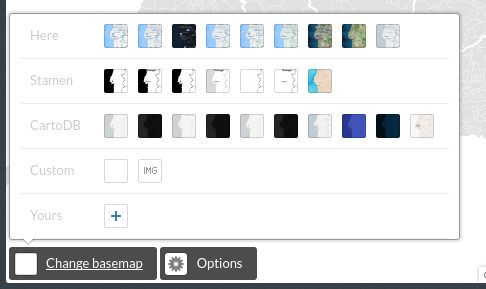

#### **Options**:

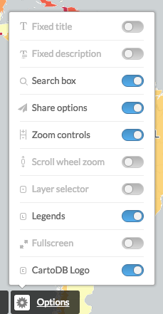

#### **Legend**:

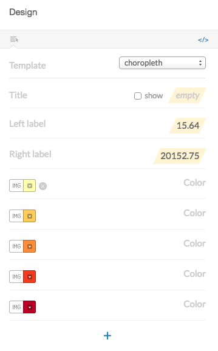

By clicking on the `</>` icon, you would see and edit the source HTML code

```html
<div class='cartodb-legend choropleth'>
<div class="legend-title">Total Population</div>
<ul>
	<li class="min">
		95044.56
	</li>
	<li class="max">
		247992435.53
	</li>
	<li class="graph count_441">
	<div class="colors">
	<div class="quartile" style="background-color:#FFFFB2"></div>
	<div class="quartile" style="background-color:#FED976"></div>
	<div class="quartile" style="background-color:#FEB24C"></div>
	<div class="quartile" style="background-color:#FD8D3C"></div>
	<div class="quartile" style="background-color:#FC4E2A"></div>
	<div class="quartile" style="background-color:#E31A1C"></div>
	<div class="quartile" style="background-color:#B10026"></div>
	</div>
	</li>
</ul>
</div>
```

#### **Labels**:

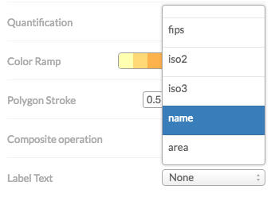

Selecting a field in the wizard will produce the following CartoCSS code to render the labels.

```css
#world_borders::labels {
  text-name: [name];
  text-face-name: 'DejaVu Sans Book';
  text-size: 10;
  text-label-position-tolerance: 10;
  text-fill: #000;
  text-halo-fill: #FFF;
  text-halo-radius: 1;
  text-dy: -10;
  text-allow-overlap: true;
  text-placement: point;
  text-placement-type: simple;
}
```

This also shows an important concept for CartoCSS. you can specify more than one rendering pass for your features. This means that using the `#layername::passname` notation you can render more than one symbol on your features. One typical example of this feature is to render lines with more than one symbol.

```css
#layer::background{
  line-width: 10;
  line-color: red;
}
#layer::foreground{
  line-width: 5;
  line-color: white;
}
```
On the above simplified CartoCSS example we use the same layer for a red background, 10 pixels widh, and then on top of it a white 5 pixels symbol.

#### Zoom based styling

The last feature we are going to cover here about CartoCSS is zoom based styling. In the same way we can do thematic maps specifying new rules for a set of features, we can also apply different rules for different zoom levels of our map. This means we can for example show the labels only between some zoom levels or increase the width of our line features when we are on high zooms. This can be achieved exactly in the same way we did with our choropleth map. So a possible

```css
@1 : #F11810;


#ne_10m_populated_places_simple{
  marker-fill-opacity: 0.9;
  marker-line-color: lighten(@1,30);
  marker-line-width: 1;
  marker-line-opacity: 1;
  marker-placement: point;
  marker-multi-policy: largest;
  marker-type: ellipse;
  marker-fill: @1;
  marker-allow-overlap: true;
  marker-clip: false;

  [zoom < 3][pop_norm <= 30]{
   marker-fill-opacity:0;
   marker-line-opacity:0;
  }
  [zoom < 5][pop_norm <= 10]{
   marker-fill-opacity:0;
   marker-line-opacity:0;
  }
  [zoom < 7][pop_norm <= 1]{
   marker-fill-opacity:0;
   marker-line-opacity:0;
  }
}

/* normal buble classification here */
```

On the example above check how we nest inside the normal CartoCSS definition some rules that will filter based on the zoom level and a field value, making transparent some features based on these criteria.

You will notice also the use of a variable `@1` and the function `lighten`. Variables and color functions are out of the scope of this training but you can check here about [colors](https://docs.cartodb.com/cartodb-platform/cartocss/properties/#color) and also about composite operations on this great [academy tutorial](https://academy.cartodb.com/courses/intermediate-design/use-composite-operations/)

#### **Infowindows and tooltip**:

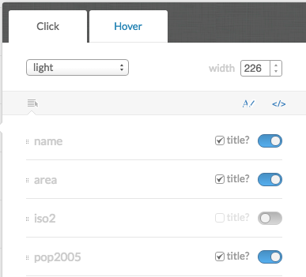

Clicking on the `</>` will also show the source code for the Infowindows.

```html
<div class="cartodb-popup v2">
  <a href="#close" class="cartodb-popup-close-button close">x</a>
  <div class="cartodb-popup-content-wrapper">
    <div class="cartodb-popup-content">
      <h4>country</h4>
      <p>{{name}}</p>
      <h4>population</h4>
      <p>{{pop_norm}}</p>
      <h4>area</h4>
      <p>{{new_area}}</p>
    </div>
  </div>
  <div class="cartodb-popup-tip-container"></div>
</div>
```

#### **Title, text and images**:

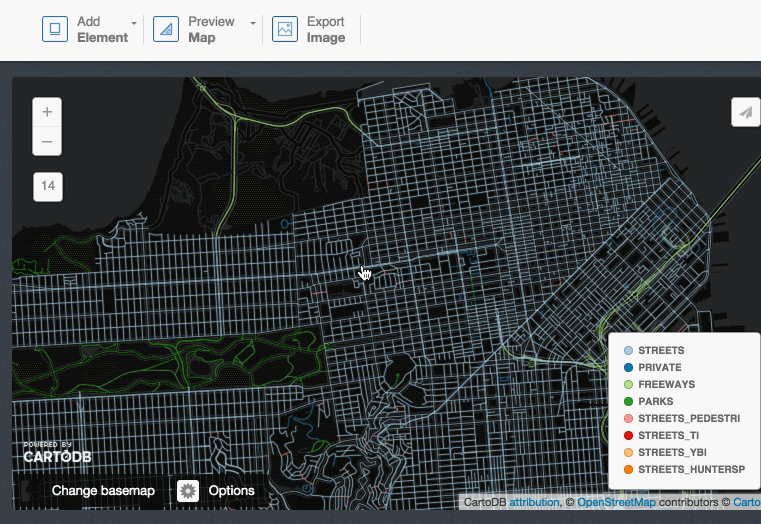

### 3.4 Share your map!

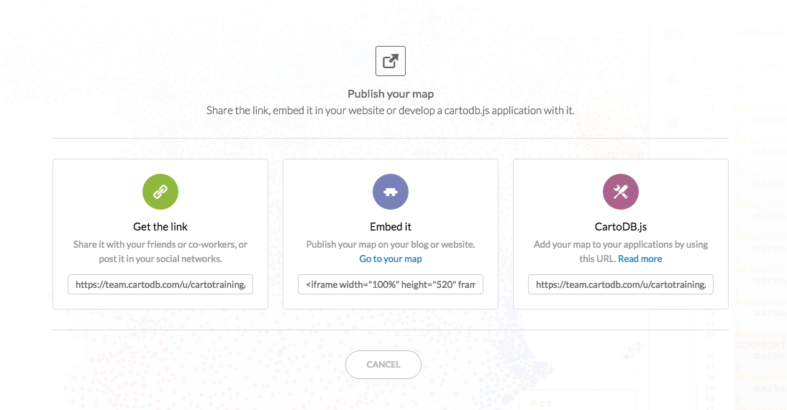

#### **Get the link**: UPDATE LINK!

[https://team.cartodb.com/u/ramirocartodb/viz/0ba65c92-120b-11e6-9ab2-0e5db1731f59/public_map](https://team.cartodb.com/u/ramirocartodb/viz/0ba65c92-120b-11e6-9ab2-0e5db1731f59/public_map)

#### **Embed it**:

```html
<iframe width="100%" height="520" frameborder="0" src="https://team.cartodb.com/u/cartotraining/viz/36d25ff0-2189-11e6-b39e-0e787de82d45/embed_map" allowfullscreen webkitallowfullscreen mozallowfullscreen oallowfullscreen msallowfullscreen></iframe>
```

<iframe width="100%" height="520" frameborder="0" src="https://team.cartodb.com/u/cartotraining/viz/36d25ff0-2189-11e6-b39e-0e787de82d45/embed_map" allowfullscreen webkitallowfullscreen mozallowfullscreen oallowfullscreen msallowfullscreen></iframe>

#### **CartoDB.js**

[https://team.cartodb.com/u/cartotraining/api/v2/viz/36d25ff0-2189-11e6-b39e-0e787de82d45/viz.json](https://team.cartodb.com/u/cartotraining/api/v2/viz/36d25ff0-2189-11e6-b39e-0e787de82d45/viz.json)

_BONUS: **[JSONView](https://chrome.google.com/webstore/detail/jsonview/chklaanhfefbnpoihckbnefhakgolnmc)**, a Google Chrome extension and **[Pretty JSON](https://github.com/dzhibas/SublimePrettyJson)**, a Sublime Text plugin to visualize json files are good resources._

### CartoDB organization features

* Your organization options
* Create/manage users of the organization
* Create groups
* Share datasets/maps with members of the organization

[CartoDB Enterprise Documentation](https://docs.cartodb.com/cartodb-enterprise/)

----

## 4. Going spatial with PostGIS <a name="postgis"></a>

### 4.1 Working with projections

#### `geometry` vs. `geography`
* **`Geometry`** uses a cartesian plane to measure and store features (CRS units):

    >The basis for the PostGIS `geometry` type is a plane. The shortest path between two points on the plane is a straight line. That means calculations on geometries (areas, distances, lengths, intersections, etc) can be calculated using cartesian mathematics and straight line vectors.

* **`Geography`** uses a sphere to measure and store features (Meters):

    >The basis for the PostGIS `geography` type is a sphere. The shortest path between two points on the sphere is a great circle arc. That means that calculations on geographies (areas, distances, lengths, intersections, etc) must be calculated on the sphere, using more complicated mathematics. For more accurate measurements, the calculations must take the actual spheroidal shape of the world into account, and the mathematics becomes very complicated indeed.

More about the `geography` type can be found [here](http://workshops.boundlessgeo.com/postgis-intro/geography.html) and [here](http://postgis.net/docs/manual-1.5/ch04.html#PostGIS_Geography).


_Source: [Boundless Postgis intro](http://workshops.boundlessgeo.com/postgis-intro)_

#### `the_geom` vs. `the_geom_webmercator`
* **`the_geom`** EPSG:4326. Unprojected coordinates in **decimal degrees** (Lon/Lat). WGS84 Spheroid.
* **`the_geom_webmercator`** EPSG:3857. UTM projected coordinates in **meters**. This is a conventional Coordinate Reference System, widely accepted as a 'de facto' standard in webmapping.

In CartoDB, **the_geom_webmercator column is the one we see represented in the map**. Know more about projections:

* In [this tutorial](http://docs.cartodb.com/tutorials/projections/).
* [Map Projections in Wikipedia](https://en.wikipedia.org/wiki/Map_projection).
* In [this CartoDB blog post](http://blog.cartodb.com/free-your-maps-web-mercator/).

### 4.2 Changing map projections

#### Accessing the **list of default projections** available in CartoDB:

```sql
SELECT
  *
FROM
  spatial_ref_sys
```

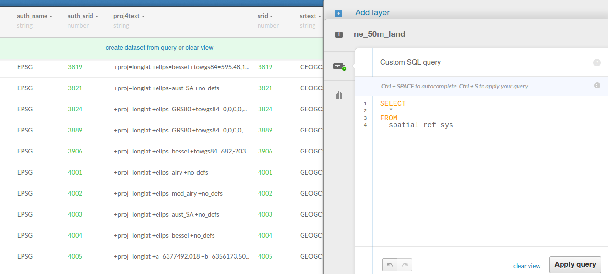

#### Accessing the hidden **the_geom_webmercator** field:

```sql
SELECT
  the_geom_webmercator
FROM
  ne_50m_land
```

#### Adding **World Robinson** projection (ESPG:54030):

```sql
INSERT INTO spatial_ref_sys
  (srid, auth_name, auth_srid, proj4text, srtext) values (54030, 'EPSG', 54030,
'+proj=robin +datum=WGS84','PROJCS["World_Robinson",
    GEOGCS["GCS_WGS_1984",
        DATUM["WGS_1984",
            SPHEROID["WGS_1984",6378137,298.257223563]],
        PRIMEM["Greenwich",0],
        UNIT["Degree",0.017453292519943295]],
    PROJECTION["Robinson"],
    PARAMETER["False_Easting",0],
    PARAMETER["False_Northing",0],
    PARAMETER["Central_Meridian",0],
    UNIT["Meter",1],
    AUTHORITY["EPSG","54030"]]');
```

#### ST_Transform()

```sql
SELECT
  cartodb_id, ST_Transform(the_geom, 54030) AS the_geom_webmercator
FROM
  ne_50m_land
```

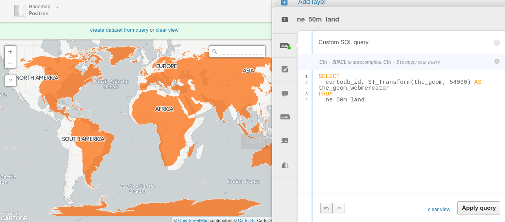

_About [`ST_Transform`](http://postgis.net/docs/ST_Transform.html)._

### 4.3 Geoprocessing

#### Create a **buffer** from points:

```sql
SELECT
  cartodb_id,
  name,
  ST_Transform(
    ST_Buffer(the_geom::geography, 50000)::geometry
    ,3857
  ) AS the_geom_webmercator
FROM
  populated_places
WHERE
  name ilike 'madrid'
```


_About [`ST_Buffer`](http://postgis.net/docs/ST_Buffer.html)._

---
**Note**: try to compute a Buffer on a place with high latitude and check the difference between using directly `the_geomwebmecator` and `the_geom::geography`
---

#### Get the **difference** between two geometries:

```sql
SELECT
  a.cartodb_id,
    ST_Difference(
        a.the_geom_webmercator,
        b.the_geom_webmercator
  ) AS the_geom_webmercator
FROM
  ne_50m_land a,
  ne_adm0_europe b
WHERE
  b.adm0_a3 like 'ESP'
```

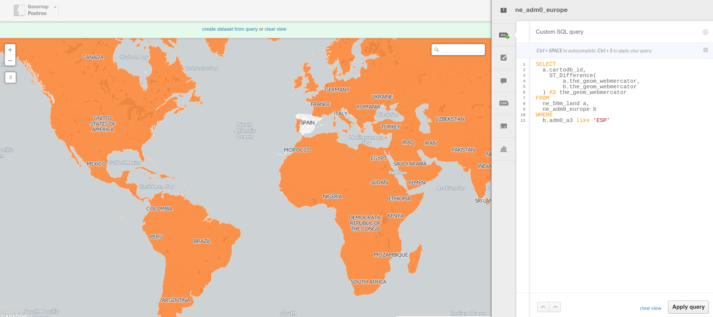

_About [`ST_Difference`](http://postgis.net/docs/ST_Difference.html)._

#### Get the number of points inside a polygon

Using `GROUP BY`:

```sql
SELECT
  e.cartodb_id,
  e.admin,
  e.the_geom_webmercator,
  count(*) AS pp_count,
  sum(p.pop_max) as sum_pop
FROM
  ne_adm0_europe e
JOIN
  ne_10m_populated_places_simple p
ON
  ST_Intersects(p.the_geom, e.the_geom)
GROUP BY
  e.cartodb_id
```

Using `LATERAL`:

```sql
SELECT
  a.cartodb_id,
  a.admin AS name,
  a.the_geom_webmercator,
  counts.number_cities,
  to_char(counts.sum_pop,'999,999,999') as sum_pop --decimal separator
FROM
  ne_adm0_europe a
CROSS JOIN LATERAL
  (
    SELECT
      count(*) as number_cities,
      sum(pop_max) as sum_pop
    FROM
      ne_10m_populated_places_simple b
    WHERE
      ST_Intersects(a.the_geom, b.the_geom)
  ) AS counts
```
_About [`ST_Intersects`](http://postgis.net/docs/ST_Intersects.html) and [Lateral JOIN](http://blog.heapanalytics.com/postgresqls-powerful-new-join-type-lateral)_

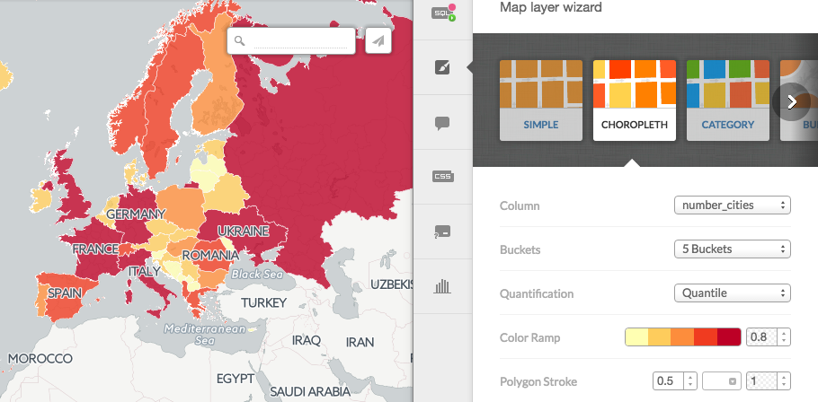

---
**Note:** You know about the `EXPLAIN ANALYZE` function? use it to take a look on how both queries are pretty similar in terms of performance.
---


#### Know wether a geometry is **within** the given range from another geometry:

```sql
SELECT
  a.*
FROM
  ne_10m_populated_places_simple a,
  ne_10m_populated_places_simple b
WHERE
    a.cartodb_id != b.cartodb_id
  AND ST_DWithin(
      a.the_geom_webmercator,
      b.the_geom_webmercator,
      150000
    )
  AND a.adm0name = 'Spain'
  AND b.adm0name = 'Spain'
```

In this case, we are using `the_geom_webmercator` to avoid casting to `geography` type. Calculations made with `geometry` type takes the CRS units.

Keep in mind that CRS **units in webmercator are not meters**, and they depend directly on the latitude.

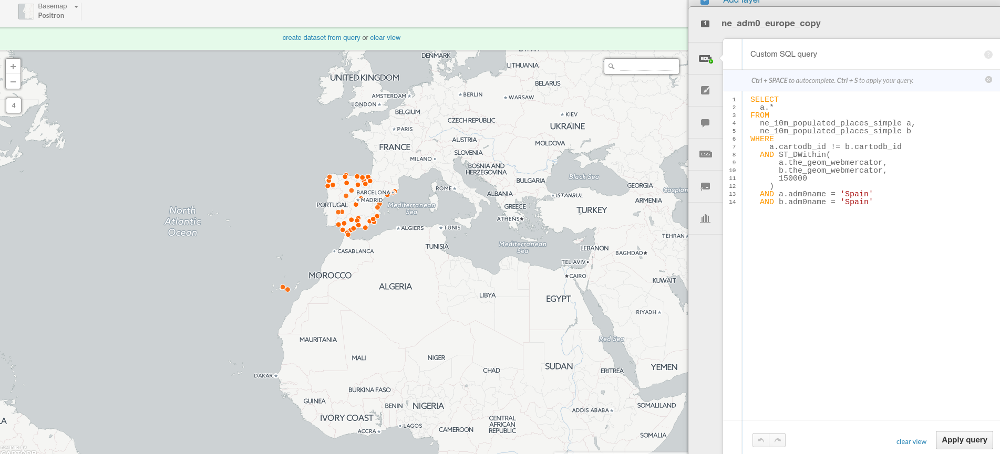

_About [`ST_DWithin`](http://postgis.net/docs/ST_DWithin.html)._

#### Create a **straight line** between two points:

```sql
SELECT
  ST_MakeLine(a.the_geom_webmercator,b.the_geom_webmercator) as the_geom_webmercator
FROM (SELECT * FROM populated_places
    WHERE name ILIKE 'madrid') as a,
    (SELECT * FROM populated_places
    WHERE name ILIKE 'barcelona'AND adm0name ILIKE 'spain') as b
```


_About [`ST_MakeLine`](http://postgis.net/docs/ST_MakeLine.html)._

#### Create **great circles** between two points:

```sql
SELECT
  ST_Transform(
  ST_Segmentize(
      ST_Makeline(
        a.the_geom,
        b.the_geom
      )::geography,
      100000
  )::geometry,
  3857
  ) as the_geom_webmercator
FROM
  (SELECT * FROM populated_places
  WHERE name ILIKE 'madrid') as a,
  (SELECT * FROM populated_places
  WHERE name ILIKE 'new york') as b
```

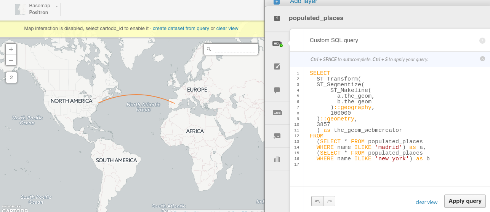

_About [Great Circles](http://blog.cartodb.com/jets-and-datelines/)._

#### Generating Grids with CDB functions

**Rectangular grid**

```sql
SELECT
  row_number() over () as cartodb_id,
  CDB_RectangleGrid(
    ST_Buffer(the_geom_webmercator,125000),
  250000,
  250000
  ) AS the_geom_webmercator
FROM
  ne_adm0_europe
WHERE
  adm0_a3 IN ('ITA','GBR')
```

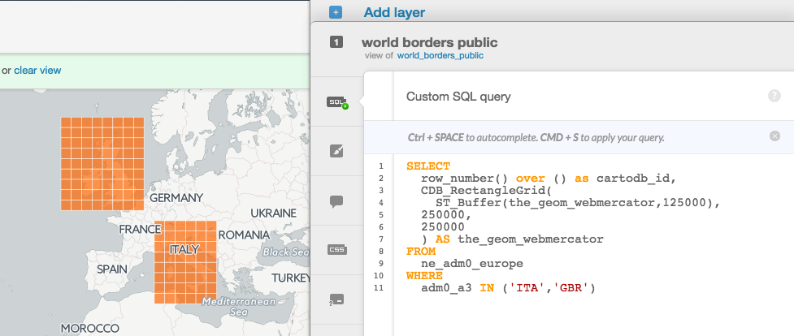

_About [CDB_RectangleGrid](http://docs.cartodb.com/tips-and-tricks/cartodb-functions/#a-rectangle-grid)_

**Adaptative Hexagonal grid**

```sql
WITH grid AS
(SELECT
  row_number() over () as cartodb_id,
  CDB_HexagonGrid(
    ST_Buffer(the_geom_webmercator, 100000),
    100000
  ) AS the_geom_webmercator
FROM
  ne_adm0_europe
WHERE
  adm0_a3 IN ('ESP','ITA'))

SELECT
  grid.the_geom_webmercator,
  grid.cartodb_id
FROM
  grid, ne_adm0_europe a
WHERE
    ST_intersects(grid.the_geom_webmercator, a.the_geom_webmercator)
  AND a.adm0_a3 IN ('ESP','ITA')
```

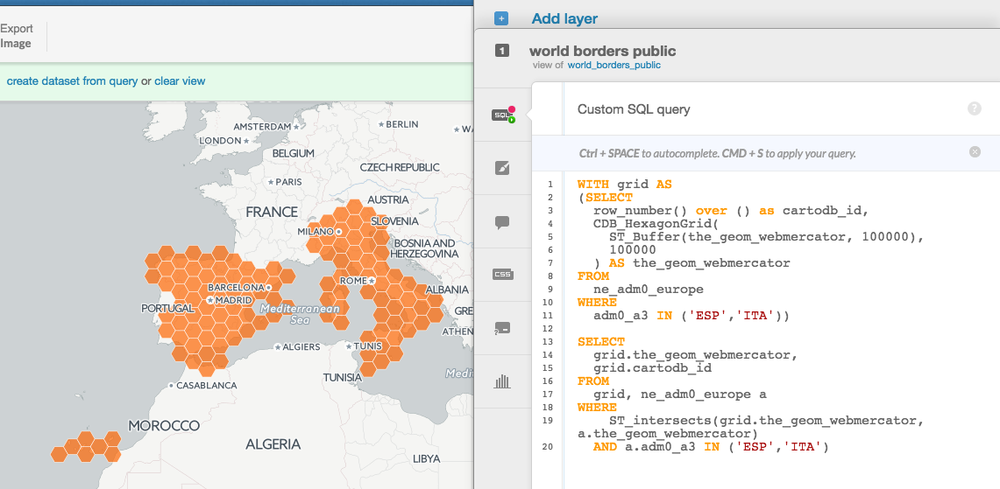

_About [CDB_HexagonGrid](http://docs.cartodb.com/tips-and-tricks/cartodb-functions/#a-hexagon-grid)_

----

## 5. Webmapping apps with CartoDB.js <a name="cartodbjs"></a>

### 5.1 CartoDB.js
[CartoDB.js](http://docs.cartodb.com/cartodb-platform/cartodb-js/) is the JavaScript library that allows to create webmapping apps using CartoDB services quickly and efficiently. It's built upon the following components:

* [jQuery](http://jquery.com)
* [Underscore.js](http://underscorejs.org)
* [Backbone.js](http://backbonejs.org/)
* It can use either [Google Maps API](https://developers.google.com/maps/) or [Leaflet](http://leafletjs.com/)

Know more about CartoDB.js [here](http://docs.cartodb.com/cartodb-platform/cartodb-js/) and [here](http://academy.cartodb.com/courses/cartodbjs-ground-up/createvis-vs-createlayer/).

### 5.2 Create Visualizations and Layers

#### `createVis()`

The most basic way to display your map from CartoDB.js involves a call to:

```javascript
cartodb.createVis(div_id, viz_json_url)
```

Couched between the `<script> ... </script>` tags, `createVis` puts a map and CartoDB data layers into the DOM element you specify. In the snippet below we assume that `<div id='map'></div>` placed earlier in an HTML file.

```javascript
window.onload = function() {
  var vizjson = 'link from share panel';
  cartodb.createVis('map', vizjson);
}
```

And that’s it! All you need is that snippet of code, a script block that sources CartoDB.js, and inclusion of the CartoDB.js CSS file. It’s really one of the easiest ways to create a custom map on your webpage. `createVis` also accepts options that you specifiy outside of the CartoDB Editor. They take the form of a [JS object](http://www.w3schools.com/js/js_objects.asp), and can be passed as a third optional argument.

```javascript
var options = {
  center: [40.4000, -3.6833], // Madrid
  zoom: 7,
  scrollwheel: true
};

cartodb.createVis('map', vizjson, options);
```

#### `createLayer()`

If you want to exercise more control over the layers and base map, `createLayer` may be the best option for you. You specifiy the base map yourself and load the layer from one or multiple viz.json files. Unlike `createVis`, `createLayer` needs a map object, such as one created by Google Maps or Leaflet. This difference allows for more control of the basemap for the JavaScript/HTML you’re writing.

A basic [Leaflet map](http://leafletjs.com/reference.html#map-class) without your data can be created as follows:

```javascript
window.onload = function() {
  // Choose center and zoom level
  var options = {
    center: [41.8369, -87.6847], // Chicago
    zoom: 7
  }

  // Instantiate map on specified DOM element
  var map = new L.Map(dom_id, options);

  // Add a basemap to the map object just created
  L.tileLayer('http://tile.stamen.com/toner/{z}/{x}/{y}.png', {
    attribution: 'Stamen'
  }).addTo(map);
}
```

The map we just created doesn’t have any CartoDB data layers yet. If you’re just adding a single layer, you can put your data on top of the basemap from above. If you want to add more, you just repeat the process. We’ll be doing much more with this later. This is the basic snippet to put your data on top of the map you just created. Drop this in below the `L.tileLayer` section.

```javascript
var vizjson = 'link from share panel';
cartodb.createLayer(map, vizjson).addTo(map);
```

### 5.3 UI Functions

#### Tooltips

A tooltip is an infowindow that appears when you hover your mouse over a map feature with vis.addOverlay(options). A tooltip appears where the mouse cursor is located on the map.

To add a tooltip to a map you need to do two steps:

First, define tooltip variable:

```javascript
  var tooltip = layer.leafletMap.viz.addOverlay({
            type: 'tooltip',
            layer: layer,
            template: '<div class="cartodb-tooltip-content-wrapper"><p>{{name}}</p></div>',
            width: 200,
            position: 'bottom|right',
            fields: [{ name: 'name' }]
  });
```
Second, add tooltip to the map:

```javascript
     $('body').append(tooltip.render().el);
```

#### Infowindows

Infowindows provide additional interactivity for your published map, controlled by layer events. It enables interaction and overrides the layer interactivity. A pop-up information window appears when a viewer clicks on a map feature.

In order to add the CartoDB.js infowindow you need to add this line within your code:

```javascript
cdb.vis.Vis.addInfowindow(map, layer, ['fields']);
```

However, you can create custom infowindows with different tools (`Moustache.js`, HTML or `underscore.js`). Whatever choice you make, you would need to create a template first and then add the infowindow with the template. Here we will see how to do it using `Moustache.js`.

[Mustache.js](http://mustache.github.io/) is a `logic-less` logic-template. That means that only tags you create templates that are replaced with a value or series of values, it works by expanding tags in a template using values provided in a hash or object.

Example: Custom infowindow template to display `cartodb_id`:

```html
  <script type="infowindow/html" id="infowindow_template">
    <div class="cartodb-popup v2">
  <a href="#close" class="cartodb-popup-close-button close">x</a>
  <div class="cartodb-popup-content-wrapper">
    <div class="cartodb-popup-content">
      <h4>ID</h4>
      <p>{{cartodb_id}}</p>
    </div>
  </div>
  <div class="cartodb-popup-tip-container"></div>
</div>
</script>
```

Then you can apply the custom infowindow template to the map with:

```javascript
cdb.vis.Vis.addInfowindow(
          map, layer, [columnName],
          {
             infowindowTemplate: $('#infowindow_template').html()
          });
```

#### Legends

In order to add legends with CartoDB.js you would need to define the elemenets and colors of the legend with HTML, then you could use the legend classes of CartoDB.js to create the legends.

There are two kind of legend classes:

First, `cartodb-legend choropleth`, applied in Choropleth maps:

```html
<div class='cartodb-legend choropleth'>
    <div class="legend-title">Population</div>
      <ul>
      	<li class="min">
      		1256
      	</li>
      	<li class="max">
      		8300
      	</li>
      	<li class="graph count_441">
      	<div class="colors">
      	<div class="quartile" style="background-color:#FFFFB2"></div>
      	<div class="quartile" style="background-color:#FED976"></div>
      	<div class="quartile" style="background-color:#FEB24C"></div>
      	<div class="quartile" style="background-color:#FD8D3C"></div>
      	<div class="quartile" style="background-color:#FC4E2A"></div>
      	<div class="quartile" style="background-color:#E31A1C"></div>
      	<div class="quartile" style="background-color:#B10026"></div>
      	</div>
      	</li>
      </ul>
  </div>
```

Second, `cartodb-legend category`, applied in simple or category maps:

```html
    <div class='cartodb-legend category'>
      <div class="legend-title" style="color:#284a59">Countries</div>
        <ul>
          <li><div class="bullet" style="background-color:#fbb4ae"></div>Spain</li>
          <li><div class="bullet" style="background-color:#ccebc5"></div>Portugal</li>
          <li><div class="bullet" style="background-color:#b3cde3"></div>France</li>
        </ul>
      </div>
```

### 5.4 Examples

* Load a visualisation with `createVis()`: [example](http://bl.ocks.org/jsanz/78d004e805ea4dbf8397814edc477a89), [editor](http://plnkr.co/edit/plhwv3IQwFxLHBGWodQp?p=preview)

* Load SQL+CartoCSS with `createLayer`: [example](http://bl.ocks.org/jsanz/8ea2c5ef8422c9f9881e2f5132e2f645), [editor](http://plnkr.co/edit/aG7ZSN24WBE6d8ZJQTqY?p=preview)

* Events. Actions on feature click: [example](http://bl.ocks.org/jsanz/1881f68fd76546eda08cafd8fdcf480c), [editor](http://plnkr.co/edit/88Qc99jdgP4X43FSTRdH?p=preview)

* Custom Infowindows: [example](http://bl.ocks.org/jsanz/a0f606c08ec854df3f5e982b3890e188), [editor](http://plnkr.co/edit/9FE6BHILGudsIrDmCzdd?p=preview)

* Custom Tooltip: [example](http://bl.ocks.org/jsanz/cd541c5a61f72e19c1e50c06fb688f40), [editor](http://plnkr.co/edit/uD0Fdw?p=preview)

* Changing SQL and CartoCSS: [example](http://bl.ocks.org/jsanz/b454ed94c8ab9131dc823166226c18ef), [editor](http://plnkr.co/edit/SzMbyj?p=preview)

#### Some more advanced examples

* [Playing with Torque time](http://bl.ocks.org/ernesmb/4939b3751d3be0cdd64b)
* [Aggregating content from clustered features with SQL](http://bl.ocks.org/ernesmb/348b9eed9ee4c7038fd7)
* [Creating a simple layer selector](http://bl.ocks.org/jsanz/6a83dbae9d6e984ca938)

----
