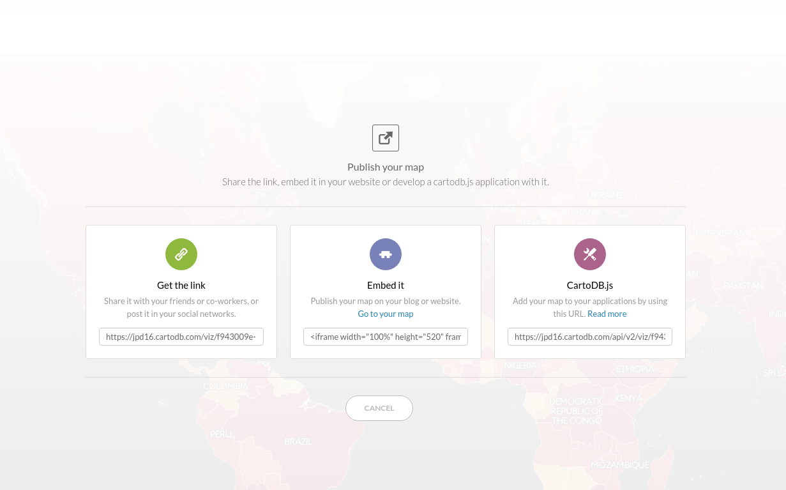

* Speaker: Ramiro Aznar · ramiroaznar@cartodb.com · [@ramiroaznar](http://twitter.com/ramiroaznar)
* May 26th 2016
* [Máster en Gestión de Desastres](http://www.mat.ucm.es/mgd/)· UCM y UPM · Madrid

## [http://bit.ly/intro-mgd](http://bit.ly/intro-mgd)

## Contents
- [1. Importing datasets](#import)
- [2. Getting your data ready](#dataset)
- [3. Making a map](#map)
- [4. Mini-Project: Subterranean evacuation routes](#project)


----

# Introduction to CartoDB Workshop for MSc Disasters Management students

## 1. Importing datasets <a name="import"></a>

### 1. 1. Supported Geospatial Data Files
CartoDB supports the following geospatial data formats to upload vector data*:

* **`Shapefile`**.
* **`KML`**.
* **`KMZ`**.
* **`GeoJSON`****. 
* **`CSV`**.
* **`Spreedsheets`**.
* **`GPX`**.
* **`OSM`**.

### 1. 2. Common importing errors
* **Dataset too large**:
	* File size limit: 150 Mb (free).
	* Import row limit: 500,000 rows (free).
	* *Solution*: split your dataset into smaller ones, import them into CartoDB and merge them.
<br/>
* **Malformed CSV**:
	* *Solution*: check termination lines, header...
<br/>
* **Encoding**:
	* *Solution*: `Save with Encoding` > `UTF-8 with BOM` in [Sublime Text](https://www.sublimetext.com/).
<br/>
* **Shapefile missing files**:
	* Missing any of the following files within the compressed file will produce an importing error:
		* `.shp`: contains the geometry. REQUIRED.
		* `.shx`: contains the shape index. REQUIRED.
		* `.prj`: contains the projection. REQUIRED.
		* `.dbf`: contains the attributes. REQUIRED.
	* Other auxiliary files such as `.sbn`, `.sbx` or `.shp.xml` are not REQUIRED.
	* *Solution*: make sure to add all required files.
<br/>
* **Duplicated id fields**:
	* *Solution*: check your dataset, remove or rename fields containing the `id` keyword.
<br/>
* **Format not supported**:
	* URLs -that are not points to a file- are not supported by CartoDB. 
	* *Solution*: check for missing url parameters or download the file into your local machine, import it into CartoDB.
<br/>

Other importing errors and their codes can be found [here](http://docs.cartodb.com/cartodb-platform/import-api/import-errors/). 

> **Practice!** Download and import into CartoDB the following datasets:
- *hospitales*, [download dataset as `csv` file](https://ramiro-training.cartodb.com/tables/hospitales).
- *estaciones*, [download dataset as `shapefile` file](https://ramiro-training.cartodb.com/tables/estaciones).
- *lineas*, [download dataset as `shapefile` file](https://ramiro-training.cartodb.com/tables/lineas).
- *escenarios*, [download dataset as `shapefile` file](https://ramiro-training.cartodb.com/tables/escenarios).
*Check this [link](http://www.openstreetmap.org/?mlat=40.44893&mlon=-3.73285#map=18/40.44893/-3.73285) in order to view the **OpenStreetMap** bounding box where some of the data was extracted (as a `.osm` file).


----

## 2. Getting your data ready <a name="dataset"></a>

### 2. 1. Geocoding

If you have a column with longitude coordinates and another with latitude coordinates, CartoDB will automatically detect and covert values into `the_geom`. If this is not the case, CartoDB can help you by turning the named places into best guess of latitude-longitude coordinates:

* **By Lon/Lat Columns**.
* **By City Names**.
* **By Admin. Regions**.
* **By Postal Codes**.
* **By IP Addresses**.
* **By Street Addresses**.

Know more about geocoding in CartoDB in [**this tutorial**](http://docs.cartodb.com/tutorials/how_to_georeference/).

> **Practice!** Georeference the *hospitales* dataset.

### 2. 2. Datasets

Search, connect and disable syncronization of the following datasets:

* **Populated Places** [`ne_10m_populated_places_simple`]: City and town points.
* **World Borders** [`world_borders`]: World countries borders.
* **European countries** [`ne_adm0_europe`]: European countries geometries.

### 2. 3. Selecting

* Selecting **all the columns**:

```sql
SELECT
  *
FROM
  ne_10m_populated_places_simple;
```

* Selecting **some columns**:

```sql
SELECT
  cartodb_id,
  name as city,
  adm1name as region,
  adm0name as country,
  pop_max,
  pop_min
FROM 
  ne_10m_populated_places_simple
```

* Selecting **distinc values**:

```sql
SELECT DISTINCT
  adm0name as country
FROM 
  ne_10m_populated_places_simple
```

* Selecting **aggregated values**:

```sql
SELECT
  count(*) as total_rows --other aggregated functions: sum(), avg()...
FROM 
  ne_10m_populated_places_simple
```

### 2. 4. Filtering


* Filtering **numeric fields**:

```sql
SELECT 
  * 
FROM 
  ne_10m_populated_places_simple
WHERE
  pop_max > 5000000;
```

* Filtering **character fields**:

```sql
SELECT 
  *
FROM 
  ne_10m_populated_places_simple
WHERE 
  adm0name ilike 'spain'
```

* Filtering a **range**:

```sql
SELECT 
  *
FROM 
  ne_10m_populated_places_simple
WHERE 
  name in ('Madrid', 'Barcelona')
AND
  adm0name ilike 'spain'
```

### 2. 5. Ordering and limiting results:

* **Ordering results**:

```sql
SELECT 
  cartodb_id,
  name as city,
  adm1name as region,
  adm0name as country,
  pop_max
FROM 
  ne_10m_populated_places_simple
WHERE 
  adm0name ilike 'spain'
ORDER BY
  pop_max DESC
```

* **Limiting results**:

```sql
SELECT 
  cartodb_id,
  the_geom_webmercator,
  name as city,
  adm1name as region,
  adm0name as country,
  pop_max
FROM 
  ne_10m_populated_places_simple
WHERE 
  adm0name ilike 'spain'
ORDER BY
  pop_max DESC LIMIT 10
```

### 2. 5. Spatial Analysis:

* Create a **buffer** from points:

```sql
SELECT
  cartodb_id,
  name,
  ST_Transform(
    ST_Buffer(the_geom::geography, 50000)::geometry
    ,3857
  ) AS the_geom_webmercator
FROM
  ne_10m_populated_places_simple
WHERE
  name ilike 'madrid'
```


* Know if tow geometries **intersect**:

```sql
SELECT
  a.*
FROM
  ne_10m_populated_places_simple a,
  ne_adm0_europe b
WHERE
  ST_Intersects(
    b.the_geom_webmercator,
    a.the_geom_webmercator
  )
```


*About [`ST_Intersects`](http://postgis.net/docs/ST_Intersects.html).

* Know wether a geometry is **within** the given range from another geometry:

```sql
SELECT
  a.*
FROM
  ne_10m_populated_places_simple a,
  ne_10m_populated_places_simple b
WHERE
    a.cartodb_id != b.cartodb_id
  AND ST_DWithin(
      a.the_geom_webmercator,
      b.the_geom_webmercator,
      150000
    )
  AND a.adm0name = 'Spain'
  AND b.adm0name = 'Spain'
```


*About [`ST_DWithin`](http://postgis.net/docs/ST_DWithin.html).

> **Practice!** Select metro stations from L1 using the following three methods:
- Filtering by (string) range ([query](https://gist.github.com/ramiroaznar/141c2a451bff3507e331eb4d13329466#file-filtering-sql)).
- Selecting stations which intersect with a 100m buffer of the L1 metro line ([query](https://gist.github.com/ramiroaznar/78381815df1d03547f724584702c0da9#file-intersect-buffer-sql)).
- Selecting stations within a minimun distance of 100m from the L1 metro line ([query](https://gist.github.com/ramiroaznar/95c7491cfc187dab362dc608eeb9c3a4#file-dwithin-sql)).


----

## 3. Making a map <a name="map"></a>

### 3. 1. Wizard

[Analyzing your dataset...](http://docs.cartodb.com/cartodb-editor/datasets/#analyzing-your-dataset) In some cases, when you connect a dataset and click on the MAP VIEW for the first time, the Analyzing dataset dialog appears. This analytical tool analyzes the data in each column, predicts how to visualize this data, and offers you snapshots of the visualized maps. You can select one of the possible map styles, or ignore the analyzing dataset suggestions.

* **Simple Map**.
* **Cluster Map**.
* **Category Map**.
* **Bubble Map**.
* **Torque Map**.
* **Heatmap Map**.
* **Torque Cat Map**.
* **Intensity Map**.
* **Density Map**.
* **Choropleth Map**:

Before making a choropleth map, we need to normalize our target column. So we are going to create two new columns with `numeric` as data type: `new_area` and `pop_norm`. Finally, run the following SQL queries to update their values:

```sql
UPDATE
  world_borders
SET
  new_area = round(st_area(the_geom)::numeric, 6)
```

```sql
UPDATE
  world_borders
SET
  pop_norm = pop2005 / new_area
```


Know more about chosing the right map to make [here](http://academy.cartodb.com/courses/intermediate-design/which-kind-of-map-should-i-make/).

### 3. 2. Styles

* **Simple Map**:

```css
/** simple visualization */

#world_borders{
  polygon-fill: #FF6600;
  polygon-opacity: 0.7;
  line-color: #FFF;
  line-width: 0.5;
  line-opacity: 1;
}
```

* **Choropleth Map**:

```css
/** choropleth visualization */

#world_borders{
  polygon-fill: #FFFFB2;
  polygon-opacity: 0.8;
  line-color: #FFF;
  line-width: 0.5;
  line-opacity: 1;
}
#world_borders [ pop_norm <= 247992435.530086] {
   polygon-fill: #B10026;
}
#world_borders [ pop_norm <= 4086677.23673585] {
   polygon-fill: #E31A1C;
}
#world_borders [ pop_norm <= 1538732.3943662] {
   polygon-fill: #FC4E2A;
}
#world_borders [ pop_norm <= 923491.374542489] {
   polygon-fill: #FD8D3C;
}
#world_borders [ pop_norm <= 616975.331234902] {
   polygon-fill: #FEB24C;
}
#world_borders [ pop_norm <= 326396.192958792] {
   polygon-fill: #FED976;
}
#world_borders [ pop_norm <= 95044.5589361554] {
   polygon-fill: #FFFFB2;
}
```

* **Category Map**.
* **Bubble Map**.
* **Torque Map**.
* **Heatmap Map**.
* **Torque Cat Map**.
* **Intensity Map**.
* **Density Map**.

Know more about CartoCSS with our [documentation](http://docs.cartodb.com/cartodb-editor/datasets/#analyzing-your-dataset).

### 3. 3. Other elements

* **Basemaps**:


* **Options**:


* **Legend**:


```html
<div class='cartodb-legend choropleth'>	
<div class="legend-title">Total Population</div>
<ul>
	<li class="min">
		95044.56
	</li>
	<li class="max">
		247992435.53
	</li>
	<li class="graph count_441">
	<div class="colors">
	<div class="quartile" style="background-color:#FFFFB2"></div>
	<div class="quartile" style="background-color:#FED976"></div>
	<div class="quartile" style="background-color:#FEB24C"></div>
	<div class="quartile" style="background-color:#FD8D3C"></div>
	<div class="quartile" style="background-color:#FC4E2A"></div>
	<div class="quartile" style="background-color:#E31A1C"></div>
	<div class="quartile" style="background-color:#B10026"></div>
	</div>
	</li>
</ul>
</div>
```

* **Labels**:


```css
#world_borders::labels {
  text-name: [name];
  text-face-name: 'DejaVu Sans Book';
  text-size: 10;
  text-label-position-tolerance: 10;
  text-fill: #000;
  text-halo-fill: #FFF;
  text-halo-radius: 1;
  text-dy: -10;
  text-allow-overlap: true;
  text-placement: point;
  text-placement-type: simple;
}
```

* **Infowindows and tooltip**:


```html
<div class="cartodb-popup v2">
  <a href="#close" class="cartodb-popup-close-button close">x</a>
  <div class="cartodb-popup-content-wrapper">
    <div class="cartodb-popup-content">
      <h4>country</h4>
      <p>{{name}}</p>
      <h4>population</h4>
      <p>{{pop_norm}}</p>
      <h4>area</h4>
      <p>{{new_area}}</p>
    </div>
  </div>
  <div class="cartodb-popup-tip-container"></div>
</div>
```

* **Title, text and images**:


### 3. 4. Share your map!



* **Get the link**: [https://team.cartodb.com/u/ramirocartodb/viz/0ba65c92-120b-11e6-9ab2-0e5db1731f59/public_map](https://team.cartodb.com/u/ramirocartodb/viz/0ba65c92-120b-11e6-9ab2-0e5db1731f59/public_map)

* **Embed it**: 

<iframe width="100%" height="520" frameborder="0" src="https://team.cartodb.com/u/ramirocartodb/viz/0ba65c92-120b-11e6-9ab2-0e5db1731f59/embed_map" allowfullscreen webkitallowfullscreen mozallowfullscreen oallowfullscreen msallowfullscreen></iframe>

* **CartoDB.js** [vizJSON file*]: https://team.cartodb.com/u/ramirocartodb/api/v2/viz/0ba65c92-120b-11e6-9ab2-0e5db1731f59/viz.json

> **Practice!** Make the Madrid Metro map as a category map coloring metro lines according to their real colors ([CartoCSS](https://gist.github.com/ramiroaznar/bdb65fb9da5b1b39898bfdd48dfc3d84#file-style-css)).

<iframe width="100%" height="520" frameborder="0" src="https://ramiro-training.cartodb.com/viz/9daf5b34-2197-11e6-b1f0-0ecfd53eb7d3/embed_map" allowfullscreen webkitallowfullscreen mozallowfullscreen oallowfullscreen msallowfullscreen></iframe>

----

## 4. Mini-Project: Subterranean evacuation routes <a name="project"></a>


----
