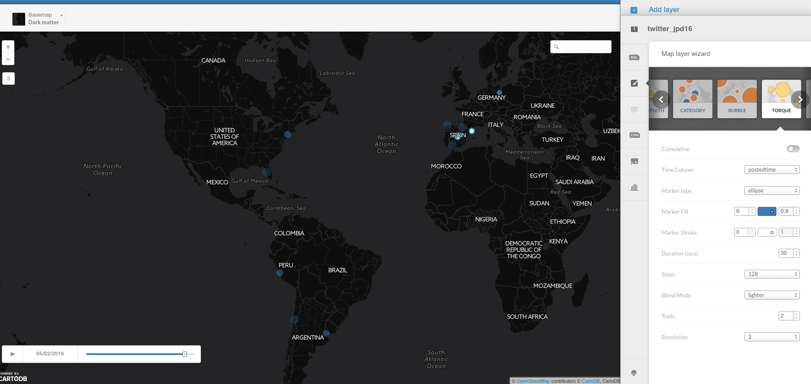
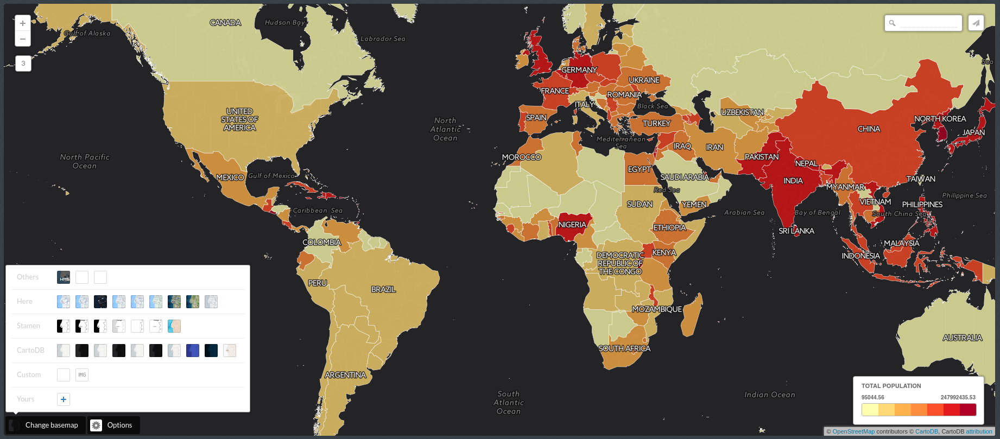
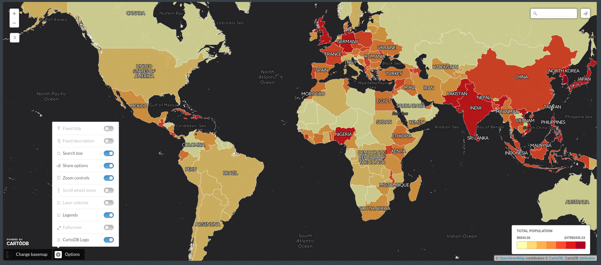
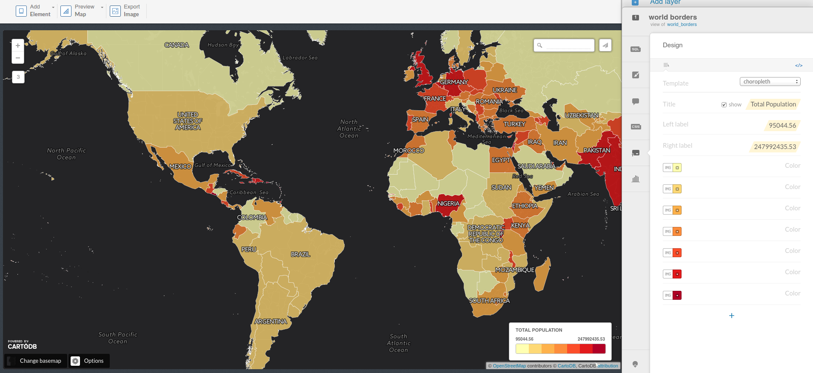

* Speaker: Ramiro Aznar · ramiroaznar@cartodb.com · [@ramiroaznar](http://twitter.com/ramiroaznar)
* 6th May 2016
* [JPD16](http://jpd16.okfn.es/)· IV Jornadas de Periodismo de Datos · Madrid

# Introduction to CartoDB Workshop for Data Journalists

## 1. Importing datasets

### 1. 1. Supported Geospatial Data Files
CartoDB supports the following geospatial data formats to upload vector data:

* **`Shapefile`**: a shapefile has to be formed, at least, by a `.shp` file, a `.shx` file, a `.prj` file and a `.dbf` file. These files contain the geometry data, the indexes, the projection information and the attributes, respectively. Shapefiles must be imported as a single compressed file, in the `.zip` or `.gz` format. *Limitations*:
    * The column name cannot exceed 10 characters.
    * Date columns only support the date, not the time.
    * It is recommended to upload Shapefiles in the EPSG 4326 projection.
    * Ensure you save your Shapefile with encoding UTF-8, prior importing.
<br/>
* **`KML`**: the KML format is a XML based format which adds to it a geographical meaning by being able to define features such as points, polygons or lines in the EPSG 4326 projection.

* **`KMZ`**: a Keyhole Markup language Zipped (KMZ) file corresponds to a compressed file, including a KML file and zero, or more, supporting files (images, icons, overlays or other elements referenced in the KML file).

* **`GeoJSON`**: the GeoJSON format is an extension of the JavaScript Object Notation (JSON) that encodes geographical features and their metadata. More detailed information about GeoJSON format [here](http://geojson.org/geojson-spec.html).

* **`CSV`**: Comma-Separated Values (or TSV, Tab-Separated Values) files can be imported to CartoDB. *Limitations*:
	* The first line of the CSV file must contain the name of the columns (headers).
	* The rest of the lines of the CSV file must follow the schema defined by the header column, in terms of number of columns.
	* It is recommended that string values are double-quoted (`"example"`).
	* If the data itself contains quotes, the values must be double-quoted and the internal quotes must be escaped (`"Null Island", "{""type"": ""Point"", ""coordinates"": [0,0]}"`).
	* CSV lines must be terminated with CR/LF, or LF [line terminators](https://en.wikipedia.org/wiki/Newline). 
<br/>
* **`Spreedsheets`**: spreadsheets such as Excel spreadsheets, OpenDocument spreadsheets or Google Drive spreadsheets are supported by CartoDB. *Limitations*:
	* The first row must contain the names for each column.
	* Merged cells are not supported.
	* Graphs, charts, or other kind of elements are not supported.
<br/>
* **`GPX`**: the GPX (GPS Exchange Format) files are XML documents that contain waypoints, tracks and/or routes. When importing a GPX file, CartoDB will generate different datasets for points, tracks and waypoints. The resulting names of these datasets will be a combination of the GPX name and their type:` _track_points`, `_tracks`, and `_waypoints`, respectively.

* **`OSM`**: CartoDB supports importing Open Street Map dumps (`.osm` files). These files are XML documents that have a `osm` parent element that can contain blocks of nodes, ways, or relations representing points, lines or polygons. CartoDB will automatically separate OSM dumps into different tables, depending on the geometry. Therefore, importing a single OSM file can lead to more than one resulting dataset.

*Importing **different geometry types** in the same layer or in a FeatureCollection element (GeoJSON) is not supported. More detailed information [here](http://docs.cartodb.com/cartodb-platform/import-api/geospatial-data-formats/#supported-geospatial-data-formats).

### 1. 2. Common importing errors
* **Dataset too large**:
	* File size limit: 150 Mb (free).
	* Import row limit: 500,000 rows (free).
	* *Solution*: split your dataset into smaller ones, import them into CartoDB and merge them.
<br/>
* **Malformed CSV**:
	* *Solution*: check termination lines, remove header...
<br/>
* **Encoding**:
	* *Solution*: `Save with Encoding` > `UTF-8 with BOM` in [Sublime Text](https://www.sublimetext.com/).
<br/>
* **Shapefile missing files**:
	* Missing any of the following files within the compressed file will produce an importing error:
		* `.shp`: contains the geometry. REQUIRED.
		* `.shx`: contains the shape index. REQUIRED.
		* `.prj`: contains the projection. REQUIRED.
		* `.dbf`: contains the attributes. REQUIRED.
	* Other auxiliary files such as `.sbn`, `.sbx` or `.shp.xml` are not REQUIRED.
	* *Solution*: make sure to add all required files.
<br/>
* **Duplicated id fields**:
	* *Solution*: check your dataset, remove or rename fields containing the `id` keyword.
<br/>
* **Format not supported**:
	* URLs -that are not points to a file- are not supported by CartoDB. 
	* *Solution*: check for missing url parameters or download the file into your local machine, import it into CartoDB.
<br/>
* **MAYUS extensions not supported**:
	* `example.CSV` is not supported by CartoDB.
	* *Solution*: rename the file.
<br/>

Other importing errors and their codes can be found [here](http://docs.cartodb.com/cartodb-platform/import-api/import-errors/). 


## 2. Getting your data ready

### 2. 1. Geocoding

If you have a column with longitude coordinates and another with latitude coordinates, CartoDB will automatically detect and covert values into `the_geom`*. If this is not the case, CartoDB can help you by turning the named places into best guess of latitude-longitude coordinates:

* **By Lon/Lat Columns**.
* **By City Names**.
* **By Admin. Regions**.
* **By Postal Codes**.
* **By IP Addresses**.
* **By Street Addresses**.

Know more about geocoding in CartoDB:

* In [**this tutorial**](http://docs.cartodb.com/tutorials/how_to_georeference/).
* In [**our Location Data Services website**](https://cartodb.com/location-data-services/geocoding/).
* In our [**documentation**](http://docs.cartodb.com/cartodb-platform/dataservices-api/geocoding-functions/).

&#42;About geometry columns:

* **`the_geom`** EPSG:4326. Unprojected coordinates in **decimal degrees** (Lon/Lat). WGS84 Spheroid.
* **`the_geom_webmercator`** EPSG:3857. UTM projected coordinates in **meters**. This is a conventional Coordinate Reference System, widely accepted as a 'de facto' standard in webmapping.

### 2. 2. Datasets

* **Populated Places** [`ne_10m_populated_places_simple`]: City and town points.
* **European Countries** [`ne_adm0_europe`]: European countries geometries.
* **World Borders** [`world_borders`]: World countries borders.

### 2. 3. Selecting

* Selecting **all the columns**:

```sql
SELECT
  *
FROM
  ne_10m_populated_places_simple;
```

* Selecting **some columns**:

```sql
SELECT
  cartodb_id,
  name as city,
  adm1name as region,
  adm0name as country,
  pop_max,
  pop_min
FROM 
  ne_10m_populated_places_simple
```

* Selecting **distinc values**:

```sql
SELECT DISTINCT
  adm0name as country
FROM 
  ne_10m_populated_places_simple
```

### 2. 4. Filtering


* Filtering **numeric fields**:

```sql
SELECT 
  * 
FROM 
  ne_10m_populated_places_simple
WHERE
  pop_max > 5000000;
```

* Filtering **character fields**:

```sql
SELECT 
  *
FROM 
  ne_10m_populated_places_simple
WHERE 
  adm0name ilike 'spain'
```

* Filtering a **range**:

```sql
SELECT 
  *
FROM 
  ne_10m_populated_places_simple
WHERE 
  name in ('Madrid', 'Barcelona')
AND
  adm0name ilike 'spain'
```

* **Combining** character and numeric filters:

```sql
SELECT 
  *
FROM 
  ne_10m_populated_places_simple
WHERE 
  name in ('Madrid', 'Barcelona')
AND
  adm0name ilike 'spain'
AND
  pop_max > 5000000
```

### 2. 5. Others:

* Selecting **aggregated values**:

```sql
SELECT
  count(*) as total_rows
FROM 
  ne_10m_populated_places_simple
```

```sql
SELECT
  sum(pop_max) as total_pop_spain
FROM 
  ne_10m_populated_places_simple
WHERE 
  adm0name ilike 'spain'
```

```sql
SELECT 
  avg(pop_max) as avg_pop_spain
FROM 
  ne_10m_populated_places_simple
WHERE 
  adm0name ilike 'spain'
```

* **Ordering results**:

```sql
SELECT 
  cartodb_id,
  name as city,
  adm1name as region,
  adm0name as country,
  pop_max
FROM 
  ne_10m_populated_places_simple
WHERE 
  adm0name ilike 'spain'
ORDER BY
  pop_max DESC
```

* **Limiting results**:

```sql
SELECT 
  cartodb_id,
  name as city,
  adm1name as region,
  adm0name as country,
  pop_max
FROM 
  ne_10m_populated_places_simple
WHERE 
  adm0name ilike 'spain'
ORDER BY
  pop_max DESC LIMIT 10
```

## 3. Making a map

### 2. 1. Wizard

[Analyzing your dataset...](http://docs.cartodb.com/cartodb-editor/datasets/#analyzing-your-dataset) In some cases, when you connect a dataset and click on the MAP VIEW for the first time, the Analyzing dataset dialog appears. This analytical tool analyzes the data in each column, predicts how to visualize this data, and offers you snapshots of the visualized maps. You can select one of the possible map styles, or ignore the analyzing dataset suggestions.

* **Simple Map**:


* **Cluster Map**:


* **Choropleth Map**:

Before making a choropleth map, we need to normalize our target column. So we are going to create two new columns with `numeric` as data type: `new_area` and `po_norm`. Finally, run the following SQL queries to update their values:

```sql
UPDATE
  world_borders
SET
  new_area = round(st_area(the_geom)::numeric, 6)
```

```sql
UPDATE
  world_borders
SET
  pop_norm = pop2005 / new_area
```


* **Category Map**:


* **Bubble Map**:


* **Torque Map**:



* **Heatmap Map**:


* **Torque Cat Map**:


* **Intensity Map**:


* **Density Map**:


Know more about chosing the right map to make [here](http://academy.cartodb.com/courses/intermediate-design/which-kind-of-map-should-i-make/).

### 2. 2. Styles

* **Simple Map**:

```css
/** simple visualization */

#world_borders{
  polygon-fill: #FF6600;
  polygon-opacity: 0.7;
  line-color: #FFF;
  line-width: 0.5;
  line-opacity: 1;
}
```

* **Cluster Map**:

```css
/** cluster visualization */

#populated_places{
  marker-width: 12;
  marker-fill: #FD8D3C;
  marker-line-width: 1.5;
  marker-fill-opacity: 1;
  marker-line-opacity: 1;
  marker-line-color: #fff;
  marker-allow-overlap: true;

  [src = 'bucketC'] {
    marker-line-width: 5;
    marker-width: 24;
  } 

  [src = 'bucketB'] {
    marker-line-width: 5;
    marker-width: 44;
  } 

  [src = 'bucketA'] {
    marker-line-width: 5;
    marker-width: 64;
  } 
}

#populated_places::labels { 
  text-size: 0; 
  text-fill: #fff; 
  text-opacity: 0.8;
  text-name: [points_count]; 
  text-face-name: 'DejaVu Sans Book'; 
  text-halo-fill: #FFF; 
  text-halo-radius: 0; 

  [src = 'bucketC'] {
    text-size: 12;
    text-halo-radius: 0.5;
  }

  [src = 'bucketB'] {
    text-size: 17;
    text-halo-radius: 0.5;
  }

  [src = 'bucketA'] {
    text-size: 22;
    text-halo-radius: 0.5;
  }

  text-allow-overlap: true;

  [zoom>11]{ text-size: 16; }
  [points_count = 1]{ text-size: 0; }
}
```

* **Choropleth Map**:

```css
/** choropleth visualization */

#world_borders{
  polygon-fill: #FFFFB2;
  polygon-opacity: 0.8;
  line-color: #FFF;
  line-width: 0.5;
  line-opacity: 1;
}
#world_borders [ pop_norm <= 247992435.530086] {
   polygon-fill: #B10026;
}
#world_borders [ pop_norm <= 4086677.23673585] {
   polygon-fill: #E31A1C;
}
#world_borders [ pop_norm <= 1538732.3943662] {
   polygon-fill: #FC4E2A;
}
#world_borders [ pop_norm <= 923491.374542489] {
   polygon-fill: #FD8D3C;
}
#world_borders [ pop_norm <= 616975.331234902] {
   polygon-fill: #FEB24C;
}
#world_borders [ pop_norm <= 326396.192958792] {
   polygon-fill: #FED976;
}
#world_borders [ pop_norm <= 95044.5589361554] {
   polygon-fill: #FFFFB2;
}
```

* **Category Map**:

```css
/** category visualization */

#world_borders {
   polygon-opacity: 0.7;
   line-color: #FFF;
   line-width: 0.5;
   line-opacity: 1;
}

#world_borders[region=0] {
   polygon-fill: #A6CEE3;
}
#world_borders[region=142] {
   polygon-fill: #1F78B4;
}
#world_borders[region=150] {
   polygon-fill: #B2DF8A;
}
#world_borders[region=19] {
   polygon-fill: #33A02C;
}
#world_borders[region=2] {
   polygon-fill: #FB9A99;
}
#world_borders[region=9] {
   polygon-fill: #E31A1C;
}
```

* **Bubble Map**:

```css
/** bubble visualization */

#populated_places{
  marker-fill-opacity: 0.9;
  marker-line-color: #FFF;
  marker-line-width: 1;
  marker-line-opacity: 1;
  marker-placement: point;
  marker-multi-policy: largest;
  marker-type: ellipse;
  marker-fill: #FF5C00;
  marker-allow-overlap: true;
  marker-clip: false;
}
#populated_places [ pop_max <= 35676000] {
   marker-width: 25.0;
}
#populated_places [ pop_max <= 674394] {
   marker-width: 23.3;
}
#populated_places [ pop_max <= 299987.5] {
   marker-width: 21.7;
}
#populated_places [ pop_max <= 175972.5] {
   marker-width: 20.0;
}
#populated_places [ pop_max <= 111015.5] {
   marker-width: 18.3;
}
#populated_places [ pop_max <= 72387.5] {
   marker-width: 16.7;
}
#populated_places [ pop_max <= 47570.5] {
   marker-width: 15.0;
}
#populated_places [ pop_max <= 29588] {
   marker-width: 13.3;
}
#populated_places [ pop_max <= 15534] {
   marker-width: 11.7;
}
#populated_places [ pop_max <= 5500] {
   marker-width: 10.0;
}
```

* **Torque Map**:

```css
/** torque visualization */

Map {
-torque-frame-count:128;
-torque-animation-duration:30;
-torque-time-attribute:"postedtime";
-torque-aggregation-function:"count(cartodb_id)";
-torque-resolution:2;
-torque-data-aggregation:linear;
}

#twitter_jpd16{
  comp-op: lighter;
  marker-fill-opacity: 0.9;
  marker-line-color: #FFF;
  marker-line-width: 0;
  marker-line-opacity: 1;
  marker-type: ellipse;
  marker-width: 6;
  marker-fill: #3E7BB6;
}
#twitter_jpd16[frame-offset=1] {
 marker-width:8;
 marker-fill-opacity:0.45; 
}
#twitter_jpd16[frame-offset=2] {
 marker-width:10;
 marker-fill-opacity:0.225; 
}
```

* **Heatmap Map**:

```css
/** torque_heat visualization */

Map {
-torque-frame-count:1;
-torque-animation-duration:10;
-torque-time-attribute:"cartodb_id";
-torque-aggregation-function:"count(cartodb_id)";
-torque-resolution:8;
-torque-data-aggregation:linear;
}

#populated_places{
  image-filters: colorize-alpha(blue, cyan, lightgreen, yellow , orange, red);
  marker-file: url(http://s3.amazonaws.com/com.cartodb.assets.static/alphamarker.png);
  marker-fill-opacity: 0.4*[value];
  marker-width: 35;
}
#populated_places[frame-offset=1] {
 marker-width:37;
 marker-fill-opacity:0.2; 
}
#populated_places[frame-offset=2] {
 marker-width:39;
 marker-fill-opacity:0.1; 
}
```

* **Torque Cat Map**:

```css
/** torque_cat visualization */

Map {
-torque-frame-count:256;
-torque-animation-duration:30;
-torque-time-attribute:"postedtime";
-torque-aggregation-function:"CDB_Math_Mode(torque_category)";
-torque-resolution:2;
-torque-data-aggregation:linear;
}

#twitter_jpd16{
  comp-op: source-over;
  marker-fill-opacity: 0.9;
  marker-line-color: #FFF;
  marker-line-width: 0;
  marker-line-opacity: 1;
  marker-type: ellipse;
  marker-width: 6;
  marker-fill: #0F3B82;
}
#twitter_jpd16[frame-offset=1] {
 marker-width:8;
 marker-fill-opacity:0.45; 
}
#twitter_jpd16[frame-offset=2] {
 marker-width:10;
 marker-fill-opacity:0.225; 
}
#twitter_jpd16[value=1] {
   marker-fill: #A6CEE3;
}
#twitter_jpd16[value=2] {
   marker-fill: #1F78B4;
}
#twitter_jpd16[value=3] {
   marker-fill: #B2DF8A;
}
#twitter_jpd16[value=4] {
   marker-fill: #33A02C;
}
#twitter_jpd16[value=5] {
   marker-fill: #FB9A99;
}
#twitter_jpd16[value=6] {
   marker-fill: #E31A1C;
}
#twitter_jpd16[value=7] {
   marker-fill: #FDBF6F;
}
```

* **Intensity Map**:

```css
/** intensity visualization */

#populated_places{
  marker-fill: #FFCC00; 
  marker-width: 10; 
  marker-line-color: #FFF; 
  marker-line-width: 1; 
  marker-line-opacity: 1; 
  marker-fill-opacity: 0.9; 
  marker-comp-op: multiply; 
  marker-type: ellipse; 
  marker-placement: point; 
  marker-allow-overlap: true; 
  marker-clip: false; 
  marker-multi-policy: largest; 
}
```

* **Density Map**:

```css
/** density visualization */

#populated_places{
  polygon-fill: #BD0026;
  polygon-opacity: 0.8;
  line-color: #FFF;
  line-width: 0.5;
  line-opacity: 1;
}
#populated_places{
  [points_density <= 5.57148800914519e-10] { polygon-fill: #BD0026;  }
  [points_density <= 9.28581334857531e-11] { polygon-fill: #F03B20;  }
  [points_density <= 4.64290667428765e-11] { polygon-fill: #FD8D3C;  }
  [points_density <= 4.64290667428765e-11] { polygon-fill: #FECC5C;  }
  [points_density <= 4.64290667428765e-11] { polygon-fill: #FFFFB2;  }

}
```

* BONUS **Combining** styles:


```css
/** category visualization */

#populated_places {
   marker-fill-opacity: 0.9;
   marker-line-color: #FFF;
   marker-line-width: 1;
   marker-line-opacity: 1;
   marker-placement: point;
   marker-type: ellipse;
   marker-width: 10;
   marker-allow-overlap: true;
}

#populated_places[adm0name="Argentina"] {
   marker-fill: #A6CEE3;
}
#populated_places[adm0name="Australia"] {
   marker-fill: #1F78B4;
}
#populated_places[adm0name="Brazil"] {
   marker-fill: #B2DF8A;
}
#populated_places[adm0name="Canada"] {
   marker-fill: #33A02C;
}
#populated_places[adm0name="China"] {
   marker-fill: #FB9A99;
}
#populated_places[adm0name="India"] {
   marker-fill: #E31A1C;
}
#populated_places[adm0name="Indonesia"] {
   marker-fill: #FDBF6F;
}
#populated_places[adm0name="Mexico"] {
   marker-fill: #FF7F00;
}
#populated_places[adm0name="Russia"] {
   marker-fill: #CAB2D6;
}
#populated_places[adm0name="United States of America"] {
   marker-fill: #6A3D9A;
}
#populated_places {
   marker-fill: #DDDDDD;
}

/** bubble visualization */

#populated_places{
  marker-fill-opacity: 0.9;
  marker-line-color: #FFF;
  marker-line-width: 1;
  marker-line-opacity: 1;
  marker-placement: point;
  marker-multi-policy: largest;
  marker-type: ellipse;
  marker-fill: #808080;
  marker-allow-overlap: true;
  marker-clip: false;
}
#populated_places [ pop_max <= 35676000] {
   marker-width: 25.0;
}
#populated_places [ pop_max <= 674394] {
   marker-width: 23.3;
}
#populated_places [ pop_max <= 299987.5] {
   marker-width: 21.7;
}
#populated_places [ pop_max <= 175972.5] {
   marker-width: 20.0;
}
#populated_places [ pop_max <= 111015.5] {
   marker-width: 18.3;
}
#populated_places [ pop_max <= 72387.5] {
   marker-width: 16.7;
}
#populated_places [ pop_max <= 47570.5] {
   marker-width: 15.0;
}
#populated_places [ pop_max <= 29588] {
   marker-width: 13.3;
}
#populated_places [ pop_max <= 15534] {
   marker-width: 11.7;
}
#populated_places [ pop_max <= 5500] {
   marker-width: 10.0;
}
```

Know more about CartoCSS with our [documentation](http://docs.cartodb.com/cartodb-editor/datasets/#analyzing-your-dataset).

### 2. 3. Other elements

* **Basemaps**:



* **Options**:



* **Legend**:



```html
<div class='cartodb-legend choropleth'>	
<div class="legend-title">Total Population</div>
<ul>
	<li class="min">
		80
	</li>
	<li class="max">
		1600000 inhabitants
	</li>
	<li class="graph count_441">
	<div class="colors">
	<div class="quartile" style="background-color:#FFFFB2"></div>
	<div class="quartile" style="background-color:#FED976"></div>
	<div class="quartile" style="background-color:#FEB24C"></div>
	<div class="quartile" style="background-color:#FD8D3C"></div>
	<div class="quartile" style="background-color:#FC4E2A"></div>
	<div class="quartile" style="background-color:#E31A1C"></div>
	<div class="quartile" style="background-color:#B10026"></div>
	</div>
	</li>
</ul>
</div>
```

* **Labels**:


```css
#world_borders::labels {
  text-name: [name];
  text-face-name: 'DejaVu Sans Book';
  text-size: 10;
  text-label-position-tolerance: 10;
  text-fill: #000;
  text-halo-fill: #FFF;
  text-halo-radius: 1;
  text-dy: -10;
  text-allow-overlap: true;
  text-placement: point;
  text-placement-type: simple;
}
```

* **Infowindows and tooltip**:


```html
<div class="cartodb-popup v2">
  <a href="#close" class="cartodb-popup-close-button close">x</a>
  <div class="cartodb-popup-content-wrapper">
    <div class="cartodb-popup-content">
      <h4>country</h4>
      <p>{{name}}</p>
      <h4>population</h4>
      <p>{{pop2005}}</p>
      <h4>area</h4>
      <p>{{area}}</p>
    </div>
  </div>
  <div class="cartodb-popup-tip-container"></div>
</div>
```

* **Title, text and images**:


### 2. 4. Share your map!

* **Get the link**: https://jpd16.cartodb.com/viz/f943009e-12ac-11e6-a1a1-0ecfd53eb7d3/public_map

* **Embed it**: <iframe width="100%" height="520" frameborder="0" src="https://jpd16.cartodb.com/viz/f943009e-12ac-11e6-a1a1-0ecfd53eb7d3/embed_map" allowfullscreen webkitallowfullscreen mozallowfullscreen oallowfullscreen msallowfullscreen></iframe>

* **CartoDB.js**: https://jpd16.cartodb.com/api/v2/viz/f943009e-12ac-11e6-a1a1-0ecfd53eb7d3/viz.json


