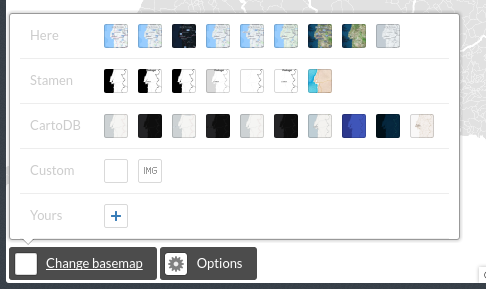
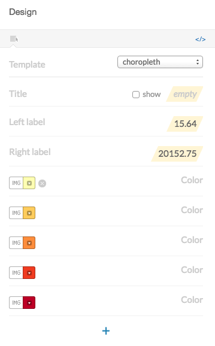
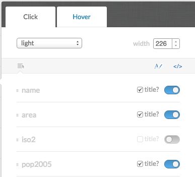

* Trainers:
  * Jorge Sanz · jorge@cartodb.com · [@xurxosanz](http://twitter.com/xurxosanz)
  * Ernesto Martínez · ernesto@cartodb.com · [@ernesmb](http://twitter.com/ernesmb)

* Collaborators:
  * Oriol Boix · oboix@cartodb.com · [@oriolbx](http://twitter.com/oriolbx)
  * Ramiro Aznar · ramiroaznar@cartodb.com · [@ramiroaznar](http://twitter.com/ramiroaznar)

* Date: June 1st 2016
* [http://bit.ly/TODO](http://bit.ly/TODO)


Map Academy, tutorials and other online resources:

* [**Map Academy** courses](https://academy.cartodb.com/).
* [**Tutorials**](https://docs.cartodb.com/tutorials/).
* [Other online resources](https://github.com/ramiroaznar/intro-cartodb).

Further questions and troubleshooting:

* Email to **support@cartodb.com**.
* Some questions could be already anwered at **[GIS Stack Exchange](gis.stackexchange.com/questions/tagged/cartodb)** `cartodb` tag.

Contents

- [Importing datasets](#import)
- [Getting your data ready](#dataset)
- [Making a simple map](#map)
- [Election maps](#election-maps)

----

## Introduction: Objective of this workshop

This workshop is meant to address the necessities of journalists starting to work with CartoDB and election maps mainly. It will focus on CartoDB editor usage and common issues as well as going a bit deeper into CartoCSS to give you an extra mile on that side to help you make better maps.


** TODO Ernesto: put one of the finished maps here **

## Importing datasets <a name="import"></a>

### Supported Geospatial Data Files

CartoDB supports the following geospatial data formats to upload vector data*:

* **`Shapefile`**
* **`KML`**
* **`KMZ`**
* **`GeoJSON`***
* **`CSV`**
* **`Spreadsheets`**
* **`GPX`**
* **`OSM`**
* **`GeoPackage`**

Importing **different geometry types** in the same layer or in a FeatureCollection element (GeoJSON) is not supported. More detailed information [here](http://docs.cartodb.com/cartodb-platform/import-api/geospatial-data-formats/#supported-geospatial-data-formats).


GeoPackage is a new format that has several advantages over the typical Shapefile:

* It's just one file
* Column names can be as long as needed
* It supports all data types including dates and booleans
* It supports all geodata types and coordinate systems


[*] More detailed information about GeoJSON format [here](http://geojson.org/geojson-spec.html), [here](http://geojsonlint.com/) and [here](http://geojson.io/#map=2/20.0/0.0).

### Common importing errors

* **Dataset too large**:
  * File size limit: 150 Mb (free).
  * Import row limit: 500,000 rows (free).
  * *Solution*: split your dataset into smaller ones, import them into CartoDB and merge them.
* **Malformed CSV**:
  * *Solution*: check termination lines, header...
* **Encoding**:
  * *Solution*: `Save with Encoding` > `UTF-8 with BOM` in [Sublime Text](https://www.sublimetext.com/), any other decent text editor or [iconv](https://en.wikipedia.org/wiki/Iconv).
* **Shapefile missing files**:
  * Missing any of the following files within the compressed file will produce an importing error:
    * `.shp`: contains the geometry. REQUIRED.
    * `.shx`: contains the shape index. REQUIRED.
    * `.prj`: contains the projection. REQUIRED.
    * `.dbf`: contains the attributes. REQUIRED.
  * Other auxiliary files such as `.sbn`, `.sbx` or `.shp.xml` are not REQUIRED.
  * *Solution*: make sure to add all required files.
* **Duplicated id fields**:
  * *Solution*: check your dataset, remove or rename fields containing the `id` keyword.
* **Format not supported**:
  * URLs -that are not points to a file- are not supported by CartoDB.
  * *Solution*: check for missing url parameters or download the file into your local machine, import it into CartoDB.
* **Non supported SRID**:
  * Solution: try to reproject your resources locally to a well known projection like `EPSG:4326`,`EPSG:3857`,`EPSG:25830` and so on.

Other importing errors and their codes can be found [here](http://docs.cartodb.com/cartodb-platform/import-api/import-errors/).

----

## Getting your data ready <a name="dataset"></a>

### Geocoding

If you have a column with longitude coordinates and another with latitude coordinates, CartoDB will automatically detect and covert values into `the_geom`. If this is not the case, CartoDB can help you by turning the named places into best guess of latitude-longitude coordinates:

* **By Lon/Lat Columns**.
* **By City Names**.
* **By Admin. Regions**.
* **By Postal Codes**.
* **By IP Addresses**.
* **By Street Addresses**.

Know more about geocoding in CartoDB [here](http://docs.cartodb.com/tutorials/how_to_georeference/).

### Datasets

These are the datasets we are going to use on our workshop. You'll find them all on our [Data Library](https://cartodb.com/data-library):

* **Spanish municipalities** [`ign_spanish_adm3_municipalities_displaced_canary`]: This is a dataset with Spanish municipalities and the Canary Islands displaced so they are closer to the Iberian Peninsula.
* **TODO**: Electoral results

After importing the datasets, in order to be able to join the alphanumeric results with the geodata, we need to add a new column to the geodata. If you are syncing the IGN dataset you need to remove the sync. Then you can add a new column and name it `cod_ine`. Set it as a number column. Then you can run this `UPDATE` to generate the INE code from the national code

```sql
UPDATE
  ign_spanish_adm3_municipalities_displaced_canary
SET
  cod_ine = natcode::bigint % 100000
```


Maybe you want to rename the table as `municipalities` to make your SQL and CartoCSS code easier to read.


### Simple SQL operations

Before starting to make maps it's a good idea to introduce you to a bit of the query language we use to render our maps. SQL is a language widely used to query relational databases and actually a powerful tool to analyze your data.

CartoDB allows you to interact with your datasets using the interface so you can filter, order and modify your data values directly from the editor. Sometimes it will be useful to use the SQL tray to perform more advanced tasks like formatting your data joining different tables.


#### Selecting all columns:

The most basic query to a table is requesting all rows and columns.

```sql
SELECT * FROM municipalities;
```

#### Selecting some columns:

Sometimes we don't need all the columns of a table so we can select just some of them by putting their names. This is specially useful when you have big tables.

```sql
SELECT
  cartodb_id,
  cod_ine,
  nameunit,
  the_geom_webmercator
FROM municipalities
```

#### Selecting distinct values:

If for any reason you want to know the values that a field of a table can have the `DISTINCT` keyword will be needed. For example the regions identifiers of Spain (17 regions plus the two autonomous cities).

```sql
SELECT
  DISTINCT codnut2
FROM municipalities
```

### Filtering

Filtering is a common operation when working with CartoDB. With the following examples you'll see how to subset your table according to different criteria.


#### Filtering numeric fields

You can use the `>`, `<`, `=`, `!=` operators to restrict a numeric or a date field.

```sql
SELECT *
FROM elections_2011
WHERE participacion > 90
```

#### Filtering character fields

Even you can use `=` with text fields, is more convenient to use `LIKE` or even better `ILIKE`. The former will do a case-insesitive search.

```sql
SELECT *
FROM municipalities
WHERE name ilike 'madrid'
```

#### Filtering a list of possible values

If you want to filter by several values you can use the `IN` keyword and pass a list of values between parenthesis and comma separated.

```sql
SELECT *
FROM elections_2011
WHERE provincia in ('Albacete','Burgos')
```

#### Combining character and numeric filters

Filters can be combined using the `AND`, `OR` and `NOT` keywords. If you have doubts about the operator precedence is always good idea to use parenthesis to make explicit your conditions.


```sql
SELECT *
FROM elections_2011
WHERE
  (
    provincia  = 'Sevilla' OR
    provincia  = 'Barcelona'
  )
  AND
    poblacion > 70000
  AND
    NOT ganador_2011 = 'PP'
```

#### Ordering results

Even you can order the results on the editor, sometimes it's useful to order explicitly the results of your query by some field. By default `ORDER` works in ascending order (`ASC`) so you don't need to specify it.

```sql
SELECT *
FROM elections_2011
WHERE ganador_2011 = 'PP'
ORDER BY
  poblacion DESC
```

#### Limiting results

If your data is ordered, then you can limit the number of results to retrieve for example the top ten municipalities of Spain by population where Spanish PP party won.


```sql
SELECT
  nombre,
  provincia,
  poblacion
FROM elections_2011
WHERE ganador_2011 = 'PP'
ORDER BY poblacion DESC
LIMIT
  10
```

#### Making calculations

** TODO Jorge **

#### Joining datasets

** TODO Jorge **

#### Other useful SQL functions

** TODO Jorge **

----


## Making our first map <a name="map"></a>

** TODO Jorge **

### CartoDB Editor map wizards

[Analyzing your dataset...](http://docs.cartodb.com/cartodb-editor/datasets/#analyzing-your-dataset) In some cases, when you connect a dataset and click on the MAP VIEW for the first time, the Analyzing dataset dialog appears. This analytical tool analyzes the data in each column, predicts how to visualize this data, and offers you snapshots of the visualized maps. You can select one of the possible map styles, or ignore the analyzing dataset suggestions.

* **Simple Map**
* **Cluster Map**
* **Category Map**
* **Bubble Map**
* **Torque Map**
* **Heatmap Map**
* **Torque Cat Map**
* **Intensity Map**
* **Density Map**
* **Choropleth Map**:

Know more about chosing the right map to make [here](http://academy.cartodb.com/courses/intermediate-design/which-kind-of-map-should-i-make/).

### Designing a base map

The last link in the website referenced above is a great discussion about the different maps CartoDB allows to create.


```css
/** simple visualization */

#layer{
  polygon-fill: #FF6600;
  polygon-opacity: 0.7;
  line-color: #FFF;
  line-width: 0.5;
  line-opacity: 1;
}
```

### Other elements

#### Basemaps



#### Options


#### Legend



By clicking on the `</>` icon, you would see and edit the source HTML code.

```html
<div class='cartodb-legend choropleth'>
<div class="legend-title">Total Population</div>
<ul>
	<li class="min">
		95044.56
	</li>
	<li class="max">
		247992435.53
	</li>
	<li class="graph count_441">
	<div class="colors">
	<div class="quartile" style="background-color:#FFFFB2"></div>
	<div class="quartile" style="background-color:#FED976"></div>
	<div class="quartile" style="background-color:#FEB24C"></div>
	<div class="quartile" style="background-color:#FD8D3C"></div>
	<div class="quartile" style="background-color:#FC4E2A"></div>
	<div class="quartile" style="background-color:#E31A1C"></div>
	<div class="quartile" style="background-color:#B10026"></div>
	</div>
	</li>
</ul>
</div>
```

#### Labels


Selecting a field in the wizard will produce the following CartoCSS code to render the labels.

```css
#world_borders::labels {
  text-name: [name];
  text-face-name: 'DejaVu Sans Book';
  text-size: 10;
  text-label-position-tolerance: 10;
  text-fill: #000;
  text-halo-fill: #FFF;
  text-halo-radius: 1;
  text-dy: -10;
  text-allow-overlap: true;
  text-placement: point;
  text-placement-type: simple;
}
```


This also shows an important concept for CartoCSS. you can specify more than one rendering pass for your features. This means that using the `#layername::passname` notation you can render more than one symbol on your features. One typical example of this feature is to render lines with more than one symbol.

```css
#layer::background{
  line-width: 10;
  line-color: red;
}
#layer::foreground{
  line-width: 5;
  line-color: white;
}
```
On the above simplified CartoCSS example we use the same layer for a red background, 10 pixels widh, and then on top of it a white 5 pixels symbol.


#### Infowindows and tooltip:



Clicking on the `</>` will also show the source code for the Infowindows.

```html
<div class="cartodb-popup v2">
  <a href="#close" class="cartodb-popup-close-button close">x</a>
  <div class="cartodb-popup-content-wrapper">
    <div class="cartodb-popup-content">
      <h4>country</h4>
      <p>{{name}}</p>
      <h4>population</h4>
      <p>{{pop_norm}}</p>
      <h4>area</h4>
      <p>{{new_area}}</p>
    </div>
  </div>
  <div class="cartodb-popup-tip-container"></div>
</div>
```

#### Title, text and images:


### Share your map!


#### Get the link:

[https://team.cartodb.com/u/cartotraining/viz/36d25ff0-2189-11e6-b39e-0e787de82d45/public_map](https://team.cartodb.com/u/cartotraining/viz/36d25ff0-2189-11e6-b39e-0e787de82d45/public_map)

#### Embed it:

```html
<iframe width="100%" height="520" frameborder="0" src="https://team.cartodb.com/u/cartotraining/viz/36d25ff0-2189-11e6-b39e-0e787de82d45/embed_map" allowfullscreen webkitallowfullscreen mozallowfullscreen oallowfullscreen msallowfullscreen></iframe>
```

<iframe width="100%" height="520" frameborder="0" src="https://team.cartodb.com/u/cartotraining/viz/36d25ff0-2189-11e6-b39e-0e787de82d45/embed_map" allowfullscreen webkitallowfullscreen mozallowfullscreen oallowfullscreen msallowfullscreen></iframe>


## Election maps <a name="election-maps"></a>

** TODO Ernesto **

#### Choropleth Map:

Before making a choropleth map, we need to **normalize** our target column. For that, we need to divide the population by the area.

```sql
SELECT
  wb.*,
  pop2005/(ST_Area(the_geom::geography)/1000000) AS pop_norm
FROM
  world_borders wb
```

Click on 'create new dataset from query'.

Rename the new dataset to **`world_borders_norm`**


```css
/** choropleth visualization */

#layer{
  polygon-fill: #FFFFB2;
  polygon-opacity: 0.8;
  line-color: #FFF;
  line-width: 0.5;
  line-opacity: 1;
}
#layer [ pop_norm <= 247992435.530086] {
   polygon-fill: #B10026;
}
#layer [ pop_norm <= 4086677.23673585] {
   polygon-fill: #E31A1C;
}
#layer [ pop_norm <= 1538732.3943662] {
   polygon-fill: #FC4E2A;
}
#layer [ pop_norm <= 923491.374542489] {
   polygon-fill: #FD8D3C;
}
#layer [ pop_norm <= 616975.331234902] {
   polygon-fill: #FEB24C;
}
#layer [ pop_norm <= 326396.192958792] {
   polygon-fill: #FED976;
}
#layer [ pop_norm <= 95044.5589361554] {
   polygon-fill: #FFFFB2;
}
```

#### Proportional symbols map

Take a look on this excellent [blog post by Mamata Akella](https://blog.cartodb.com/proportional-symbol-maps/) regarding how to produce proportional symbols maps. The easiest ones being buble maps since it's directly supported by CartoDB wizards. The other type, the graduated symbols where you compute the radius of the symbol to be used later on the CartoCSS* section needs a bit of SQL computation but nothing hard.

```sql
WITH aux AS(
  SELECT
    max(pop2005) AS max_pop
  FROM
    world_borders
  )
SELECT
  cartodb_id,
  pop2005,
  ST_Centroid(the_geom_webmercator) AS the_geom_webmercator,
  5+30*sqrt(pop2005)/sqrt(aux.max_pop) AS size
FROM
  world_borders,
  aux
```
```css
#layer{
  marker-fill-opacity: 0.8;
  marker-line-color: #FFF;
  marker-line-width: 1;
  marker-line-opacity: 1;
  marker-width: [size];
  marker-fill: #FF9900;
  marker-allow-overlap: true;
}
```

[*] Know more about CartoCSS with our [documentation](https://docs.cartodb.com/cartodb-platform/cartocss/) and try our [cartoColors](http://cartodb.github.io/labs-colorscales/#)!

----
