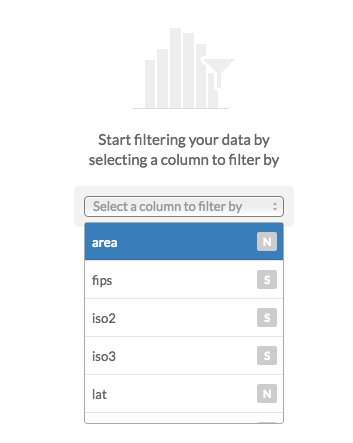
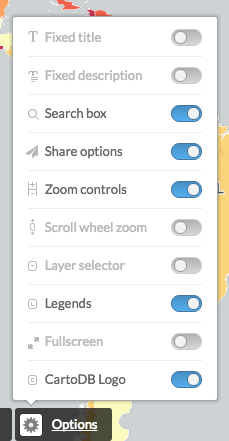

* Trainers:
  * Jorge Sanz · jorge@cartodb.com · [@xurxosanz](http://twitter.com/xurxosanz)
  * Ernesto Martínez · ernesto@cartodb.com · [@ernesmb](http://twitter.com/ernesmb)

* Collaborators:
  * Oriol Boix · oboix@cartodb.com · [@oriolbx](http://twitter.com/oriolbx)
  * Ramiro Aznar · ramiroaznar@cartodb.com · [@ramiroaznar](http://twitter.com/ramiroaznar)

* Date: June 1st 2016
* [http://bit.ly/TODO](http://bit.ly/TODO)


Map Academy, tutorials and other online resources:

* [**Map Academy** courses](https://academy.cartodb.com/).
* [**Tutorials**](https://docs.cartodb.com/tutorials/).
* [Other online resources](https://github.com/ramiroaznar/intro-cartodb).

Further questions and troubleshooting:

* Email to **support@cartodb.com**.
* Some questions could be already anwered at **[GIS Stack Exchange](gis.stackexchange.com/questions/tagged/cartodb)** `cartodb` tag.

Contents

- [Importing datasets](#import)
- [Getting your data ready](#dataset)
- [Making a simple map](#map)
- [Election maps](#election-maps)

----

## Introduction: Objective of this workshop

This workshop is meant to address the necessities of journalists starting to work with CartoDB and election maps mainly. It will focus on CartoDB editor usage and common issues as well as going a bit deeper into CartoCSS to give you an extra mile on that side to help you make better maps.


<iframe width="100%" height="520" frameborder="0" src="https://team.cartodb.com/u/cartotraining/viz/bdcf3914-27f2-11e6-8fe7-0ecd1babdde5/embed_map" allowfullscreen webkitallowfullscreen mozallowfullscreen oallowfullscreen msallowfullscreen></iframe>

----

## Importing datasets <a name="import"></a>

### Supported Geospatial Data Files

CartoDB supports the following geospatial data formats to upload vector data*:

* **`Shapefile`**
* **`KML`**
* **`KMZ`**
* **`GeoJSON`***
* **`CSV`**
* **`Spreadsheets`**
* **`GPX`**
* **`OSM`**
* **`GeoPackage`**

Importing **different geometry types** in the same layer or in a FeatureCollection element (GeoJSON) is not supported. More detailed information [here](http://docs.cartodb.com/cartodb-platform/import-api/geospatial-data-formats/#supported-geospatial-data-formats).


GeoPackage is a new format that has several advantages over the typical Shapefile:

* It's just one file
* Column names can be as long as needed
* It supports all data types including dates and booleans
* It supports all geodata types and coordinate systems


[*] More detailed information about GeoJSON format [here](http://geojson.org/geojson-spec.html), [here](http://geojsonlint.com/) and [here](http://geojson.io/#map=2/20.0/0.0).

### Common importing errors

* **Dataset too large**:
  * File size limit: 150 Mb (free).
  * Import row limit: 500,000 rows (free).
  * *Solution*: split your dataset into smaller ones, import them into CartoDB and merge them.
* **Malformed CSV**:
  * *Solution*: check termination lines, header...
* **Encoding**:
  * *Solution*: `Save with Encoding` > `UTF-8 with BOM` in [Sublime Text](https://www.sublimetext.com/), any other decent text editor or [iconv](https://en.wikipedia.org/wiki/Iconv).
* **Shapefile missing files**:
  * Missing any of the following files within the compressed file will produce an importing error:
    * `.shp`: contains the geometry. REQUIRED.
    * `.shx`: contains the shape index. REQUIRED.
    * `.prj`: contains the projection. REQUIRED.
    * `.dbf`: contains the attributes. REQUIRED.
  * Other auxiliary files such as `.sbn`, `.sbx` or `.shp.xml` are not REQUIRED.
  * *Solution*: make sure to add all required files.
* **Duplicated id fields**:
  * *Solution*: check your dataset, remove or rename fields containing the `id` keyword.
* **Format not supported**:
  * URLs -that are not points to a file- are not supported by CartoDB.
  * *Solution*: check for missing url parameters or download the file into your local machine, import it into CartoDB.
* **Non supported SRID**:
  * Solution: try to reproject your resources locally to a well known projection like `EPSG:4326`,`EPSG:3857`,`EPSG:25830` and so on.

Other importing errors and their codes can be found [here](http://docs.cartodb.com/cartodb-platform/import-api/import-errors/).

----

## Getting your data ready <a name="dataset"></a>

### Geocoding

If you have a column with longitude coordinates and another with latitude coordinates, CartoDB will automatically detect and covert values into `the_geom`. If this is not the case, CartoDB can help you by turning the named places into best guess of latitude-longitude coordinates:

* **By Lon/Lat Columns**.
* **By City Names**.
* **By Admin. Regions**.
* **By Postal Codes**.
* **By IP Addresses**.
* **By Street Addresses**.

Know more about geocoding in CartoDB [here](http://docs.cartodb.com/tutorials/how_to_georeference/).

### Datasets

These are the datasets we are going to use on our workshop. You'll find them all on our [Data Library](https://cartodb.com/data-library):

* **Spanish municipalities** [`ign_spanish_adm3_municipalities_displaced_canary`]: This is a dataset with Spanish municipalities and the Canary Islands displaced so they are closer to the Iberian Peninsula.
* **TODO**: Electoral results

After importing the datasets, in order to be able to join the alphanumeric results with the geodata, we need to add a new column to the geodata. If you are syncing the IGN dataset you need to remove the sync. Then you can add a new column and name it `cod_ine`. Set it as a number column. Then you can run this `UPDATE` to generate the INE code from the national code

```sql
UPDATE
  ign_spanish_adm3_municipalities_displaced_canary
SET
  cod_ine = natcode::bigint % 100000
```


Maybe you want to rename the table as `municipalities` to make your SQL and CartoCSS code easier to read.


### Simple SQL operations

Before starting to make maps it's a good idea to introduce you to a bit of the query language we use to render our maps. SQL is a language widely used to query relational databases and actually a powerful tool to analyze your data.

CartoDB allows you to interact with your datasets using the interface so you can filter, order and modify your data values directly from the editor. Sometimes it will be useful to use the SQL tray to perform more advanced tasks like formatting your data joining different tables.


#### Selecting all columns:

The most basic query to a table is requesting all rows and columns.

```sql
SELECT * FROM municipalities;
```

#### Selecting some columns:

Sometimes we don't need all the columns of a table so we can select just some of them by putting their names. This is specially useful when you have big tables.

```sql
SELECT
  cartodb_id,
  cod_ine,
  nameunit,
  the_geom_webmercator
FROM municipalities
```

#### Selecting distinct values:

If for any reason you want to know the values that a field of a table can have the `DISTINCT` keyword will be needed. For example the regions identifiers of Spain (17 regions plus the two autonomous cities).

```sql
SELECT
  DISTINCT codnut2
FROM municipalities
```

### Filtering

Filtering is a common operation when working with CartoDB. With the following examples you'll see how to subset your table according to different criteria.



#### Filtering numeric fields

You can use the `>`, `<`, `=`, `!=` operators to restrict a numeric or a date field.

```sql
SELECT *
FROM elections_2011
WHERE participacion > 90
```

#### Filtering character fields

Even you can use `=` with text fields, is more convenient to use `LIKE` or even better `ILIKE`. The former will do a case-insesitive search.

```sql
SELECT *
FROM municipalities
WHERE name ilike 'madrid'
```

#### Filtering a list of possible values

If you want to filter by several values you can use the `IN` keyword and pass a list of values between parenthesis and comma separated.

```sql
SELECT *
FROM elections_2011
WHERE provincia in ('Albacete','Burgos')
```

#### Combining character and numeric filters

Filters can be combined using the `AND`, `OR` and `NOT` keywords. If you have doubts about the operator precedence is always good idea to use parenthesis to make explicit your conditions.


```sql
SELECT *
FROM elections_2011
WHERE
  (
    provincia  = 'Sevilla' OR
    provincia  = 'Barcelona'
  )
  AND
    poblacion > 70000
  AND
    NOT ganador_2011 = 'PP'
```

#### Ordering results

Even you can order the results on the editor, sometimes it's useful to order explicitly the results of your query by some field. By default `ORDER` works in ascending order (`ASC`) so you don't need to specify it.

```sql
SELECT *
FROM elections_2011
WHERE ganador_2011 = 'PP'
ORDER BY
  poblacion DESC
```

#### Limiting results

If your data is ordered, then you can limit the number of results to retrieve for example the top ten municipalities of Spain by population where Spanish PP party won.


```sql
SELECT
  nombre,
  provincia,
  poblacion
FROM elections_2011
WHERE ganador_2011 = 'PP'
ORDER BY poblacion DESC
LIMIT 10
```

#### Making calculations

You can make calculations and run functions on your query `SELECT` part and also on the `WHERE` section. This way you can compute densities, normalize columns, format dates and numbers, etc. Next example shows how to get the number of voters multiplying the participation index by the population and how to get the population per square kilometer dividing the total population by the polygon area and multiplying by 1.000.000 to convert square meters to square kilometers.

```sql
SELECT
  *,
  participacion * poblacion / 100.0 as voters,
  poblacion / ST_Area(the_geom::geography) * 1000000 as pop_km2
FROM elections_2011
WHERE
  poblacion / ST_Area(the_geom::geography) * 1000000 > 10000

```

More about mathematical functions [here](https://www.postgresql.org/docs/9.1/static/functions-math.html).

#### Joining datasets

It's very common to have different datasets that we need to join to produce a map. Typically we have a geographic reference dataset (as IGN in this case) and we need to join it with some business data, like election results. To do so we use the `JOIN` clause where we refer to another table and make explicit the condition to join fields from one table to the other, normally using a common field. In our case we have a **one to one** relation, where for every municipality we will look for a row on the elections result table to take the data. There are other cases where we have a **one to many** relationship so we would need to aggregate data from the referenced table. A related example of the former type would be using a provinces table where we want to summarize elections results by municipality.

```sql
SELECT
  m.cartodb_id,
  m.the_geom_webmercator,
  e.codigo_municipio,
  e.nombre,
  e.edad_media,
  e.ganador_2011
FROM municipalities m
JOIN elections_2011 e
ON m.cod_ine = e.codigo_municipio
```

#### Other useful SQL functions

Apart from doing normal calculations there are other functions you can apply to your columns. For example you can compute aggregated functions to count the nomber of records, or get the maximum, minimum and average values for a column.

```sql
SELECT
  count(*)       as counts,
  max(poblacion) as max_pob,
  min(poblacion) as min_pob,
  avg(poblacion) as avg_pob
FROM elections_2011
```

This can be very useful if you group your data, for example:

```sql
SELECT
  partido_ganador_2015,
  count(*)       as counts,
  max(poblacion) as max_pob,
  min(poblacion) as min_pob,
  avg(poblacion) as avg_pob
FROM elections_2011
GROUP BY partido_ganador_2015
ORDER BY counts DESC
```

`ROUND` and `TRUNC` will convert float numbers into integers, the first rounding to the nearest one. `TO_CHAR` is a more complex function that can be used to format numbers and dates into strings with decimal and thousand separators, any arbitrary date format, etc.

```sql
SELECT
  ROUND(1.9)     as rounded,    -- 2
  ROUND(1.193,1) as rounded2,   -- 1.2
  TRUNC(1.9)     as truncated,  -- 1
  TO_CHAR(12345.9332,'999,999.99') as formatted,    -- '12,345.93'
  TO_CHAR(now(),'Day DD/MM/YY HH:mm:SS') as today   -- 'Wednesday 01/06/16 10:06:32'
```

More about the `TO_CHAR` function [here](https://www.postgresql.org/docs/9.5/static/functions-formatting.html).

----

## Making our first map <a name="map"></a>

** TODO Jorge **

### CartoDB Editor map wizards

[Analyzing your dataset...](http://docs.cartodb.com/cartodb-editor/datasets/#analyzing-your-dataset) In some cases, when you connect a dataset and click on the MAP VIEW for the first time, the Analyzing dataset dialog appears. This analytical tool analyzes the data in each column, predicts how to visualize this data, and offers you snapshots of the visualized maps. You can select one of the possible map styles, or ignore the analyzing dataset suggestions.

* **Simple Map**
* **Cluster Map**
* **Category Map**
* **Bubble Map**
* **Torque Map**
* **Heatmap Map**
* **Torque Cat Map**
* **Intensity Map**
* **Density Map**
* **Choropleth Map**:

Know more about choosing the right map to make [here](http://academy.cartodb.com/courses/intermediate-design/which-kind-of-map-should-i-make/).

### Designing a base map

In this exercise on working with elections maps, the first thing to do is preparing a base map. This is necessary mainly because we are using a version of the municipalities dataset where the Canary Islands are displaced so we can't use normal CartoDB basemaps. This base map will serve as reference background but it will also use the provinces dataset to give a better visual context and understanding of the different Spanish regions.

Create a new map and add the municipalities and the provinces datasets as two layers. The result should be like this one.

<iframe width="100%" height="520" frameborder="0" src="https://team.cartodb.com/u/cartotraining/viz/af49ac7e-2687-11e6-b081-0e31c9be1b51/embed_map?zoom=6" allowfullscreen webkitallowfullscreen mozallowfullscreen oallowfullscreen msallowfullscreen></iframe>

```css
#provincias[zoom>3] {
    line-color: #fff;
    line-width: 1.5;
    polygon-opacity:0;
}
```

The provinces CartoCSS is just a lines symbol with transparent polygons.


```css
#municipalities{
  polygon-fill: #E1E1E1;
  line-color:white;
  line-width:1;
  line-opacity:0.1;


  [zoom>=7]{
    line-width:.25;
    line-opacity:.7;
  }
}
```

Municipalities CartoCSS is a simple map symbol with a small change for zoom bigger than 6, decreasing lines opacity and width.


### Other elements

#### Basemaps

On this map we will use a custom color (white). Depending on your needs you can use a variety of predefined basemaps or even put your own from a third party services.


#### Options

Use the options to choose the functionality you want for your map, like enabling a layer selector or removing the search box.



#### Legend

In this case our base map won't need a legend but for other layers you configure using the wizard CartoDB will set up a legend for you. If you do a further work on CartoCSS or just want to have a customized legend you will need to manually edit its HTML code clicking on the `</>` icon


```html
<div class='cartodb-legend choropleth'>
<div class="legend-title">Total Population</div>
<ul>
	<li class="min">
		95044.56
	</li>
	<li class="max">
		247992435.53
	</li>
	<li class="graph count_441">
	<div class="colors">
	<div class="quartile" style="background-color:#FFFFB2"></div>
	<div class="quartile" style="background-color:#FED976"></div>
	<div class="quartile" style="background-color:#FEB24C"></div>
	<div class="quartile" style="background-color:#FD8D3C"></div>
	<div class="quartile" style="background-color:#FC4E2A"></div>
	<div class="quartile" style="background-color:#E31A1C"></div>
	<div class="quartile" style="background-color:#B10026"></div>
	</div>
	</li>
</ul>
</div>
```

#### Labels

Labels are a common feature on maps, CartoDB wizard will help you to configure their settings like font, size, halo and colors.


Selecting a field in the wizard will produce the following CartoCSS code to render the labels. Once you have your labels CartoCSS you can customize manually other settings like only showing them on a certain zoom range.

```css
Map{
  buffer-size:256
}

#provincias[zoom>3] {
    line-color: #fff;
    line-width: 1.5;
    polygon-opacity:0;
}

#provincias::labels[zoom>5] {
  text-name: [nameunit];
  text-face-name: 'Lato Regular';
  text-size: 10;
  text-label-position-tolerance: 0;
  text-fill: #3f3f3f;
  text-halo-fill: #fffdfd;
  text-halo-radius: 1;
  text-dy: -10;
  text-allow-overlap: true;
  text-placement: point;
  text-placement-type: dummy;
}

```


This also shows an important concept for CartoCSS. you can specify more than one rendering pass for your features. This means that using the `#layername::passname` notation you can render more than one symbol on your features. One typical example of this feature is to render lines with more than one symbol.

```css
#layer::background{
  line-width: 10;
  line-color: red;
}
#layer::foreground{
  line-width: 5;
  line-color: white;
}
```
On the above simplified CartoCSS example we use the same layer for a red background, 10 pixels widh, and then on top of it a white 5 pixels symbol.


#### Infowindows and tooltip:


Clicking on the `</>` will also show the source code for the Infowindows.

```html
<div class="cartodb-popup v2">
  <a href="#close" class="cartodb-popup-close-button close">x</a>
  <div class="cartodb-popup-content-wrapper">
    <div class="cartodb-popup-content">
      <h4>country</h4>
      <p>{{name}}</p>
      <h4>population</h4>
      <p>{{pop_norm}}</p>
      <h4>area</h4>
      <p>{{new_area}}</p>
    </div>
  </div>
  <div class="cartodb-popup-tip-container"></div>
</div>
```

#### Title, text and images:


### Share your map!


#### Get the link:

[https://team.cartodb.com/u/cartotraining/viz/36d25ff0-2189-11e6-b39e-0e787de82d45/public_map](https://team.cartodb.com/u/cartotraining/viz/36d25ff0-2189-11e6-b39e-0e787de82d45/public_map)

#### Embed it:

```html
<iframe width="100%" height="520" frameborder="0" src="https://team.cartodb.com/u/cartotraining/viz/36d25ff0-2189-11e6-b39e-0e787de82d45/embed_map" allowfullscreen webkitallowfullscreen mozallowfullscreen oallowfullscreen msallowfullscreen></iframe>
```

<iframe width="100%" height="520" frameborder="0" src="https://team.cartodb.com/u/cartotraining/viz/36d25ff0-2189-11e6-b39e-0e787de82d45/embed_map" allowfullscreen webkitallowfullscreen mozallowfullscreen oallowfullscreen msallowfullscreen></iframe>

----

## Election maps <a name="election-maps"></a>

** TODO Ernesto **

----

> Know more about CartoCSS with our [documentation](https://docs.cartodb.com/cartodb-platform/cartocss/) and try our [cartoColors](http://cartodb.github.io/labs-colorscales/#)!

----

#### Choropleth Map:

Before making a choropleth map, we need to **normalize** our target column. For that, we need to divide the population by the area of each municipality. That produces a Population Density map.
The CartoCSS section in this map is coming from our cartoColors app (see the link above), that allows to analize the data and assign the most suitable color ramp for our data.

##### SQL
```sql
SELECT
  m.cartodb_id,
  m.the_geom_webmercator,
  e.codigo_municipio,
  e.nombre,
  e.poblacion/(ST_Area(
    m.the_geom::geography
  )/1000000) AS pop_density
FROM cartotraining.municipalities m
JOIN cartotraining.elections_2011 e
ON m.cod_ine = e.codigo_municipio
```

##### CartoCSS
```css
/** choropleth visualization */
/** Jenks scale */

@color0: #f3e79b;
@color1: #f9b281;
@color2: #eb7f86;
@color3: #b85f9a;
@color4: #5c53a5;

#elections_2011{
polygon-opacity: 0.9;
polygon-fill: @color0;
line-opacity: 1;
line-width: 0.5;
line-color: lighten(@color0,5);

  [pop_density>0]{
    polygon-fill: @color0;
    line-color: lighten(@color0,5);
       }
  [pop_density>8.07419296338199]{
    polygon-fill: @color1;
    line-color: lighten(@color1,5);
       }
  [pop_density>28.3464260803082]{
    polygon-fill: @color2;
    line-color: lighten(@color2,5);
       }
  [pop_density>209.091331347213]{
    polygon-fill: @color3;
    line-color: lighten(@color3,5);
       }
  [pop_density>1560.90092390169]{
    polygon-fill: @color4;
    line-color: lighten(@color4,5);
       }
}
```

<iframe width="100%" height="520" frameborder="0" src="https://team.cartodb.com/u/cartotraining/viz/8dd0f622-273d-11e6-b8ad-0e787de82d45/embed_map" allowfullscreen webkitallowfullscreen mozallowfullscreen oallowfullscreen msallowfullscreen></iframe>

----

#### Graduated symbols + Category map

Take a look on this excellent [blog post by Mamata Akella](https://blog.cartodb.com/proportional-symbol-maps/) regarding how to produce proportional symbols maps. The easiest ones being buble maps since it's directly supported by CartoDB wizards. The other type, the graduated symbols where you compute the radius of the symbol to be used later on the CartoCSS* section needs a bit of SQL computation but nothing hard


As the formula above states, we need the maximum value for the population column in order to calculate the new `size` column. We could get that running an auxiliary query with `max()` aggregation function, or simply going to DATA VIEW and ordering the column by _DESCENDING_ values.

##### SQL
```sql
SELECT
  m.cartodb_id,
  ST_Centroid(m.the_geom_webmercator) AS the_geom_webmercator,
  e.codigo_municipio,
  e.nombre,
  e.partido_ganador_2015,
  e.poblacion,
  4+32*sqrt(poblacion)/sqrt(3165235) AS size
FROM
  cartotraining.municipalities m
JOIN cartotraining.elections_2011 e
ON m.cod_ine = e.codigo_municipio
ORDER BY poblacion DESC
```

##### CartoCSS
```css
#elections_2011 {
   marker-fill-opacity: 0.9;
   marker-line-color: #FFF;
   marker-line-width: 0.25;
   marker-line-opacity: 1;
   marker-placement: point;
   marker-type: ellipse;
   marker-width: [size];
   marker-allow-overlap: true;
   marker-fill: #DDDDDD;

  [partido_ganador_2015="C's"] {marker-fill: #FF9900; }
  [partido_ganador_2015="DL"] {marker-fill: #FFCC00; }
  [partido_ganador_2015="EAJ-PNV"] {marker-fill: #B2DF8A; }
  [partido_ganador_2015="EH BILDU"] {marker-fill: #33A02C; }
  [partido_ganador_2015="EN COMÚ"] {marker-fill: #7B00B4; }
  [partido_ganador_2015="ERC-CATSI"] {marker-fill: #E31A1C; }
  [partido_ganador_2015="PODEMOS"] {marker-fill: #3B007F; }
  [partido_ganador_2015="PODEMOS-COMPROMÍS"] {marker-fill: #A53ED5; }
  [partido_ganador_2015="PP"] {marker-fill: #3E7BB6; }
  [partido_ganador_2015="PSOE"] {marker-fill: #F84F40; }
}
```

<iframe width="100%" height="520" frameborder="0" src="https://team.cartodb.com/u/cartotraining/viz/1aa78bd6-274f-11e6-ba8c-0ea31932ec1d/embed_map" allowfullscreen webkitallowfullscreen mozallowfullscreen oallowfullscreen msallowfullscreen></iframe>

----

#### Percentage for one specific party

We made a standard choropleth map using the vote percentage for one specific party.

##### SQL
```sql
SELECT
  m.cartodb_id,
  m.the_geom_webmercator,
  e.codigo_municipio,
  e.nombre,
  e.porcentaje_psoe,
  e.participacion
FROM
  cartotraining.municipalities m
JOIN cartotraining.elections_2011 e
ON m.cod_ine = e.codigo_municipio
```

##### CartoCSS
```css
#elections_2011{
  polygon-fill: #F2D2D3;
  line-color: #FFF;
  line-width: 0.5;
  line-opacity: 0.5;
}

#elections_2011 [ porcentaje_psoe <= 77.78] {polygon-fill: #C1373C; }
#elections_2011 [ porcentaje_psoe <= 40.48] {polygon-fill: #CC4E52; }
#elections_2011 [ porcentaje_psoe <= 29.93] {polygon-fill: #D4686C; }
#elections_2011 [ porcentaje_psoe <= 21.28] {polygon-fill: #EBB7B9; }
#elections_2011 [ porcentaje_psoe <= 12.16] {polygon-fill: #F2D2D3; }
```

<iframe width="100%" height="520" frameborder="0" src="https://team.cartodb.com/u/cartotraining/viz/242e57be-27d3-11e6-8b8c-0e5db1731f59/embed_map" allowfullscreen webkitallowfullscreen mozallowfullscreen oallowfullscreen msallowfullscreen></iframe>

----

#### Winner party + Population Density

In this case we are going to use the winner party in each municipality to create a category map. To add another dimension to our map, we are goint to use the opacity as a symbol for the population density.
In order to do so, we are going to use the same formula than before, and add a new set of CartoCSS rules based on the `pop_density` column.

##### SQL
```sql
SELECT
  m.cartodb_id,
  m.the_geom_webmercator,
  e.codigo_municipio,
  e.nombre,
  e.partido_ganador_2015,
  e.poblacion,
  e.poblacion/(
    ST_Area(m.the_geom::geography)/1000000
  ) AS pop_density
FROM
  municipalities m
JOIN elections_2011 e
ON m.cod_ine = e.codigo_municipio
```

##### CartoCSS
```css
#elections_2011 {
   polygon-opacity: 0.7;
   line-color: #FFF;
   line-width: 0.25;
   line-opacity: 0.5;
   polygon-fill: #DDDDDD;

  [pop_density<=100]{polygon-opacity:1.0}
  [pop_density<=90]{polygon-opacity:0.9}
  [pop_density<=80]{polygon-opacity:0.8}
  [pop_density<=70]{polygon-opacity:0.7}
  [pop_density<=60]{polygon-opacity:0.6}
  [pop_density<=50]{polygon-opacity:0.5}
  [pop_density<=40]{polygon-opacity:0.4}
  [pop_density<=30]{polygon-opacity:0.3}
  [pop_density<=20]{polygon-opacity:0.2}
  [pop_density<=10]{polygon-opacity:0.1}
}

#elections_2011[partido_ganador_2015="C's"] {polygon-fill: #ff9900; }
#elections_2011[partido_ganador_2015="DL"] {polygon-fill: #ffcc00; }
#elections_2011[partido_ganador_2015="EAJ-PNV"] {polygon-fill: #B2DF8A; }
#elections_2011[partido_ganador_2015="EH BILDU"] {polygon-fill: #33A02C; }
#elections_2011[partido_ganador_2015="EN COMÚ"] {polygon-fill: #7b00b4; }
#elections_2011[partido_ganador_2015="ERC-CATSI"] {polygon-fill: #850200; }
#elections_2011[partido_ganador_2015="PODEMOS"] {polygon-fill: #3b007f; }
#elections_2011[partido_ganador_2015="PODEMOS-COMPROMÍS"] {polygon-fill: #a53ed5; }
#elections_2011[partido_ganador_2015="PP"] {polygon-fill: #3e7bb6; }
#elections_2011[partido_ganador_2015="PSOE"] {polygon-fill: #f84f40; }
```

<iframe width="100%" height="520" frameborder="0" src="https://team.cartodb.com/u/cartotraining/viz/bdcf3914-27f2-11e6-8fe7-0ecd1babdde5/embed_map" allowfullscreen webkitallowfullscreen mozallowfullscreen oallowfullscreen msallowfullscreen></iframe>

----

#### Comparing results from previous elections

In this map we are going to find those municipalities in which the 2015 winner party is different than 2011. For that, the `CASE` [conditional funcion](https://www.postgresql.org/docs/current/static/functions-conditional.html) will do the trick.

So, we select a column called `new_winner` that will have a `NULL` value if 2015 winner is the same than 2011. If the winner party is different, `new_winner` will contain the name of the winner party.

After that, a very easy Category Map will suit our needs.

##### SQL
```sql
SELECT
  m.cartodb_id,
  m.the_geom_webmercator,
  e.codigo_municipio,
  e.nombre,
  e.poblacion,
  e.ganador_2011,
  e.partido_ganador_2015,
  CASE
    WHEN ganador_2011 ILIKE partido_ganador_2015 THEN NULL
    WHEN ganador_2011 NOT ILIKE partido_ganador_2015 THEN partido_ganador_2015
  END new_winner
FROM
  municipalities m
JOIN elections_2011 e
ON m.cod_ine = e.codigo_municipio
```

###### CartoCSS
```css
#elections_2011 {
   polygon-opacity: 0.7;
   polygon-fill: #DDD;
   line-color: #FFF;
   line-width: 0.5;
   line-opacity: 0.5;
}

#elections_2011[new_winner="C's"] {polygon-fill: #ff9900; }
#elections_2011[new_winner="DL"] {polygon-fill: #ffcc00; }
#elections_2011[new_winner="EAJ-PNV"] {polygon-fill: #B2DF8A; }
#elections_2011[new_winner="EH BILDU"] {polygon-fill: #33A02C; }
#elections_2011[new_winner="EN COMÚ"] {polygon-fill: #7b00b4; }
#elections_2011[new_winner="ERC-CATSI"] {polygon-fill: #850200; }
#elections_2011[new_winner="PODEMOS"] {polygon-fill: #3b007f; }
#elections_2011[new_winner="PODEMOS-COMPROMÍS"] {polygon-fill: #a53ed5; }
#elections_2011[new_winner="PP"] {polygon-fill: #3e7bb6; }
#elections_2011[new_winner="PSOE"] {polygon-fill: #f84f40; }
```

<iframe width="100%" height="520" frameborder="0" src="https://team.cartodb.com/u/cartotraining/viz/6806e63a-2801-11e6-80e4-0ea31932ec1d/embed_map" allowfullscreen webkitallowfullscreen mozallowfullscreen oallowfullscreen msallowfullscreen></iframe>

----
