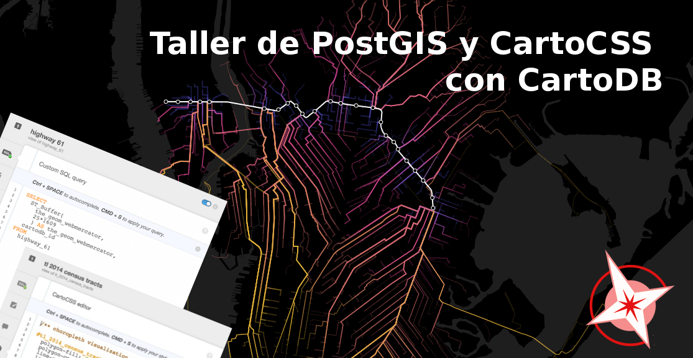
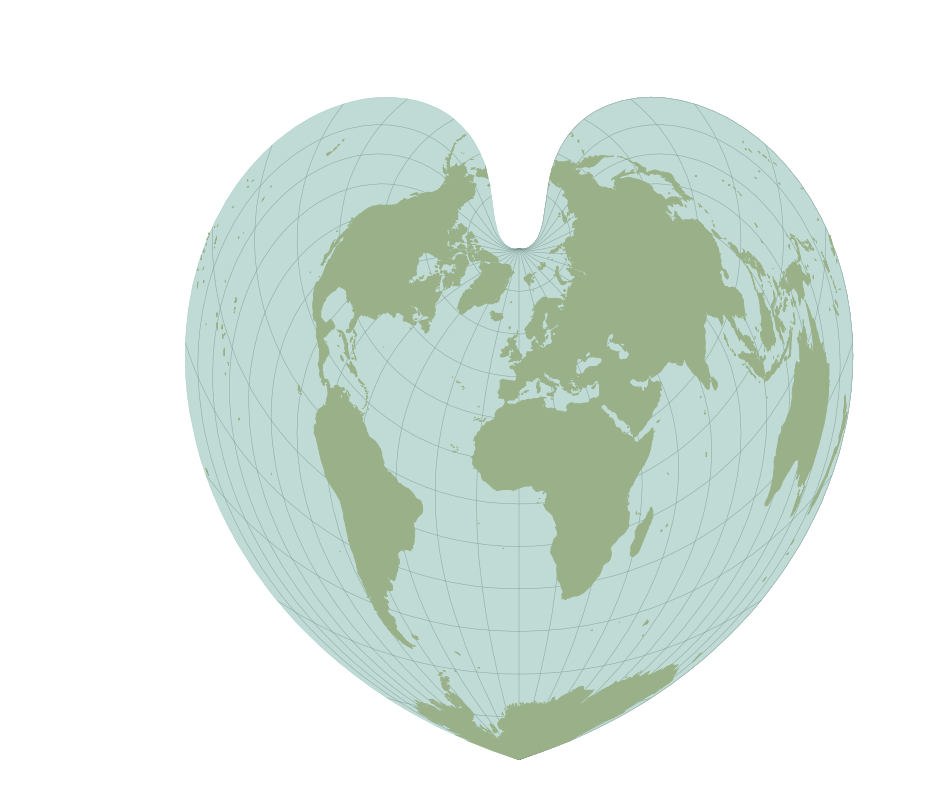
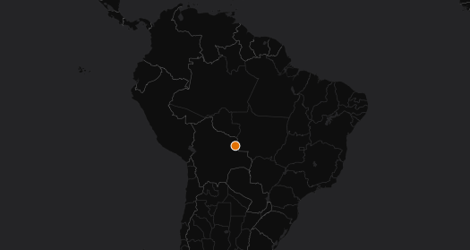
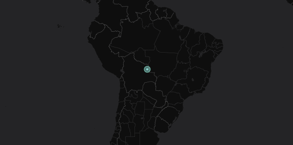
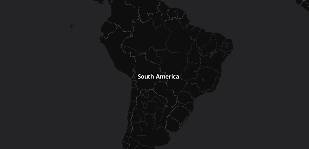
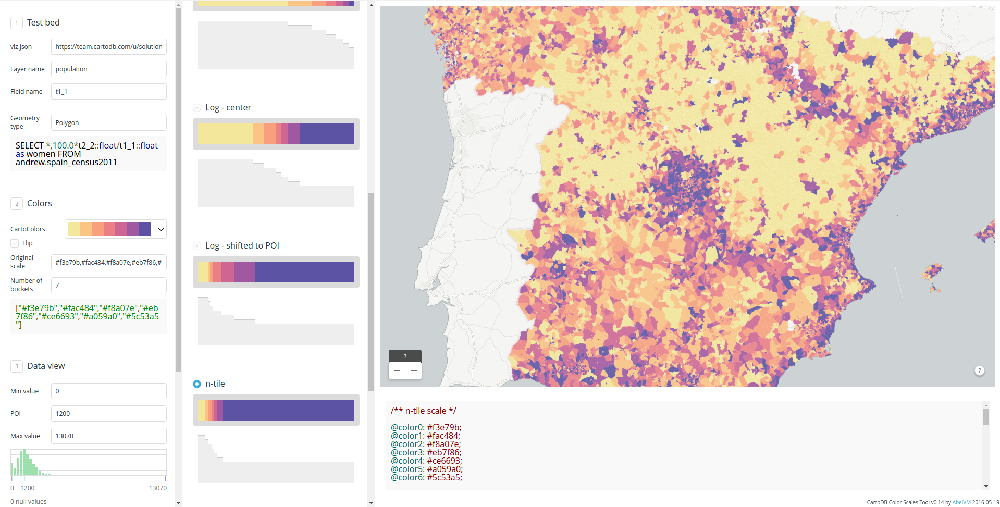
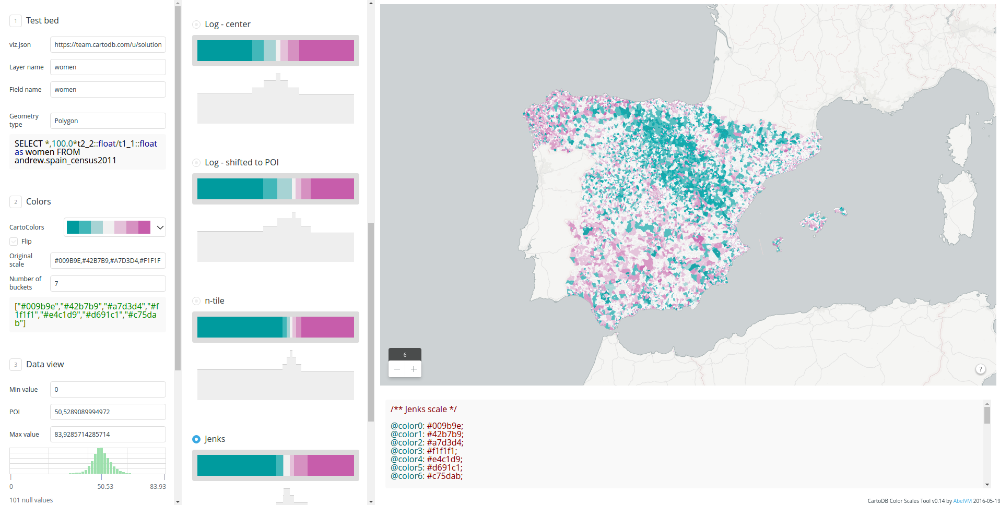

* Trainer: Ramiro Aznar · ramiroaznar@cartodb.com · [@ramiroaznar](http://twitter.com/ramiroaznar)
* June 18th 2016
* CartoCSS Intermediate Workshop · [GeoInquietos Madrid](http://geoinquietos.org/grupos/madrid/) · [Medialab-Prado](http://medialab-prado.es/)

### [http://bit.ly/cartocss](http://bit.ly/postgis)
### [http://bit.ly/cartocss](http://bit.ly/cartocss)

<br>



<br>

This workshop is mainly based on the CartoDB Design Webinars conducted by Mamata Akella ([@mamatakella](http://twitter.com/mamatakella)) and Emilio García ([@piensaenpixel](http://twitter.com/piensaenpixel)):

* Part 1 - Airport Traffic Map: [slides](https://docs.google.com/presentation/d/1gFR-JFoIOQgsW3UlC_7jmf6Y2xivKMP9WzRY1gUhdJc/edit#slide=id.gf0137e96d_0_59) & [gist](https://gist.github.com/piensaenpixel/d4058de9781eb77ebc81#file-readme-md).
* Part 2 - Migration Map: [slides](https://docs.google.com/presentation/d/1e0P-BoUlxz1JcxKvF9Q4SE-PFuRs2NvMbPXI9L_AIOE/edit#slide=id.gf0137e96d_0_59) & [gist](https://gist.github.com/piensaenpixel/d7596c688dac980bde61886bc1a21869).

#### Map Academy, tutorials and other CartoCSS related online resources

* [**Map Academy** courses](https://academy.cartodb.com/):
  * [Intro to Map Design](https://academy.cartodb.com/courses/design-for-beginners/)
  * [Academy Lite - CartoCSS](https://academy.cartodb.com/courses/academy-lite/cartocss/)
* [**Tutorials**](https://docs.cartodb.com/tutorials/):
  * [Style Map Based Values in your Table](https://docs.cartodb.com/tutorials/conditional_styling/)
* [CartoCSS **Documentation**](https://docs.cartodb.com/cartodb-platform/cartocss/)
* [Other online resources](https://github.com/ramiroaznar/intro-cartodb)

#### Further questions and troubleshooting

* Some questions could be already anwered at **[GIS Stack Exchange](gis.stackexchange.com/questions/tagged/cartodb)** `cartodb` tag.
* Email to **support@cartodb.com**.

### Contents

1. [(Some) Design Principles](#design)
2. [Styling with CartoCSS](#cartocss)
3. [Let's get mapping!](#map)

----

### 1. (Some) Design Principles <a name="design"></a>

[Slides](https://docs.google.com/presentation/d/1LbBIFPEWki58F2yRdbESTKGgm_sjnZRf9VV4odLGPlM/edit?usp=sharing)

<br>



<br>

----

### 2. Styling with CartoCSS <a name="cartocss"></a>

#### 2. 1. CartoCSS best practices

While there are many ways to apply the same visual effects with CartoCSS properties, this section describes the most efficient and intuitive methods for structuring your CartoCSS syntax.

You can apply CartoCSS properties to the overall map style, or to specific map symbolizers (such as markers and points). Sometimes, applying properties to a symbolizer is not the most effective workflow for enhancing your overall map style. Other times, applying a style to the overall map is not rendered if there is no default value defined, and thus, not needed. For example, see how composite operations can be used for color blending, based on style or symbolizer.

When applying CartoCSS syntax, it helps to understand how values are applied to your map:

* The source is where the style is applied (either as a value or as a symbolizer property)

* The destination is the effect on the rest of the map, underneath the source

* Any layers that appear above the source are unaffected by the applied style and are rendered normally

* Typically, you apply CartoCSS properties to different layers on a map. You can add multiple styles and values for each layer

* Alternatively, you can apply CartoCSS by nesting categories and values. Categories contain multiple values listed under the same, single category using brackets `{ }`. This enables you visualize all of the styling elements applied to the overall map or to individual symbolizers, and avoid adding any redundant or unnecessary parameters. This is the suggested method if you are applying styles to a multi-scale map.

**Note**: Be mindful when applying styles to a map with multiple layers. Instead of applying an overall style to each map layer, apply the style to one layer on the map using this nested structure. For example, suppose you have a map with four layers, you can define zoom dependent styling as a nested value in one map layer. You do not have to go through each layer of the map to apply a zoom style. Using the nested structure allows you to apply all of the styling inside the brackets `{ }`. This is a more efficient method of applying overall map styling.

Search in the Data Library the `continents` dataset, connect it and disable the sync connection. Then run the following SQL query, visualize it and rename the map as `continents_centroids`:

```sql
SELECT 
  cartodb_id,
  name as continent,
  st_transform(st_centroid(the_geom),3857) as the_geom_webmercator
FROM 
  continents
```

Note how the CartoCSS syntax is structured:

##### CartoCSS syntax structured by @ values

<br>



<br>

```css
@africa: #A6CEE3;
@antarctica: #1F78B4;
@asia: #B2DF8A;
@australia: #33A02C;
@europe: #FB9A99;
@northamerica: #E31A1C;
@oceania: #FDBF6F;
@southamerica:#FF7F00; 

#continents {
  marker-fill-opacity: 0.9;
  marker-line-color: #FFF;
  marker-line-width: 1;
  marker-width: 10;
  marker-allow-overlap: true;

  [continent="Africa"] {
   marker-fill: @africa;
  }
  [continent="Antarctica"] {
    marker-fill: @antarctica;
  }
  [continent="Asia"] {
    marker-fill: @asia;
  }
  [continent="Australia"] {
    marker-fill: @australia;
  }
  [continent="Europe"] {
    marker-fill: @europe;
  }
  [continent="North America"] {
    marker-fill: @northamerica;
  }
  [continent="Oceania"] {
    marker-fill: @oceania;
  }
  [continent="South America"] {
    marker-fill: @southamerica;
  }
}
```

##### CartoCSS syntax structured by styling over an already styled feature

<br>



<br>

```css
#continents{
      marker-fill-opacity: 1;
      marker-line-color: #7fcdbb;
      marker-line-width: 1;
      marker-line-opacity: 0;
      marker-placement: point;
      marker-type: ellipse;
      marker-width: 4;
      marker-fill: #91e1d8;
      marker-allow-overlap: true;
    }
  #continets::point{
      marker-fill-opacity: 0.5;
      marker-line-color: #7fcdbb;
      marker-line-width: 1;
      marker-line-opacity: 1;
      marker-placement: point;
      marker-type: ellipse;
      marker-width: 12;
      marker-fill: #91e1d8;
      marker-allow-overlap: true;
    }
```

##### CartoCSS syntax structure to style layer labels

<br>



<br>

```css
Map {
  buffer-size: 2000; /* Ensures that labels crossing tile boundaries are equally rendered in each tile. */
    }
#continents::labels {
  text-name: [continent];
  text-face-name: "Open Sans Bold";
  text-size: 12;
  text-fill: #FFFFFF;
  text-halo-fill: fadeout(#000000, 30%);
  text-halo-radius: 2;
  text-allow-overlap: true;
  text-placement: point;
  text-placement-type: simple;
  text-dy: 10;
    }
```

<br>

<iframe width="100%" height="520" frameborder="0" src="http://cartodb.github.io/labs-cdbfiddle/#https://team.cartodb.com/u/ramirocartodb/api/v2/viz/a3ec8052-271f-11e6-a8ac-0e31c9be1b51/viz.json" allowfullscreen webkitallowfullscreen mozallowfullscreen oallowfullscreen msallowfullscreen></iframe>

<br>

#### 2. 2. CartoColors

[Labs-ColorScales](http://cartodb.github.io/labs-colorscales/#), an app to obtain CartoCSS palettes from a viz.json, a layer and a numeric field.

##### Sequential Palettes

<br>



<br>

##### Qualitative Paletters

<br>

<iframe width='100%' height='520' frameborder='0' src='https://observatory.cartodb.com/viz/7f0e5b0a-f5d5-11e5-a140-0e5db1731f59/embed_map' allowfullscreen webkitallowfullscreen mozallowfullscreen oallowfullscreen msallowfullscreen></iframe>

<br>

##### Sequential + Qualitative Paletters

<br>

<iframe width='100%' height='520' frameborder='0' src='https://observatory.cartodb.com/viz/2efcbf5c-080a-11e6-ac50-0e31c9be1b51/embed_map' allowfullscreen webkitallowfullscreen mozallowfullscreen oallowfullscreen msallowfullscreen></iframe>

<br>

##### Diverging palettes

<br>



<br>

#### 2. 3. Turbo-Carto

[Next-Gen Styling for Data-Driven Maps](https://blog.cartodb.com/turbo-carto/), CartoCSS is alive!
[Bl.ock](http://bl.ocks.org/ramiroaznar/raw/9cf1f56b4af28e74df27830be8df67f1/)

<br>

<iframe width='100%' height='520' frameborder='0' src='https://cartodb.github.io/cartodb.js/examples/easy-turbo-carto.html' allowfullscreen webkitallowfullscreen mozallowfullscreen oallowfullscreen msallowfullscreen></iframe>

<br>

----

### 3. Let's get mapping! <a name="map"></a>

#### 3. 1. Make a custom basemap...

First, we will create a simple basemap that we can use to display the airport traffic information on top of.

##### Add the data 
 
* From your **Maps** dashboard, click on **NEW MAP**.
* In the **Add datasets** dialogue, search for "world borders" to find the `World Borders (High Definition)` dataset available in the CartoDB Library.
* Once located, click to highlight, and then click **CREATE MAP** which will sync the layer to your account from the CartoDB Library and also add it to our map.

##### Style the background  

The default basemap is Positron to change that, let's change the background color of the map. In the Editor choose "Change basemap" and change the default color to `#2e3c43`.

##### Style the countries  

To continue with the subtle theme for our basemap, we'll style the countries so they sit nicely with the background color of the map. First, let's rename the layer to "Basemap". Next, we'll open the styling Wizard and change the following properties:
  
```css
/** Basemap Style */

#basemap{
polygon-fill: #FFFFFF;
polygon-opacity: 0.5;
line-color: #FFF;
line-width: 0.25;
line-opacity: 0.1;
}
```

<br>

<iframe width="100%" height="520" frameborder="0" src="https://team.cartodb.com/u/ramirocartodb/viz/3b3cb8be-273e-11e6-9f49-0ea31932ec1d/embed_map" allowfullscreen webkitallowfullscreen mozallowfullscreen oallowfullscreen msallowfullscreen></iframe>

<br>
  
##### Give our Map a Title

Double click on the title and change it to "Airport Traffic".

<br>

#### 3. 2. ...and then an airport traffic map!

  1. Add Layer with the traffic dataset ([here](https://team.cartodb.com/u/piensaenpixel/tables/airport_traffic/public))
  2. Rename as to **`Airports Points`**
  3. Style *point* layer:

      ```
      #airport_traffic{
        marker-fill-opacity: 0.6;
        marker-line-color: #3E7BB6;
        marker-line-width: 0.20;
        marker-line-opacity: 0;
        marker-placement: point;
        marker-multi-policy: largest;
        marker-type: ellipse;
        marker-fill: #FFFFFF;
        marker-allow-overlap: true;
        marker-clip: false;
      }
      ```
  4. For more context we are going to style this layer depends the *number of users*:

      ```
      #airport_traffic [ users <= 249143] {
         marker-width: 6.0;
      }
      #airport_traffic [ users <= 35019] {
         marker-width: 5.4;
      }
      #airport_traffic [ users <= 22640] {
         marker-width: 4.9;
      }
      #airport_traffic [ users <= 16512] {
         marker-width: 4.3;
      }
      #airport_traffic [ users <= 12334] {
         marker-width: 3.8;
      }
      #airport_traffic [ users <= 9051.5] {
         marker-width: 3.2;
      }
      #airport_traffic [ users <= 6472] {
         marker-width: 2.7;
      }
      #airport_traffic [ users <= 4445] {
         marker-width: 2.1;
      }
      #airport_traffic [ users <= 2752] {
         marker-width: 1.6;
      }
      #airport_traffic [ users <= 1266] {
         marker-width: 1.0;
      }
      ```

  5. Add layer with the same dataset
  6. Rename as **`Airports Routes`**
  7. Now we need connect both cities (the_geom to the_geom_1), we convert points in line. We need use this simple SQL:

     ```
      SELECT cartodb_id, users, field_4,
        ST_TRANSFORM(
          ST_MakeLine(the_geom, the_geom_1),3857
        ) AS the_geom_webmercator
        FROM airport_traffic WHERE field_4 = 'Q3'
     ```
  8. We style the *lines*:

     ```
        #airport_traffic {
          polygon-opacity: 0;
          line-color: #5CA2D1;
          line-width: .25;
          line-opacity: 1;
        }
     ```

  9. If you like we could style the line depends the *number of users*:

     ```
        #airport_traffic [ users <= 229457] {
          line-opacity: 0.40;
        }
        #airport_traffic [ users <= 26186] {
          line-opacity: 0.35;
        }
        #airport_traffic [ users <= 15551] {
          line-opacity: 0.30;
        }
        #airport_traffic [ users <= 10161] {
          line-opacity: 0.25;
        }
        #airport_traffic [ users <= 6115] {
          line-opacity: 0.20;
        }
        #airport_traffic [ users <= 3320] {
          line-opacity: 0.15;
        }
        #airport_traffic [ users <= 1245] {
          line-opacity: .1;
        }
     ```
  10. Change the order of the layers, put the airports point on the top

  11. Add title and customize legends


#### Publish the final map

<br>

<iframe width='100%' height='520' frameborder='0' src='https://team.cartodb.com/u/piensaenpixel/viz/c4eee79a-f59c-11e5-a898-0ea31932ec1d/embed_map' allowfullscreen webkitallowfullscreen mozallowfullscreen oallowfullscreen msallowfullscreen></iframe>

<br>

You can take a look [this blog post](http://blog.cartodb.com/jets-and-datelines/) about how to draw great circles instead of lines:

<br>

<iframe width='100%' height='520' frameborder='0' src='https://team.cartodb.com/u/piensaenpixel/viz/81b0a7ea-bee5-11e5-8a91-0ecfd53eb7d3/embed_map' allowfullscreen webkitallowfullscreen mozallowfullscreen oallowfullscreen msallowfullscreen></iframe>

<br>

----
