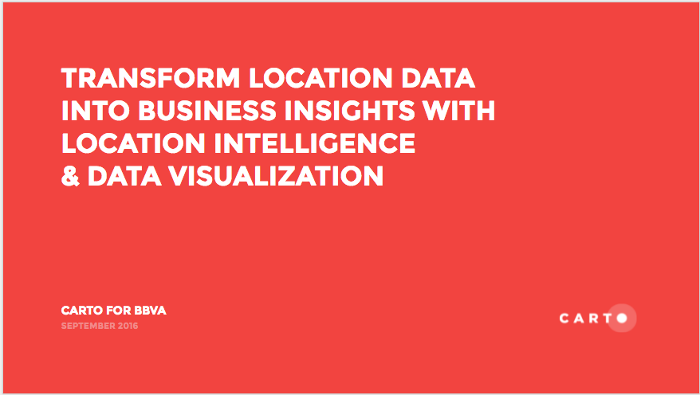
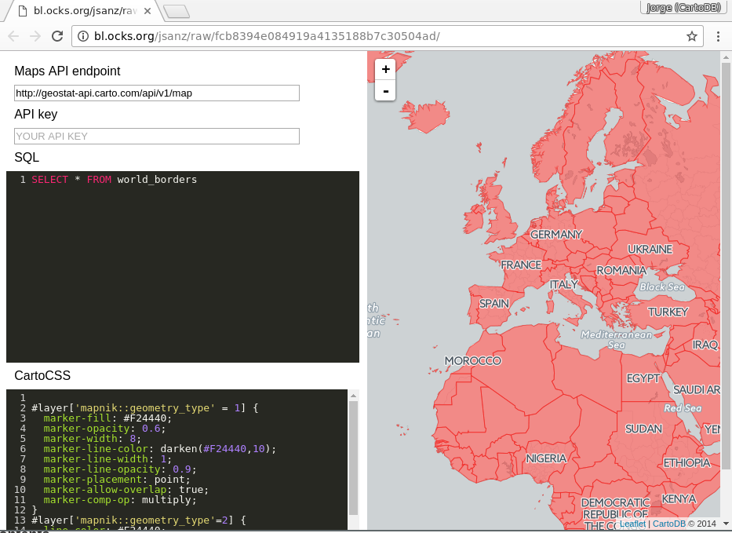
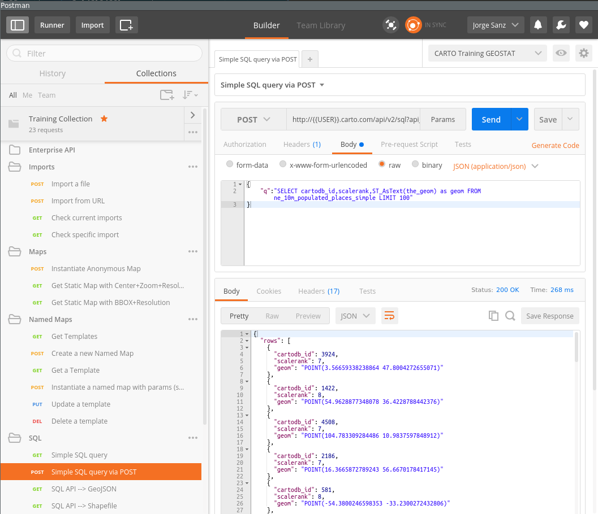

----

* Trainer: 
  * Daniel Carrión · daniel@carto.com · [@dani_carrion](http://twitter.com/dani_carrion)
  * Ramiro Aznar · ramiroaznar@carto.com · [@ramiroaznar](http://twitter.com/ramiroaznar)
* September 22st, 2016
* CARTO Tutorial about the Builder and Engine
* [http://bit.ly/160922-bbva-carto](http://bit.ly/160922-bbva-carto)

<br>

## Introduction

### Prerequisites

* A modern browser (Google Chrome would be perfect)
* [Postman](http://getpostman.com) if you want to play with CARTO APIs, but you can use `curl` or any other decent HTTP client (desirable)

### Map Academy, tutorials and other online resources

You can take a look on those resources if you want to warm up with CARTO

* [**Map Academy** courses](http://carto.com/academy).
* [**Tutorials**](https://carto.com/docs/tutorials/).
* [Other online resources](https://github.com/ramiroaznar/intro-cartodb).

### Further questions and troubleshooting

* Email to **support@cartodb.com**.
* Some questions could be already anwered at **[GIS Stack Exchange](http://gis.stackexchange.com/questions/tagged/cartodb)** `carto` tag.


### Contents

* [Introduction to CARTO](#intro)
* [Builder](#builder)
  * [San Francisco trees](#sf-trees)
  * [Portland sales territories](#portland)
  * [USA railways risk analysis](#railways)
* [Engine overview](#engine)
  * [Spatial SQL](#postgis)
  * [Style with Turbo-Carto](#turbocarto)
  * [APIs](#apis)

### Accounts set up

* The instructor will provide you a user and passwor to access your account
* Log into your `bbvaXX` account going to `https://bbvaXX.carto.com`

----

## Introduction to CARTO <a name="intro"></a>

Slides available [here](https://docs.google.com/presentation/d/1YN6QvskWMy9TKJkeftM0I2YonozbB7_TneLRyI8hevg/edit?usp=sharing)



----

## Builder <a name="builder"></a>

The Builder is the new main web interface to interact with the CARTO platform. It's a product aimed to everyone willing to manage, analyze and visualize geospatial information. It's highly focused on usability, with a friendly graphical interface that unlocks all the power of the CARTO Engine without having to know all the details on underlying technologies such as PostGIS or CartoCSS.

----

### Simple exercise: San Francisco tree map <a name="sf-trees"></a>

* *Degree of Difficulty*: **
* *Goal*: Display the different kinds of trees in San Francisco and when they were planted.
* *Features Highlighted*:
  * Widgets: Category and time-series widget.
* *Datasests needed*:
  * sf_trees dataset from the [San Francisco Trees map](https://team.carto.com/u/builder-demo/viz/10be49bc-6683-466e-8cbe-c11d4ef4aa95/public_map)

<br>

#### 1. Import and create map

##### 1. 1. Import the ``Street Tree List`` as a csv file into your dataset dashboard.

* Download the dataset as a CSV
* Go to your account and import is using the `NEW DATASET` wizard

##### 1. 2. Dataset view

* Take a look on the dataset
* Switch between the metadata and the SQL view, try any simple query like limiting the result.
* Take a look on the spatial distribution using the `PREVIEW` window.

#### 1. 3. Click on ``CREATE MAP`` from the ``Street Tree List`` dataset.

* Change the name of the map to ``San Francisco Trees``

<br>

#### 2. Layers and styles

##### 2. 1. Ordering of the layers in the Builder

* Change the basemap to the dark_matter (labels below) basemap and check the different basemaps options.

* Note how the layer we added gets the `a0` identifier. This is not important now but it will be later when adding analysis and widgets.

##### 2. 2. Layer options

* `DATA`:
  * This interface gives a general view of the fields the layer, its name and its data type but also from there you can add them as widgets.
  * Switch to `VALUES` to `SQL`. The SQL panel allows more advanced users to manage data in a more precise way.
  * Finally, use the button in the bottom center of the map to switch between the table and the map view.

* `STYLE`:
  * In the ``Aggregation menu``, select the ``None`` option.
  * In the ``Fill`` options, select the ``By Value`` option and then choose the ``common_species`` option to color the dots depending on the values of the ``common_species`` values.
  * Change the size of the dots to 3 and change the stroke value of the points to 0.


* `POP-UPS`:
  * Select the Hover tab and the light style for the hover infowindow.
  * In the ``Show Items`` section of the hover menu, select the ``common_species`` field and change its name to *Common Species*.
  * By doing this, a pop-up will appear when we hover over the points on the map.


<br>

#### 3. Widgets

##### 3. 1. Category Widget

* Back to the main menu, select the ``WIDGETS`` tab and select the ``ADD WIDGET``.
* In the options of the ``Category`` tab, select the ``common_species`` and ``caretaker`` checkboxes in order to have widgets that display the different categories of the ``common_species`` and ``caretaker`` fields. Click ``CONTINUE``to add the widgets on the map.


##### 3. 2. Time series widget

* Back to the main menu, select the ``WIDGETS`` tab and select the ``ADD WIDGET``.
* In the options of the ``Time-series`` tab, select the ``plant_date`` checkbox in order to display the dates were the trees were planted. Click ``CONTINUE``to add the widgets on the map.


##### 3. 3. Change order and name of widgets

* Back to the main menu, select the ``WIDGETS`` tab to see a list with the widgets that we have added.
* We can drag and drop the widgets in the widget menu to change their order.


* We can change the name of our widgets by selecting the ``rename`` option of the widget menu or by doing a double click on the widget name in the widgets menu.


* Change the name of the ``common_species`` widget to ``Common Species``, the name of the ``caretaker`` widget to ``Caretaker`` and the name of the ``plant_date`` widget to ``Plant Date``.


<br>

#### 4. Share map

* At the bottom of the main menu, click the ``Share`` button.
* Select the ``Publish`` tab and click on the ``Publish`` button that is below the Map title in order to share our map.


* After clicking the ``Publish`` button, we can select the option that we want to share our map.


----

### Analysis exercise: sales territories <a name="portland"></a>

* *Degree of Difficulty*: ***.
* *Goal*: Find the best place to create a store near the customers.
* *Features Highlighted*:
  * Analysis: Cluster Analysis, Weight Centroid Analysis, Area of influence analysis and Filter Points in polygons analysis.
  * Widgets: Formula widget and histogram widget.
* *Datasests needed*:
  * Customer locations dataset **``customer_home_locations``** from [Sales Territories (Portland) Demo](https://team.carto.com/u/builder-demo/viz/39fd43f3-3d3b-4b71-8c13-895305ccc2b8/public_map).

<br>

#### 1. Import and create map

##### 1. 1. Import ``customer_home_locations`` csv.

* Use the `NEW DATASET` wizard to import the table.

##### 1. 2. Click on ``CREATE MAP`` from the ``customer_home_locations``.

##### 1. 3. Rename ``customer_home_locations`` to ``Customer home locations`` and change the title of the map to ``Sales Territories (Portland) Demo``.

* You should have a dashboard like this:


<br>

#### 2. Layer styling: first view

On this example we will start with a single color styling and fixed marker size.

* Change the fill color to ``#cc1035`` and set the size of the markers to 7.
* Set the stroke of the points to 0.
* Switch to `VALUES` to `CARTOCSS`. Take a look on the CartoCSS properties and try to change any of them like increasing the width of the marker.


<br>

#### 3. Analysis

##### 3. 1. Cluster Analysis

* Back to the main menu of the layers, select the ``customer_home_locations`` layer and click on ``ADD ANALYSIS`` option.

* From the analysis menu, select the ``Calculate cluster points`` analysis and click on ``ADD ANALYSIS``.


* In the ``ANALYSES`` tab of the layer, we have three sections:
  * **Workflow**: Is an overview of the analysis that we apply to the layer, so you can have more than one. The analysis should have the name ``A1`` to indicate that is the first analysis applied to the layer.
  * **Source**: asks for the geometry where we will calculate the cluster of the ``customer_home_locations`` layer.
  * **Parameters**: Define the number of possible stores that you want. We set the number of clusters to 6.


* After clicking ``Apply``, CARTO will return the result of the ``Calculate cluster points`` analysis. After finishing the analysis, CARTO will return the same number of points on the map, but with an extra column called ``cluster_no``.
* In order to have a better understanding of the result of the ``Calculate cluster points`` analysis and see how the points are grouped, we should change the fill option of the points (in the ``Style`` tab) according to the value of the ``cluster_no`` column using the ``BY VALUE`` option:


##### 3. 2. Weight Centroid Analysis

* We will apply the analysis to the  result of the ``Calculate cluster points``  analysis, so we will go back to the main menu and we will  click on the ``ADD ANALYSIS`` option of the ``customer_home_locations`` layer.
* We will select the ``Find centroid of geometries`` analysis.


* In the ``ANALYSES`` tab of the layer, we have two sections:
  * **Workflow**: Now, because we are applying a second analysis to the ``customer_home_locations`` layer, the workflow has changed. ``A1`` represent the cluster analysis, but now we have a new analysis named ``A2`` to indicate that is the second analysis applied to the layer.
  * **Centroid**:
    * *Source*: we indicate that we are using as the source, the results from the ``Calculate cluster points``  analysis. The source is not the original points of the layer, but the points that we got after the ``Calculate cluster points``  analysis.
  * **Parameters**: to set how we want to calculate the centroids of the cluster data. We will select the  ``Categorized by`` option using the ``cluster_no`` column, we will also select the ``Aggregated by`` parameter to aggregate  the result using the average  of the ``customer_value`` column and finally we will select the ``Weigthted by`` parameter using the ``customer_value`` column to indicate the column that we want to use to calculate the centroids of the clustered regions.


* After clicking ``Apply``, we should see a result where we can see the centroids of the clustered areas from the Cluster Analysis


###### 3. 2. 1. Improve visualization

* We could style our resulting points by changing the size and the color according to the resulting aggregated values.


* We also could add a popup to the layer, so for each point we can display its value. In order to do this we go to the ``Popup`` tab and we select the ``hover`` option to display the popup when we mouse over the centroids.
We select the column ``value`` to display its values in the popup.  We also will change the name that will be displayed on the popup to ``AVG. CUSTOMER VALUE``.


* Back to the main menu, in the ``Layers`` tab,we drag and drop the Cluster node analysis outside of the layer (layer A1) to create a new data layer with the customer locations (layer B).By doing this, we will have on the map a layer with the clustered points and a layer with their centroids.


* Now, we change the name of the layers. The name of Layer A will be ``Centroids`` and the name of layer B will be ``Customer Locations``. Then, we change the style of the ``Customer Locations`` layer using the values from the column ``cluster_no`` in order to style the points depending on the cluster they belong to.


##### 3. 3. Area of influence analysis

* We will apply the analysis to the  result of the Centroid Analysis.We will go back to the main menu and we will  click on the ``ADD ANALYSIS`` option of the ``Centroids`` layer (A).
* We will select the ``Create areas of influence`` analysis.


* In the ``ANALYSES`` tab of the layer, we have three sections:
  * **Workflow**: Now, because we are applying a third analysis to the ``Centroids`` layer, the workflow has changed. ``A1`` represent the cluster analysis, ``A2`` represent the Centroid analysis and ``A3`` indicates the third analysis applied to the layer.
  * **Create areas of influence**:
    * *Input*: we indicate that we are using as the input, the results from the ``Centroid`` analysis. The input is not the original points of the layer, but the points that we got after the ``Centroid`` analysis.
  * **Parameters**: define the distance of the area of influence, the type of units, the radius and the boundaries. The boundaries might be ``intact`` or ``dissolved``. If we choose the ``intact`` option, that means that if our areas of influence polygons overlap, then they will keep their original polygon borders. On the other hand, if we choose the ``dissolve`` option, if the areas of influence polygons overlap, they will be merged so the result will be one big polygon. We set the units to kilometres, set the radius to ``1`` kilometre and choose the ``intact`` option for the ``boundaries`` parameter.
* After clicking ``Apply``, we should see a result where we can see the areas of influence of 100 meters around the subway stations:


###### 3. 3. 1. Improve visualization

* Back to the main menu, in the ``Layers``tab,we drag and drop the Area of influence node analysis outside of layer (A3) to create a new Data layer with the areas of influence (C). The new layer (C) will have the same name as the layer A, we will change the name of layer C to ``Areas of Influence``.


##### 3. 4. Filter Points in polygons analysis

* We will apply the analysis to the ``Areas of Influence`` layer, so we click ``ADD ANALYSIS`` option of that layer and we select the ``Filter points in polygons`` option.


* In the ``ANALYSES`` tab of the layer, we have two sections:
  * **Workflow**: Now, because we are applying a second analysis to the ``Areas of Influence`` layer, the workflow has changed. ``B1`` represent the area of influence analysis, but now we have a new analysis named ``B2`` to indicate that is the second analysis applied to the layer.
  * **Filter points in polygons**:
    * *Source*: we indicate that we are using as the source, the results from the ``area of influence`` analysis. The source is not the original points of the layer, but the polygons that we got after the ``area of influence`` analysis.
    * **Target Layer**: is the ``Clusters`` layer (B1).

* After clicking ``Apply``, we should see a result where instead of the circles we had before on our ``Areas of Influence`` Layer, we should have now points referring to customers within those ``Areas of Influence``. The result is indicating the customers that are closer to the stores.


<br>

#### 4. Widgets

##### 4. 1. Formula widget

* Back to the main menu, select the WIDGETS tab and select the ADD WIDGET option.
* In the options of the Formula tab, select the ``cartodb_id``column of the B1 layer and we click on ``CONTINUE``.


* In the widget menu, we set the ``OPERATION`` parameter to ``count`` and we change the name of the widget to ``Total Customers``.


* Back to the main menu, select the WIDGETS tab and select the ADD WIDGET option.
* In the options of the Formula tab, select the ``cartodb_id``  of the C2 layer.


* In the widget menu, we set the ``OPERATION`` parameter to ``count`` and we change the name of the widget to ``Customers within Areas of influence``.


##### 4. 2. Histogram widget

* Back to the main menu, select the WIDGETS tab and select the ADD WIDGET option.
* In the options of the Histogram tab, select the ``customer_value`` of the B1 layer and we click on ``CONTINUE``.


* We should get a "U shape" histogram:


* Go back to the main menu, and filter your map with the histogram. Watch how the map changes !


----

### Analysis exercise: railways risk analysis<a name="railways"></a>

* *Degree of Difficulty*: ***
* *Goal*: what US counties have higher risk for insuring railroad companies.
* *Features Highlighted*:
  * Widgets: Category, Formula and Time Series.
  * Analysis: Intersect, Outliers & Cluster analysis.
* *Datasests needed*:
  * Railroad accidents (**`dot_rail_safety_data`**): download it [from the `builder-demo` CARTO account](https://team.carto.com/u/ramirocartodb/tables/builder-demo.dot_rail_safety_data_1/public/map?redirected=true) and import it into CARTO from your local machine.
  * US counties (**`cb_2013_us_county_500k`**): search and connect via Data Library.

<br>

#### 1. Import and create a map

* Import the `dot_rail_safety_data` csv file into your dataset dashboard.
* Create a new map with it
* You should have a dashboard like this:


<br>

#### 2. Style layer

* `FILL`: click on the marker size, select `BY VALUE`, set `total_damage` as the variable and choose a color.
* Change the `STROKE` to 0.
* Switch to `VALUES` to `CARTOCSS`. With the CartoCSS panel advanced users are allowed to layer style in a more precise way.

> Switch to the CartoCSS view and check how the quantitative map has been defined. You'll see a `ramp()` function. This is TurboCarto, our CartoCSS processor that helps creating parametric symbolization based on column values. Learn more about TurboCarto in this [awesome blog post](https://carto.com/blog/styling-with-turbo-carto/) by our senior cartographer [Mamata Akella](https://mamataakella.carto.com).


<br>

#### 3. Add widgets

##### 3. 1. Back to the main menu, select `WIDGETS`

* `ADD WIDGET`:
  * *Railroad Companies Category Widget*: select `Category`, choose `railroad`, and click on `CONTINUE`. In order to rename the widget, come back to the list of widgets and double click on the name and rename it as "Railroad Companies".
    * Take a look on how CARTO Builder sets a connection between vizualization and widgets. This connection is bidirectional, the map changes widgets values and clicking on categories changes the map.
    * Click on the `Auto style` droplet button to see how each dot is colored according to its category.
    * Disable the `Auto style` to come back to the default visualization.


* *Total Damage Formula Widget*: select `Formula`, choose `total_damage`, and click on `CONTINUE` and set `OPERATION` to `sum` and add `$` as `PREFIX`. In order to rename the widget, come back to the list of widgets and double click on the name and rename it as "Total damage".
    * Again, experimient with the connection between visualization and widgets.
    * Try to filter by company and see how the total damage widget is updated automatically.
    * Change the order of the widgets, you can prioritize visually one over another.


* *Date Time Series Widget*: select `Time Series`, choose `date`, and click on `CONTINUE` in order to rename the widget.


<br>

#### 4. Add US counties layer, start the analysis

##### 4. 1. Back to the main menu, select `LAYERS`, then `ADD`

* Click on `DATA LIBRARY`, type "counties" on the `SEARCH` bar, select the  **`cb_2013_us_county_500k`** dataset and finally, click on `ADD LAYER`.
* Rename the new layer to "US Counties".

##### 4. 2. Click on "US Counties" layer, `ANALYSES`, `ADD ANALYSIS`

* Select `Intersect second layer`: this analysis performs a spatial intersection and aggregates the geometry values from the target layer that intersect with the geometry of the source layer..
  * Select "Railroad accidents" as `TARGET LAYER` and `SUM(total_damage)` as `OPERATION`. Apply.
  * When the analysis is done, an explanatory window will pop up. Click on `DONE`.

* First, using the map take a look on the results of the analysis: only the counties overlapping with data points are showed. Secondly, go to the dataset view to show the new column created with the previous analysis, `sum_total_damage`.


* *Sum Total Damage Histogram Widget*: from the same `DATA` section, check the `Add as a widget` box of the `sum_total_damage` field and `EDIT`. This will create a new histogram widget. Set the buckets to `7` and rename it as "Sum Total Damage".

* Use the autostyling and removing the visibility of the "Railroad accidents" layer. Remove auto style again. Go back to the main menu.


<br>

#### 5. Continue the analysis, get outliers and clusters

##### 5. 1. Click on `ADD ANALYSIS` just below "US Counties"

* Select `Detect outliers and clusters`: this analysis finds areas in your data where clusters of high values or low values exist, as well as areas which are dissimilar from their neighbors.
  * Select `sum_total_damage` as `TARGET COLUMN` and leave the rest of parameters with the default values. Apply.
  * Again, when the analysis is done, an explanatory window will pop up. Click on `DONE`.

* First, using the map show the viewer the results of the analysis: only the counties considered by the analysis as outliers or clusters are showed. Secondly, go to the dataset view to show the new columns created with the previous analysis, `quad` is the column more interesting because contains the groups that the analysis has made:

* `HH` and `LL`: clusters of high or low values surrounded by similar values
* `HL` and `LH`: outliers of high or low values surrounded by opposite values


* We are going to add a last widget, *Sum Total Damage Histogram Widget*: click on `WIDGETS`, `ADD`, `Category` and select `quads`. `CONTINUE`. Rename it as "Groups".

* Filter by `HH` and `HL` counties. Those are counties with high value of total damage surrounded by counties with also high values, and counties with high value of total damage surrounded by counties with low values. Click on `Auto style` to better distinguish them. Remove the auto style.


<br>

#### 6. Share and export your results

##### 6. 1. Back to the main menu, click on the three dots on the "US Counties" layer

* Select `Export data`, choose `CSV`.
* Open (with Excel or another similar software) the csv file you just download **`US_Counties.csv`**. Collapse `the_geom` column. You should have 39 counties/rows, containing only `HH` and `HL` values.


##### 6. 2. Back to the main menu, show the publish dialogs

* Below the map title it should show `PRIVATE`, `ADD PEOPLE` and `Map not published yet`. Let's change that.
  * First, click on `PRIVATE`, and again. Select `Link`.
  * Secondly, click on `SHARE` (at the bottom of the main menu). Click on `PUBLISH`, and then `DONE`.
  * Get the link and past it into your browser.

> The dashboard should show your "Railroad accidents" as green dots with sizes depending on the total damage. In addition, all the groups of counties will be displayed. This is because the filters and auto styling you did, it is not applied. Finally, you will have four widgets but in different order.


* Back to the main menu, click on "US Counties" layer. Go to the `STYLE` tab. Style the layer with a `FILL` `BY VALUE`. Select `quads` as variable and choose a couple of colors that can be easily distinguished.
* Click again on `SHARE` and now in `UPDATE`.
* Now if you go back to your browser tab where you have pasted the link nothing has changed. But if you refresh the page, voilá! The colors have modified.


----

<br>

## Engine <a name="engine"></a>

### Spatial SQL  <a name="postgis"></a>

On this section you'll have the chance to test some of the most common [PostGIS](http://postgis.net/docs/reference.html) SQL procedures. To follow this section you only need to open a browser pointing to this url: [http://bl.ocks.org/ramiroaznar/raw/5a10c324dd0f4230f20db75b671a3eda/](http://bl.ocks.org/ramiroaznar/raw/5a10c324dd0f4230f20db75b671a3eda/) and change the Maps API entry point to `http://bbva-api.carto.com/api/v1/map`.



From that point, you can place any valid query on the SQL panel that plays with the following datasets from [Natural Earth](http://www.naturalearthdata.com/)

* `ne_50m_land`
* `ne_adm0_europe`
* `ne_10m_populated_places_simple`
* `world_borders`

Over different examples we'll see how to make buffers, intersect or calculate lines between different features of those tables. You can paste the SQL presented on the panel, make changes and see how it works saving them using `Control+S` or `Command+S` depending on your operating system.

If no data shows on your map open the developer console and look for any errors. Usually when there's an error on your SQL statement the API will return a message that may help on finding the issue.

This section assumes some basic knowledge on SQL. If you need a bit more of help on the basics of this language take a look on [this workshop](../introductory/elections-workshop.html), there's a section on simple SQL queries.

<br>

#### Contents

- Transform to a different projection
- Get the number of points inside a polygon
- Know wether a geometry is **within** the given range from another geometry:
- Create a **buffer** from points:
- Get the **difference** between two geometries:
- Create a **straight line** between two points:
- Create **great circles** between two points:
- Generating Grids with CDB functions

<br>

#### Transform to a different projection

```sql
SELECT
  cartodb_id,
  ST_Transform(the_geom, 54030) AS the_geom_webmercator
FROM
  ne_50m_land
```

_About [working with different projections in CARTO](http://cartodb.github.io/training/intermediate/cartocss.html#projections) and [`ST_Transform`](http://postgis.net/docs/ST_Transform.html)._

<br>

#### Get the number of points inside a polygon

Using `GROUP BY`:

```sql
SELECT
  e.cartodb_id,
  e.admin,
  e.the_geom_webmercator,
  count(*) AS pp_count,
  sum(p.pop_max) as sum_pop
FROM
  ne_adm0_europe e
JOIN
  ne_10m_populated_places_simple p
ON
  ST_Intersects(p.the_geom, e.the_geom)
GROUP BY
  e.cartodb_id
```

Using `LATERAL`:

```sql
SELECT
  a.cartodb_id,
  a.admin AS name,
  a.the_geom_webmercator,
  counts.number_cities AS pp_count,
  counts.sum_pop
FROM
  ne_adm0_europe a
CROSS JOIN LATERAL
  (
    SELECT
      count(*) as number_cities,
      sum(pop_max) as sum_pop
    FROM
      ne_10m_populated_places_simple b
    WHERE
      ST_Intersects(a.the_geom, b.the_geom)
  ) AS counts
```

_About [`ST_Intersects`](http://postgis.net/docs/ST_Intersects.html) and [Lateral JOIN](http://blog.heapanalytics.com/postgresqls-powerful-new-join-type-lateral)_

----

**Note:** You know about the `EXPLAIN ANALYZE` function use it to take a look on how both queries are pretty similar in terms of performance.

----

----

**Note:** Add this piece of CartoCSS (we will cover styling later) at the end so you have a nice coropleth map:

```css
#layer['mapnik::geometry_type'=3] {
  line-width: 0;
  polygon-fill: ramp([pp_count], ("#edd9a3","#f99178","#ea4f88","#a431a0","#4b2991"), quantiles(5));
}
```

----

<br>

#### Know wether a geometry is **within** the given range from another geometry:

```sql
SELECT
  a.*
FROM
  ne_10m_populated_places_simple a,
  ne_10m_populated_places_simple b
WHERE
    a.cartodb_id != b.cartodb_id
  AND ST_DWithin(
      a.the_geom_webmercator,
      b.the_geom_webmercator,
      150000
    )
  AND a.adm0name = 'Spain'
  AND b.adm0name = 'Spain'
```

In this case, we are using `the_geom_webmercator` to avoid casting to `geography` type. Calculations made with `geometry` type takes the CRS units.

Keep in mind that CRS **units in webmercator are not meters**, and they depend directly on the latitude.

_About [`ST_DWithin`](http://postgis.net/docs/ST_DWithin.html)._

<br>

#### Create a **buffer** from points:

```sql
SELECT
  cartodb_id,
  name,
  ST_Transform(
    ST_Buffer(the_geom::geography, 250000)::geometry
    ,3857
  ) AS the_geom_webmercator
FROM
  ne_10m_populated_places_simple
WHERE
  name ilike 'trondheim'
```

Compare the result with

```sql
SELECT
  cartodb_id,
  name,
  ST_Transform(
    ST_Buffer(the_geom, 2)
    ,3857
  ) AS the_geom_webmercator
FROM
  ne_10m_populated_places_simple
WHERE
  name ilike 'trondheim'
```

Why this is not a circle?

_About [`ST_Buffer`](http://postgis.net/docs/ST_Buffer.html)._

<br>

#### Get the **difference** between two geometries:

```sql
SELECT
  a.cartodb_id,
    ST_Difference(
        a.the_geom_webmercator,
        b.the_geom_webmercator
  ) AS the_geom_webmercator
FROM
  ne_50m_land a,
  ne_adm0_europe b
WHERE
  b.adm0_a3 like 'ESP'
```

_About [`ST_Difference`](http://postgis.net/docs/ST_Difference.html)._

<br>

#### Create a **straight line** between two points:

```sql
SELECT
  ST_MakeLine(
    a.the_geom_webmercator,
    b.the_geom_webmercator
  ) as the_geom_webmercator
FROM (
    SELECT * FROM ne_10m_populated_places_simple
    WHERE name ILIKE 'madrid'
  ) as a,
  (
    SELECT * FROM ne_10m_populated_places_simple
    WHERE name ILIKE 'barcelona'AND adm0name ILIKE 'spain'
  ) as b
```

_About [`ST_MakeLine`](http://postgis.net/docs/ST_MakeLine.html)._

<br>

#### Create **great circles** between two points:

```sql
SELECT
  ST_Transform(
    ST_Segmentize(
      ST_Makeline(
        a.the_geom,
        b.the_geom
      )::geography,
      100000
    )::geometry,
  3857
  ) as the_geom_webmercator
FROM
  (SELECT * FROM ne_10m_populated_places_simple
  WHERE name ILIKE 'madrid') as a,
  (SELECT * FROM ne_10m_populated_places_simple
  WHERE name ILIKE 'new york') as b
```

_About [Great Circles](http://blog.cartodb.com/jets-and-datelines/)._

<br>

#### Generating Grids with CDB functions

##### Rectangular grid

```sql
SELECT
  row_number() over () as cartodb_id,
  CDB_RectangleGrid(
    ST_Buffer(the_geom_webmercator,125000),
  250000,
  250000
  ) AS the_geom_webmercator
FROM
  ne_adm0_europe
WHERE
  adm0_a3 IN ('ITA','GBR')
```

_About [CDB_RectangleGrid](http://docs.cartodb.com/tips-and-tricks/cartodb-functions/#a-rectangle-grid)_

##### Adaptative Hexagonal grid

```sql
WITH grid AS (
  SELECT
    row_number() over () as cartodb_id,
    CDB_HexagonGrid(
      ST_Buffer(the_geom_webmercator, 100000),
      100000
    ) AS the_geom_webmercator
  FROM
    ne_adm0_europe
  WHERE
    adm0_a3 IN ('ESP','ITA')
)
SELECT
  grid.the_geom_webmercator,
  grid.cartodb_id
FROM
  grid, ne_adm0_europe a
WHERE
  a.adm0_a3 IN ('ESP','ITA') AND
  ST_intersects(
    grid.the_geom_webmercator,
    a.the_geom_webmercator
  )
```

_About [CDB_HexagonGrid](http://docs.cartodb.com/tips-and-tricks/cartodb-functions/#a-hexagon-grid)_

<br>

### Style with Turbo-Carto <a name="turbocarto"></a>

#### CartoCSS & Turbo-Carto

[CartoCSS](https://carto.com/docs/carto-engine/cartocss/) is the syntax language that enables you to customize the style of your map data. Similar to working with a Cascading Style Sheet for styling webpages, CartoCSS is specific to the design of map symbolizer properties (such as marker size, marker color, line stroke, text display, and so on). You can apply CartoCSS styles directly from the the Map View of the CARTO Builder. [Here](http://cartodb.github.io/training/intermediate/cartocss.html#cartocss) you can find an intermediate workshop about designing with CartoCSS. If you are interested in knowing about how to color maps, there are two lessons ([1st part](https://carto.com/academy/courses/intermediate-design/choose-colors-1/) & [2nd part](https://carto.com/academy/courses/intermediate-design/choose-colors-2/)) in CARTO Map Academy.

[Turbo Carto](https://carto.com/blog/styling-with-turbo-carto/) allows you to create color and symbol size ramps with just a single line of code, so you don’t need to worry anymore about calculating the correct bins for your thematic map. It does it for you. Turbo Carto is built around the idea of ramps. You can apply a ramp to any traditional CartoCSS property used to define a map symbol’s size (-width), color (-fill), and even opacity (-opacity) based off an attribute in your data. No matter which CartoCSS property you are ramping, Turbo Carto has a standard syntax you can follow:

```css
#layer { 
  property: ramp([attribute], (values), (filters), "mapping"); 
}
```

* `property`: the CartoCSS property you want to ramp with Turbo Carto
* `attribute`: the attribute in your data you want to symbolize
* `values`: how the attribute values will be styled (by color, by size, etc.)
* `filters`: defines which values are assigned to which attribute values
* `mapping`: defines how filters are applied (=,>=,<=,>,<)

<br>

#### Contents

- Symbol size ramp
- Color ramp
- Other combinations

<br>

#### Symbol size ramp

```sql
SELECT
  *
FROM
 ne_10m_populated_places_simple
```

```css
#layer {
  marker-width: ramp([pop_max], 1, 12, quantiles);
  marker-fill: #f24440;
  marker-fill-opacity: 0.7;
  marker-allow-overlap: true;
  marker-line-width: 0;
}
```

<br>

#### Color ramp

```sql
SELECT
  *
FROM
 world_borders
```

```css
#layer {
  polygon-fill: ramp([pop2005], (#fcde9c, #f58670, #e34f6f, #d72d7c, #7c1d6f), quantiles);
  polygon-opacity: ramp([pop2005], 0.1, 1, jenks);
  line-width: 0.4;
  line-color: ramp([pop2005], (#fcde9c, #f58670, #e34f6f, #d72d7c, #7c1d6f), quantiles);
  line-opacity: 0.5;
}
```

<br>

#### Other combinations

```sql
SELECT
  *
FROM
 world_borders
```

```css
#layer {
  polygon-fill: ramp([pop2005], (#fcde9c, #f58670, #e34f6f, #d72d7c, #7c1d6f), quantiles);
  polygon-opacity: 0.7;
  line-width: 0.4;
  line-color: #FFF;
  line-opacity: 0.5;
}
```

<br>
 
----

<br>

### Exploring CARTO Engine APIs <a name="apis"></a>

This section covers the basic usage of main [CARTO Engine APIs](carto.com/docs). Using a software called [Postman](http://getpostman.com) you'll be able to experiment with the different APIs and see how to interact directly with the platform. This is specially useful if you are going to do it from a different environment than JavaScript, as it will be covered on the last part of this workshop.

Setting up your environment:

* Open your Postman installation (normally a Google Chrome extension)
* Install a new collection from [this link](https://raw.githubusercontent.com/ernesmb/CARTO-Engine-collection/master/CARTO_Training_Collection.postman_collection.json)
* Download the environment provided by the instructor (see the shared notes doc)



<br>

#### [SQL API](https://carto.com/docs/carto-engine/sql-api/)

This is the API to interact directly with your database. You can perform not just any SELECT query but also create tables, add triggers and functions.

#### [Maps API](https://carto.com/docs/carto-engine/maps-api/)

The Maps API is the rendering engine for CARTO. This API needs in essence a query and a cartographic symbology definition to render tiles to be used on your web mapping applications. When datasets are public (as in Free accounts) you can specify queries and CartoCSS directly on your call. When private datasets are involved, then you need to define a template and give it a name to be instantiated by the final users.

#### [Import API](https://carto.com/docs/carto-engine/import-api/)

To upload bulk data to CARTO you need to use the Import API. This provides mechanisms to upload files or define the url from where CARTO will fetch your data and create tables on your account.

----
