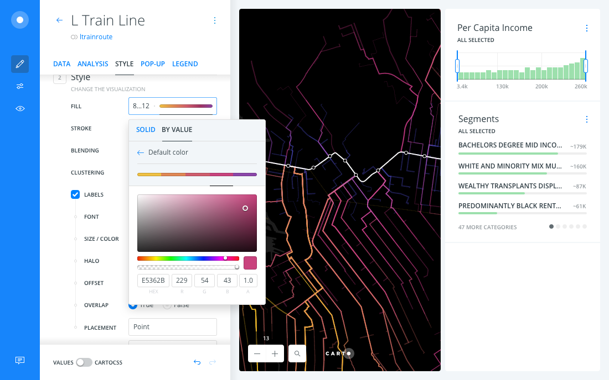
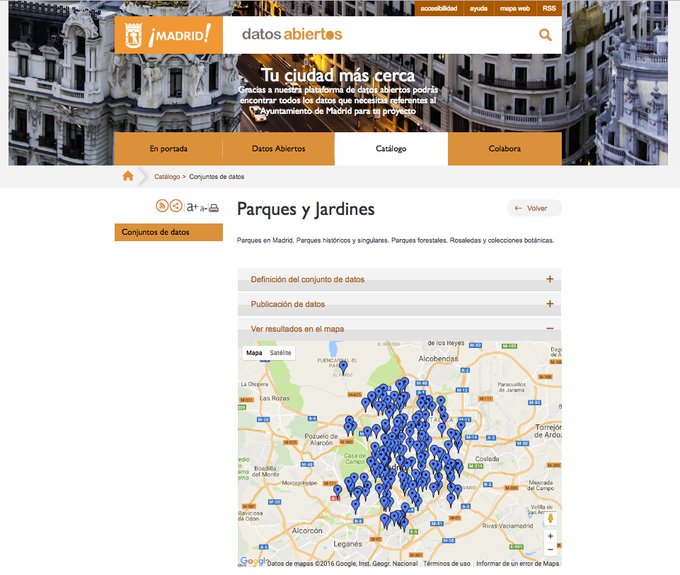

----

* Trainer: Ramiro Aznar · ramiroaznar@carto.com · [@ramiroaznar](http://twitter.com/ramiroaznar)
* September 29th, 2016
* CARTO for Open Cities
* [http://bit.ly/160929-opendata-carto](http://bit.ly/160929-opendata-carto)

<br>


<br>

### Índice

* [Introducción al Builder](#builder)
* [Demos](#demos):
  * [Árbolado urbano y manzas en NYC](#nyc)

### Prerequisitos

* Portátil.
* Conexión WiFi.
* Un navegador web moderno como Google Chrome.
* Ganas de aprender.

### Map Academy, tutoriales y otros recursos de interés

* [**Map Academy**](http://carto.com/academy).
* [**Tutoriales**](https://carto.com/docs/tutorials/).
* [Otros recursos de interés](https://github.com/ramiroaznar/intro-cartodb).

### Dispara tus dudas, problemas, errores en...

* Primero echa un ojo en las preguntas resueltas con la etiqueta `carto`en **[GIS Stack Exchange](http://gis.stackexchange.com/questions/tagged/carto)**.
* Si la primera opción falla, mandanos un email a **support@carto.com**.

### Antes de empezar...

* El instructor te dará un nombre de usuario y contraseña para poder logearte.
* Entra en [carto.com/login](http://carto.com/login) e introduce `opendataXX` y tu contraseña para acceder a tu cuenta `https://opendataXX.carto.com`.

<br>

----

## 1. Introducción al Builder <a name="builder"></a>

[CARTO Builder](https://carto.com/builder) es nuestra nueva aplicación web que permite a cualquier profesional analizar y predecir tendencias valiosas para sus organizaciones, de una manera intuitiva, lógica y fácil, a través de dashboards interactivos, dinámicos.

En [la siguiente presentación](https://docs.google.com/presentation/d/1M6UsXwzZkCRAIhCHftxNRYYQiWRG7caX0vkd2ZW8Ygg/edit#slide=id.g17701ad10f_0_0) se explicarán los componentes (capas, _widgets_ y visualización) así como el _workflow_ del Builder. Para conocer más en detalle puedes echarle un ojo a nuestra [documentación](https://carto.com/docs/carto-builder/) y sección de [preguntas frequentes](https://carto.com/docs/carto-builder/faqs/).

<br>



<br>

*Nota: puedes seguir investigando sobre esta herramienta en nuestro blog: [introducción](https://carto.com/blog/welcome-to-carto-builder/), [puntos](https://carto.com/blog/creating-point-maps-with-carto-builder/), [polígonos](https://carto.com/blog/creating-polygon-maps-with-carto-builder/), [categorías](https://carto.com/blog/creating-category-maps-with-carto-builder/), [agregaciones](https://carto.com/blog/exploring-big-datasets-with-carto/) y [estilos](https://carto.com/blog/styling-with-turbo-carto/).
 
<br>

----

## 2. Demos <a name="demos"></a>

<br>

----

### 2. 1. Acceso a zonas verdes en Madrid <a name="madrid"></a>

En la segunda y última demo intentaremos responder a la siguiente pregunta: **¿cuántos niños viven a menos de 500m de un parque en Madrid?**.

<br>

#### Descarga e importación de datos

* Descarga el dataset `parques_jardines` de [este link](https://team.carto.com/u/ramirocartodb/tables/builder-demo.parques_jardines/public/map) como archivo `csv`. Este dataset se descargo previamente del [portal de Datos Abiertos del Ayuntamiento de Madrid](http://datos.madrid.es/portal/site/egob/menuitem.c05c1f754a33a9fbe4b2e4b284f1a5a0/?vgnextoid=dc758935dde13410VgnVCM2000000c205a0aRCRD&vgnextchannel=374512b9ace9f310VgnVCM100000171f5a0aRCRD), contiene las localizaciones (puntos) de los diferentes zonas verdes de la ciudad de Madrid.

<br>



<br>

* Una vez descargado, arrastra el fichero sobre el menu de Datasets de tu cuenta de CARTO. El dataset se debería abrir en vista de tabla.

<br>

#### Añade widgets para filtrar por parque, barrio y distrito

* Haz click sobre el botón `CREATE MAP`. Y renombra el título y el nombre de la capa a tu gusto.

* Para añadir widgets, sigue los siguientes pasos:
  1. Haz click sobre la capa.
  2. En la pestaña de `DATA` verás la lista de columnas. Activa los checkbox de los siguientes campos: `nombre`, `barrio` y `distrito`.
  3. Renombra cada widget a tu gusto.

<br>

#### Crea áreas de influencia alrededor de cada parque

* Para crear áreas de influencia (AOI) o buffers alrededor de cada parque o jardín, sigue los siguientes pasos:
<br>
  1. Haz click en `ADD ANLYSIS` justo debajo del nombre de nuestra capa.
  2. Selecciona `Create areas of influence` y haz click en `ADD ANALYSIS`.
  3. Cambia la casilla de metros a `500`*. 
  4. Activa la opción de `Dissolve`.
  5. Haz click en `APPLY`.
<br>

* Arrastra la capa inicial o fuente (`A0`) fuera del análisis.

*Nota: para este taller hemos utilizado metros, pero se podrían crear isolíneas de tiempo. Échale un ojo a estos ejemplos para [zonas verdes](https://team.carto.com/u/ramirocartodb/builder/f9f8a670-7994-11e6-8058-0e05a8b3e3d7/embed), [bibliotecas](https://team.carto.com/u/ramirocartodb/builder/0639ddde-79b6-11e6-a450-0e3ebc282e83/embed), [polideportivos](https://team.carto.com/u/ramirocartodb/builder/4f5946c6-7993-11e6-87de-0ee66e2c9693/embed) y [hospitales](https://team.carto.com/u/ramirocartodb/builder/12a5a056-79bd-11e6-b756-0e3ff518bd15/embed).

<br>

#### Obtén la cantidad de niños que viven en las áreas de influencia

* Para obtener el dato de cuántos niños (según el INE) viven en las áreas de influencia alrededor de los parques de Madrid que acabamos de crear debemos seguir los siguientes pasos:
<br>
  1. Haz click en el símbolo `+` para añadir un nuevo analisis en tu workflow.
  2. Selecciona `Enrich from Data Observatory`*. Haz click en `ADD ANALYSIS`.
  3. Nombra la nueva columna (`NEW COL. NAME`) como `jov_pob`.
  4. Selecciona `Spain` en `COUNTRY`.
  5. Selecciona `Age and Gender` en `MEASUREMENT`.
  6. Selecciona `Persons aged under 16 years` en `SEGMENTS`.
  7. Haz click en `APPLY`.

> ¿Puedes contestar a la segunda pregunta?

* Si abrimos la vista de tabla podremos ver la nueva columna creada, y su valor. Pero para tenerlo presente en nuestra visualización, lo vamos añadir como un widget:
<br>
  1. Haz click sobre la pestaña de `DATA`. Accitva el checkbox del único campo `jov_pob`.
  2. Haz click en `EDIT`. Renombra el título a tu gusto, y cambia el tipo de widget a `FORMULA`.

*Nota: para conocer que otros datos están disponibles en el [Data Observatory](https://carto.com/data-observatory/) échale un ojo a [este catálogo](https://cartodb.github.io/bigmetadata/).

<br>

#### ¿Y en el barrio de Embajadores? ¿Y en el distrito Centro? ¿Y en el Jardín del Templo de Debod?

* Filtrando con los widgets de parques, barrios y distritos comprueba como los análisis se rehacen, los widgets se actualizan y finalmente la cantidad de niños varía.

<iframe width="100%" height="520" frameborder="0" src="https://team.carto.com/u/ramirocartodb/builder/e8dd15ca-863b-11e6-a4d5-0ee66e2c9693/embed" allowfullscreen webkitallowfullscreen mozallowfullscreen oallowfullscreen msallowfullscreen></iframe>

<br>

#### Publica y comparte tu mapa y tus resultados

* Estiliza el mapa a tu gusto. En mi casa he utilizado este CartoCSS:

```css
#layer {
  polygon-fill: #25A55F;
  polygon-opacity: 0.7;
  line-width: 2;
  line-color: lighten(#25A55F,30);
  line-opacity: 1;
}
```

* Para publicar y compartir tu mapa, sigue los siguientes pasos:
<br>
  1. En el menu principal, haz click en el botón de `SHARE`.
  2. Haz click en el botón azúl que pone `PUBLISH`.
  3. Comparte el link en twitter u otras RRSS.
<br>

* Para obtener el archivo `.carto` el cual contiene todos los análisis, estilos y widgets de tu visualización, sigue los siguientes pasos:
<br>
  1. Haz click en los tres puntos verticales a la derecha del título.
  2. Selecciona `EXPORT MAP`.
  3. Haz click en el botón `OK, EXPORT`.
<br>

* Este archivo lo podrás importar a partir de Noviembre cuando el Builder esté disponible para todos los usuarios. Mientras tanto puedes exportarte los datasets (construídos a través de tus análisis y filtrados gracias a los widgets) de esta manera:
<br>
  1. Haz click en los tres puntos suspensivos a la derecha del título de cualquier capa.
  2. Selecciona `EXPORT DATA`.
  3. Selecciona el formato deseado, y haz click en `DOWNLOAD`.
<br>

----
