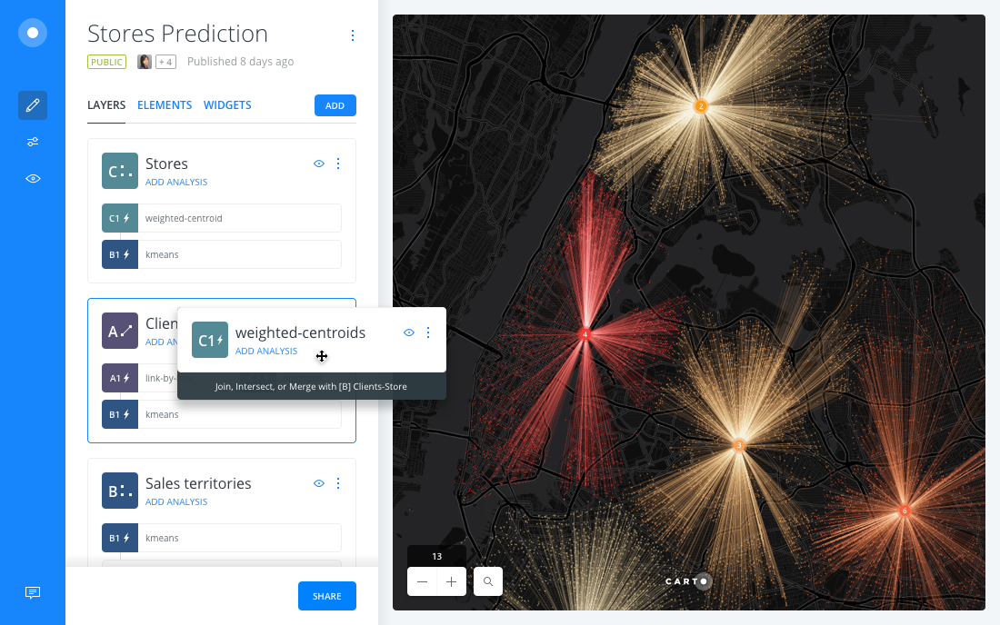
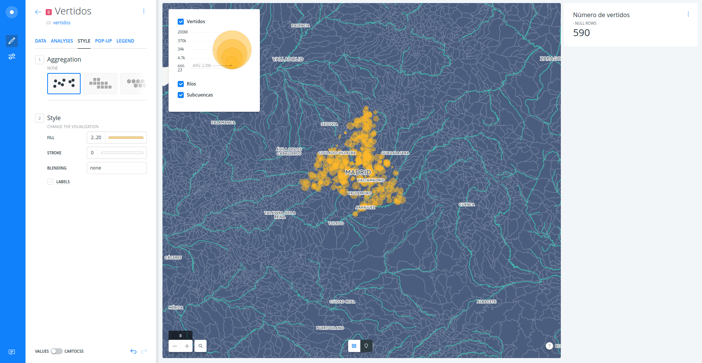
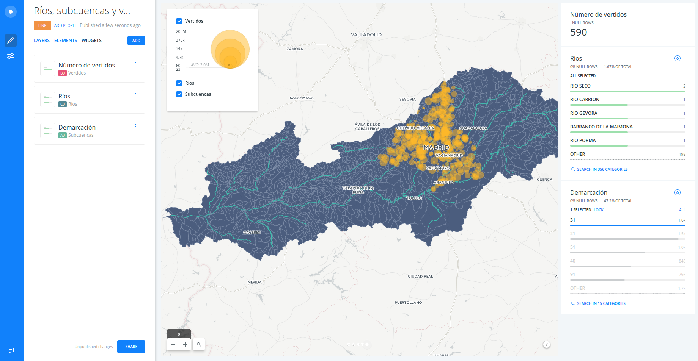
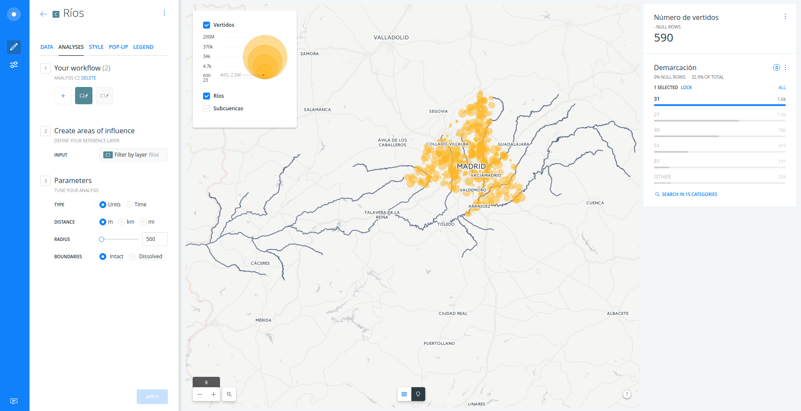

---

* Trainer: Ramiro Aznar · ramiroaznar@carto.com · [@ramiroaznar](http://twitter.com/ramiroaznar)
* November 11th, 2016
* Data Analysis and Visualization for environmental professionals
* Instituto Superior de Medio Ambiente (ISM) [event](http://www.ismedioambiente.com/programas-formativos/analisis-y-visualizacion-de-datos-ambientales-con-carto)
* [http://bit.ly/161011-ism-carto](http://bit.ly/161011-ism-carto)

---

## Introduction

### Prerequisites

* Laptop
* A modern browser (Google Chrome would be perfect)

### Map Academy, tutorials and other online resources

You can take a look on those resources if you want to warm up with CARTO

* [**Map Academy** courses](http://carto.com/academy).
* [**Tutorials**](https://carto.com/docs/tutorials/).
* [Other online resources](https://github.com/ramiroaznar/intro-cartodb).

### Further questions and troubleshooting

* Email to **support@carto.com**.
* Some questions could be already anwered at **[GIS Stack Exchange](http://gis.stackexchange.com/questions/tagged/carto)** `carto` tag.

### Contents

1. [Introduction to CARTO](#intro)
2. [Builder](#builder)
3. [Demo](#demo)

### Accounts set up

* The instructor will provide you a user and passwor to access your account
* Log into your `ismcartoXX` account going to `https://ismcartoXX.carto.com`

----

## Introduction to CARTO 

 

 

Slides available [here](https://docs.google.com/presentation/d/1P0zQWn-83UAaz2rshEIbZTncUVB6sUyUVTGaJ4aE2Go/edit?usp=sharing).

---

## Builder 

 

 

The [BUILDER](https://carto.com/builder/) is the new main web interface to interact with the CARTO platform. **It's a product aimed to everyone willing to manage, analyze and visualize geospatial information**. It's highly focused on usability, with a friendly graphical interface that unlocks all the power of the CARTO [ENGINE](https://carto.com/engine/) without having to know all the details on underlying technologies such as PostGIS or CartoCSS.

---

## Demo 

With this demo we want to answer the following question: _**what is the river more polluted within the Comunidad de Madrid?**_

### 1. Import datasets and create a map

#### 1. 1. Import datasets into CARTO

* Download the following datasets* from the `builder-demo` account:
  * [`vertidos`](https://team.carto.com/u/builder-demo/tables/vertidos/public) (as csv file), pollution point sources.
  * [`rios`](https://team.carto.com/u/builder-demo/tables/rios/public) (as shapefile file), Spanish rivers.
  * [`subcuencas`](https://team.carto.com/u/builder-demo/tables/subcuencas_nivel_0/public) (as shapefile), small Spanish rivers watersheds.

* Import the three datasets (one by one) into your CARTO account.

* Select `vertidos`, `rios` and `subcuencas` from your datasets dashboard, click on `NEW MAP`.

*These datasets were previously download from [the MARM website](http://servicios2.marm.es/sia/visualizacion/descargas/mapas.jsp).

 

#### 1. 2. Rename map title and layers

* Rename map title to **`Vertidos, ríos y subcuencas`**.
* Order the layers: first `vertidos`, then `rios` and at the bottom, `subcuencas`.
* Rename layers: 
  * `vertidos` as `Vertidos`,
  * `rios` as `Ríos`,
  * `subcuencas` as `Subcuencas`.

 

### 2. Style `Vertidos` layer and add your first widgets

#### 2. 1. Add your first widgets

* Click on `Vertidos` layer.
* On the `DATA` taba, you will be able to see an overview of all the fields that this layer contains.
  1. Activate the checkbox of `points count`.
  2. Click on `EDIT`.
  3. Rename the widget as `Número de vertidos`.

> This widget is a formula which counts the number of points (vertidos) within the visualization bounding box. Try to add a widget which filters rivers by name.

 

#### 2. 1. Style `Vertidos` layer

* Back to the main menu, in order to style `Vertidos` layer follow these steps:
  1. Click on `Vertidos` layer.
  2. Click on the `STYLE` tab. 
  3. Click on the number 7 next to `FILL` and set the marker size to `BY VALUE`.
  4. Select `volumen_m`. Leave the min and max default values.
  5. Click on the color bar and set the `opacity` to `0.5`.
  6. Set the `STROKE` to `0`.

> You have just created a bubble map! Larger points are "vertidos" with higher "volumen", and smaller points are "vertidos" with lower "volumen".

 

### 2. Filter rivers by watersheds

#### 2. 1. Connect `Rios` and `Subcuencas` layers

* In order to connect these two datasets, we need a common field. In our case, `cod_demar`. Then, we need to apply the `Filter by layer` analysis. Please, follow these steps:
  1. Back to the main menu, click on `Rios` layer.
  2. Click on `ANALYSIS` tab.
  3. Click on `ADD NEW ANALYSIS`.
  4. Select `Filter by layer` analysis. Click on `ADD ANALYSIS`.
  5. Set the parameters as follow:
    * `FILTER BY LAYER`: `Subcuencas`.
    * `SOURCE COLUMN`: `cod_demar`.
    * `FILTER COLUMN`: `cod_demar`.
  6. Click on `APPLY`.

 

#### 2. 2. Add a widget in order to filter `Rios` by `Subcuencas`

* You have both layers connected by the `cod_demar`. Now you would only need to add a category widget for filtering by this field:
  1. Back to the main menu, click on `Subcuencas` layer.
  2. Activate the checkbox of `cod_demar`.
  3. Click on `EDIT`.
  4. Rename the widget as `Demarcación`.
* Because we are only interested on the rivers that crosses the Comunidad de Madrid where the "vertidos" are located, we will click on `31` value (Tajo river watershed).

 

### 3. Intersect `Vertidos` points with areas of influence from every `Rio`

#### 3. 1. Create areas of influences

* Back to the main menu, in order to improve the visualization, disable the view of the `Subcuencas` layer.
* Then click on `ADD ANALYSIS` just below the `Rio` layer.
  1. Select `Create areas of influence`. Click on `ADD ANALYSIS`.
  2. Set the `RADIUS` parameter to `500` meters.
  3. Click on `APPLY`.

> You can check how dynamically the analysis is run by BUILDER changing the `RADIUS` parameter.

 

#### 3. 2. Intersect `Vertidos` points and get aggregate values

* You do not need to go back to run a new analysis. Just click on the `+` sign to concatenate a third and last analysis to the `Ríos` layer:
  1. Select `Intersect with second layer` analysis. Click on `ADD ANALYSIS`.
  2. Set the parameters as follow:
    * `TARGET LAYER`: `Subcuencas`.
    * `OPERATION`: `SUM(volume_m)`.
  3. Click on `APPLY`.

* Go back, to the main menu. Click on `Ríos` layer and check the new column `sum_volume_m` in the table view.

 

#### 3. 3. Add an histogram widget to explore volume of `Vertidos` per `Ríos`

* Back to the main menu, click on `Ríos` layer.
  1. Activate the checkbox of `sum_volume_m`.
  2. Click on `EDIT`.
  3. Rename the widget as `Volumen (m3) per river`.

> Could you answer the question?

#### 3. 4. Color `Ríos` layer by `Volumen` of `Vertido`

* Back to the main menu, in order to style `Vertidos` layer follow these steps:
  1. Click on `Ríos` layer.
  2. Click on the `STYLE` tab. 
  3. Click on the color bar next to `FILL` and set the polygon fill to `BY VALUE`.
  4. Select `sum_volumen_m`.
  5. Choose a color palette and set the number of buckets to `5`.
  6. Click on the color bar and set the `opacity` to `0.7`.
  7. Set the `STROKE` to `0.2`.

 

<iframe width="100%" height="520" frameborder="0" src="https://solutionscdb.carto.com/u/cdbsol-admin/builder/bfceaba2-8ee8-11e6-9655-0ecd1babdde5/embed" allowfullscreen webkitallowfullscreen mozallowfullscreen oallowfullscreen msallowfullscreen></iframe>

 

* The same intersect analysis can be done to the `Subcuencas` layer:

 

<iframe width="100%" height="520" frameborder="0" src="https://solutionscdb.carto.com/u/cdbsol-admin/builder/9c060f60-8ee0-11e6-b675-0ee66e2c9693/embed" allowfullscreen webkitallowfullscreen mozallowfullscreen oallowfullscreen msallowfullscreen></iframe>

 

#### 3. 5. Share your analysis and visualization!

* In order to publish your results, back to the main menu and click on `SHARE`.
* Click on `PUBLISH` (change from `Private` to `Public` if need).
* Copy the link and share it via email, Twitter, LinkedIn or your favorite social network.

----
