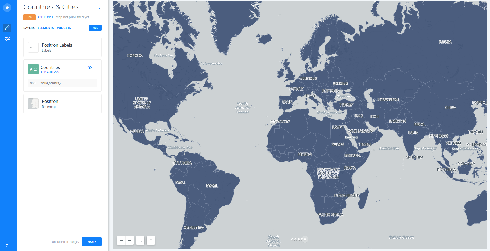
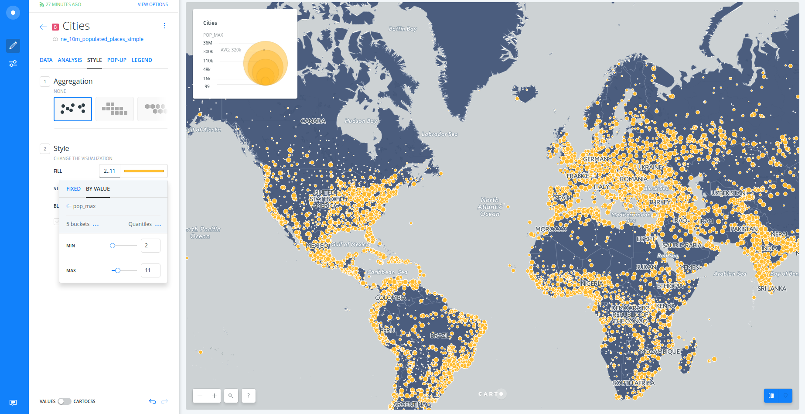
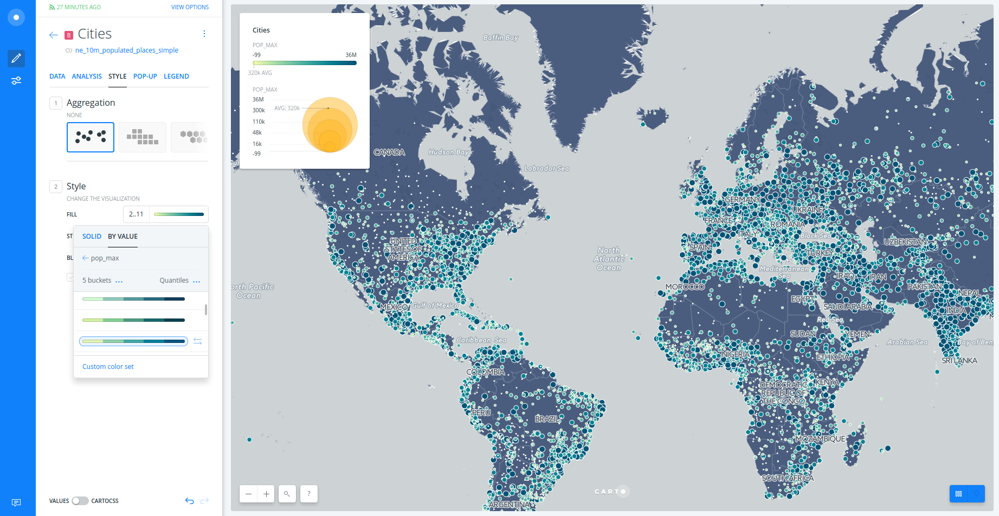
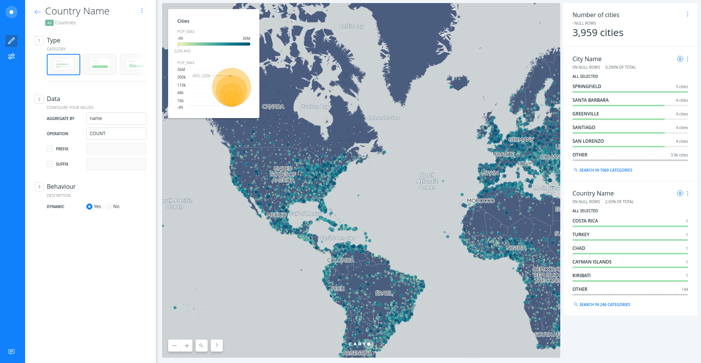
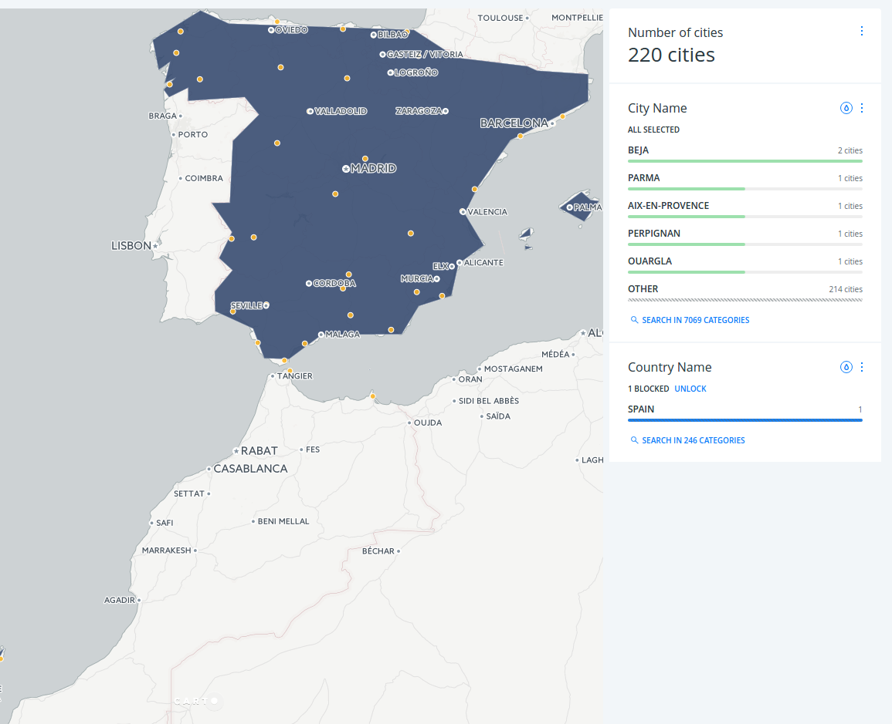

---

* Trainers: 
  * Ramiro Aznar · ramiroaznar@carto.com · [@ramiroaznar](http://twitter.com/ramiroaznar)
  * Jorge Sanz · jsanz@carto.com · [@xurxosanz](http://twitter.com/xurxosanz)
  * Ernesto Martinez · ernesto@carto.com · [@ernesmb](http://twitter.com/ernesmb)
  * Andrew Thompson · athompson@carto.com · [@andrewbt](http://twitter.com/andrewbt)
* November 5th, 2016
* Medialab-Prado [event](http://medialab-prado.es/article/taller-de-introduccion-al-carto-builder)
* GeoInquietos Madrid [meetup](https://www.meetup.com/es-ES/Geoinquietos-MAD/events/234912577/)

## [http://bit.ly/161105-geoinq-builder](http://bit.ly/161105-geoinq-builder)

---

<figcaption>Introduction to CARTO BUILDER</figcaption>

 

## Introduction

### Prerequisites

* Laptop
* A modern browser (Google Chrome would be perfect)

### Resources

You can take a look on those resources if you want to warm up with CARTO

* [**Learn** guides](https://carto.com/learn/guides).
* BUILDER [**Documentation**](https://carto.com/docs/carto-builder/) & [**FAQs**](https://carto.com/docs/carto-builder/faqs/).
* [`New Features` blog posts](https://carto.com/blog/categories/new-features).
* [Other online resources](https://github.com/ramiroaznar/intro-cartodb).

### Support

* Email to **support@carto.com**.
* Some questions could be already anwered at **[GIS Stack Exchange](http://gis.stackexchange.com/questions/tagged/carto)** `carto` tag.

### Contents

1. [Getting started](#getting-started)
* [Create a map](#map)
* [Layers](#layers)
* [Styling](#styling)
* [Widgets](#widgets)
* [Analysis](#analysis)
* [Publish](#publish)

2. [Demo: *Spies in the sky*](#demo)
* [Use case](#usecase)
* [Instructions](#instructions)
* [Result & Bonus!](#result)

### Setting up

* The instructors will provide you a user and passwor to access your account
* Log into your `geoinq-cartoXX` account going to `https://carto.com/login`

----

## 1. Getting started 

### 1.1. Create a map 

* Click on **`NEW MAP`**.
* Clik on **`SEARCH`** and type "world borders".
* Select `world_borders` dataset.
* Click on **`CREATE MAP`**.
* You can rename the map and layer title as "Countries & Cities" and "Countries" respectively, doing double click over them.

 

<figcaption>A view of BUILDER main dashboard</figcaption>

### 1.2. Layers 

* Add a new layer:
  * Click on **`ADD`**.
  * Click on **`SEARCH`** and type "populated places".
  * Select `ne_10m_populated_places_simple` dataset.
  * Click on **`ADD LAYER`**.
* You can rename the title of this new layer as "Cities".
* Click on the layer to show its components: 
  * **`DATA`**
  * **`ANALYSIS`**
  * **`STYLE`**
  * **`POP-UP`**
  * **`LEGEND`**

 

<figcaption>A view of BUILDER layer main menu</figcaption>

### 1.3. Styling 

* Create a bubble (proportional symbols) map:
  * Click on **`STYLE`**.
  * Click on point-size number.
  * Select **`BY VALUE`**.
  * Select `pop_max` column.

 

<figcaption>A view of BUILDER bubble map</figcaption>

 

* Create a chroropleth map:
  * Click on `marker-fill` column.
  * Select **`BY VALUE`**.
  * Select `pop_max` column.
  * You can customize your map further changing (and flipping) a different color palette, the number of buckets and quantification method.

 

<figcaption>A view of BUILDER bubble & choropleth map</figcaption>

 

* To learn more about how this works behind the scenes check out the CartoCSS panel.

### 1.4. Widgets 

* Add widgets to "Cities" layer:
  * Click on **`DATA`**.
  * Select `point count` in order to show the number of cities.
  * Select `name` in order to filter by city name.
  * Click on **`EDIT`** in order to customize both widgets.
* Add widgets to "Countries" layer:
  * Click on **`LAYERS`**.
  * Click on "Countries" layer.
  * Click on **`DATA`**.
  * Select `name` in order to filter by country name.
  * Click on **`EDIT`** in order to customize both widgets.
* Now you can filter and autostyle by country and city name.

 

<figcaption>A view of BUILDER widgets</figcaption>

### 1.5. Analysis 

* Go back to the main menu.
* Click on **`ADD ANALYSIS`** just below "Cities".
* Select **`Filter by layer`** analysis.
* Click on **`ADD ANALYSIS`**.
* Set the parameters as follows:
  * `FILTER BY LAYER`: "Countries".
  * `SOURCE COLUMN`: `sov_a3`.
  * `FILTER COLUMN`: `iso3`.
* Now fitering by country, you are also filtering the cities within that country. 

 

<figcaption>A view of BUILDER filtering and analysis power</figcaption>

### 1.6. Publish 

* Click on **`SHARE`**.
* Set to `LINK` or `PUBLIC`.
* Click on **`PUBLISH`**.
* Now you can share the map as link or embed.

 

<iframe width="100%" height="520" frameborder="0" src="https://team.carto.com/u/ramirocartodb/builder/23cd250b-ffd9-4267-806f-b935716eeb8c/embed" allowfullscreen webkitallowfullscreen mozallowfullscreen oallowfullscreen msallowfullscreen></iframe>

---

## 2. Demo: *Spies in the sky* 

### 2.1. Use Case 

This use case is based on a data journalism research [published in buzzfeed in April](https://www.buzzfeed.com/peteraldhous/spies-in-the-skies?utm_term=.oreRaVR2l4#.htP3xv3LK9). The authors used [data from FlighRadar24](https://www.flightradar24.com/how-it-works), where thousands of collaborators upload flight information using automatic dependent surveillance-broadcast (ADS-B) technology. You can have a look at how they built the dataset [in this github repository](http://buzzfeednews.github.io/2016-04-federal-surveillance-planes/analysis.html). The research reveals that each weekday, dozens of U.S. government aircraft (from FBI and DHS agencies) take to the skies and slowly circle over American cities.

Back in the day, the authors used CARTO Editor SQL and CartoCSS. Now because of BUILDER, you can do the same but in just a few minutes!

 

### 2.2. Instructions 

* Download flight data from [here](https://team.carto.com/u/builder-demo/tables/flights/public?redirected=true).
* Explore the visualization. Could you observe any clear pattern? The expected pattern are straight lines, but what about the circles?
* Add `flight_id` category widget.
* If you go to San Francisco area, one of dots showing the circle pattern is the `8366cde` flight.
* Add **filter by column value** analysis, selecting `8366cde` as the `flight_idp`.
* Remove widget.
* Drag the analysis node out.
* Add time series widget.
* Add **connect with lines** analysis.
* Drag the analysis node out.
* Add **centroids** analysis to dot points.
* Drag the analysis node out.
* Style: dots, lines and centroids layer.
* Add widgets to get insights.
* Publish.

 

### 2.3. Result & Bonus! 

<iframe width="100%" height="520" frameborder="0" src="https://solutionscdb.carto.com/u/jsanzcdb/builder/347e9dcc-978b-11e6-b789-0ee66e2c9693/embed?state=%7B%22map%22%3A%7B%22ne%22%3A%5B33.98322500128355%2C-117.78133392333984%5D%2C%22sw%22%3A%5B34.31281554905527%2C-117.07855224609376%5D%7D%2C%22widgets%22%3A%7B%2253e5d9c6-d100-4ee3-a2fc-0c7a07989f6a%22%3A%7B%22normalized%22%3Atrue%7D%2C%22472671ae-23d4-4fbd-ae3f-3ee16ebded43%22%3A%7B%22normalized%22%3Atrue%7D%7D%7D" allowfullscreen webkitallowfullscreen mozallowfullscreen oallowfullscreen msallowfullscreen></iframe>

 

* Bonus: you can connect with lines the flight data points to their centroid.

---
