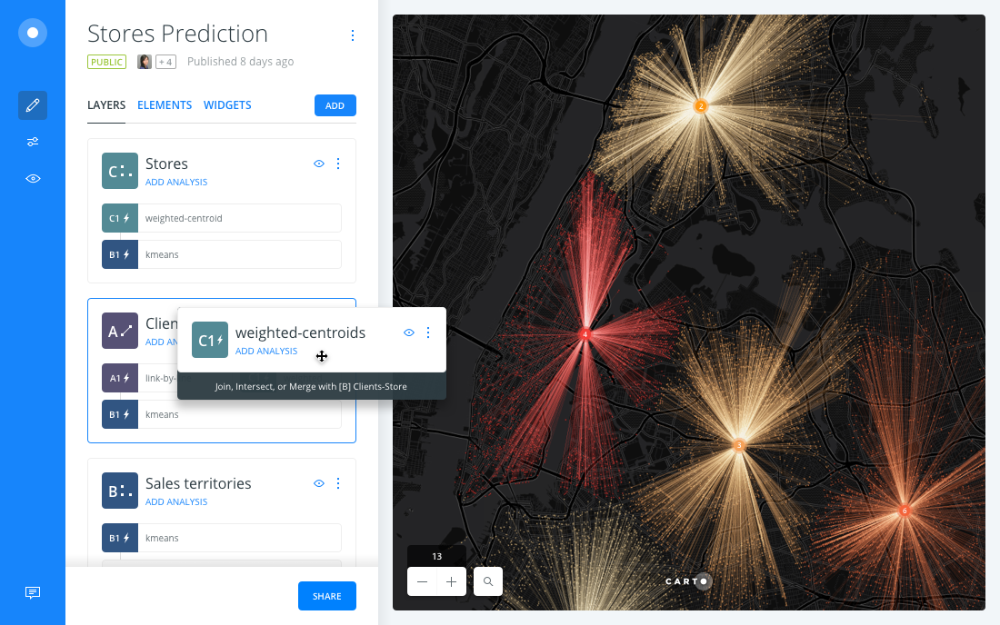
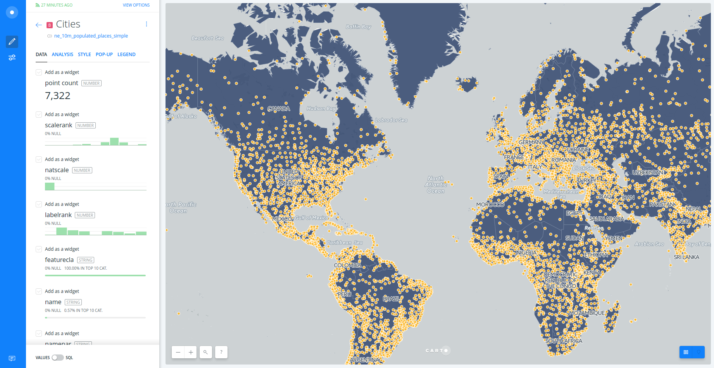

---

* Trainers: 
  * Ramiro Aznar · ramiroaznar@carto.com · [@ramiroaznar](http://twitter.com/ramiroaznar)
  * Jorge Sanz · jsanz@carto.com · [@xurxosanz](http://twitter.com/xurxosanz)
  * Ernesto Martinez · ernesto@carto.com · [@ernesmb](http://twitter.com/ernesmb)
  * Andrew Thompson · athompson@carto.com · [@andrewbt](http://twitter.com/andrewbt)
* November 5th, 2016
* Medialab-Prado [event](http://medialab-prado.es/article/taller-de-introduccion-al-carto-builder)
* GeoInquietos Madrid [meetup](https://www.meetup.com/es-ES/Geoinquietos-MAD/events/234912577/)

## [http://bit.ly/161011-ism-carto](http://bit.ly/161105-intro-builder)

---

<figcaption>Introduction to CARTO BUILDER</figcaption>

 

## Introduction

### Prerequisites

* Laptop
* A modern browser (Google Chrome would be perfect)

### Resources

You can take a look on those resources if you want to warm up with CARTO

* [**Map Academy** courses](http://carto.com/academy).
* [**Tutorials**](https://carto.com/docs/tutorials/).
* BUILDER [**Documentation**](https://carto.com/docs/carto-builder/) & [**FAQs**](https://carto.com/docs/carto-builder/faqs/).
* [`New Features` blog posts](https://carto.com/blog/categories/new-features).
* [Other online resources](https://github.com/ramiroaznar/intro-cartodb).

### Support

* Email to **support@carto.com**.
* Some questions could be already anwered at **[GIS Stack Exchange](http://gis.stackexchange.com/questions/tagged/carto)** `carto` tag.

### Contents

1. [Getting started](#getting-started)
1.1. [Create a map](#map)
1.2. [Layers](#layers)
1.3. [Styling](#styling)
1.4. [Widgets](#widgets)
1.5. [Analysis](#analysis)
1.6. [Publish](#publish)

2. [Demo: *Spies in the sky*](#demo)

### Setting up

* The instructors will provide you a user and passwor to access your account
* Log into your `geoinq-cartoXX` account going to `https://carto.com/login`

----

## 1. Getting started 

### 1.1. Create a map 

* Click on **`NEW MAP`**.
* Clik on **`SEARCH`** and type "world borders".
* Select `world_borders` dataset.
* Click on **`CREATE MAP`**.
* You can rename the map and layer title as "Countries & Cities" and "Countries" respectively, doing double click over them.

 

<figcaption>A view of BUILDER main dashboard</figcaption>

### 1.2. Layers 

* Add a new layer:
  * Click on **`ADD`**.
  * Click on **`SEARCH`** and type "populated places".
  * Select `ne_10m_populated_places_simple` dataset.
  * Click on **`ADD LAYER`**.
* You can rename the title of this new layer as "Cities".
* Click on the layer to show its components: 
  * **`DATA`**
  * **`ANALYSIS`**
  * **`STYLE`**
  * **`POP-UP`**
  * **`LEGEND`**

 

<figcaption>A view of BUILDER layer main menu</figcaption>

### 1.3. Styling 

* Create a bubble (proportional symbols) map:
  * Click on **`STYLE`**.
  * Click on point-size number.
  * Select **`BY VALUE`**.
  * Select `pop_max` column.

 

<figcaption>A view of BUILDER bubble map</figcaption>

 

* Create a chroropleth map:
  * Click on `marker-fill` column.
  * Select **`BY VALUE`**.
  * Select `pop_max` column.
  * You can customize your map further changing (and flipping) a different color palette, the number of buckets and quantification method.

 

<figcaption>A view of BUILDER bubble & choropleth map</figcaption>

 

* To learn more about how this works behind the scenes check out the CartoCSS panel.

### 1.4. Widgets 

* Add widgets to "Cities" layer:
  * Click on **`DATA`**.
  * Select `point count` in order to show the number of cities.
  * Select `name` in order to filter by city name.
  * Click on **`EDIT`** in order to customize both widgets.
* Add widgets to "Countries" layer:
  * Click on **`LAYERS`**.
  * Click on "Countries" layer.
  * Click on **`DATA`**.
  * Select `name` in order to filter by country name.
  * Click on **`EDIT`** in order to customize both widgets.
* Now you can filter and autostyle by country and city name.

 

<figcaption>A view of BUILDER widgets</figcaption>

### 1.5. Analysis 

* Go back to the main menu.
* Click on **`ADD ANALYSIS`** just below "Cities".
* Select **`Filter by layer`** analysis.
* Click on **`ADD ANALYSIS`**.
* Set the parameters as follows:
  * `FILTER BY LAYER`: "Countries".
  * `SOURCE COLUMN`: `sov_a3`.
  * `FILTER COLUMN`: `iso3`.
* Now fitering by country, you are also filtering the cities within that country. 

 

<figcaption>A view of BUILDER filtering and analysis power</figcaption>

 

### 1.6. Publish 

 

---

## 2. Demo: *Spies in the sky* 

 

---.
