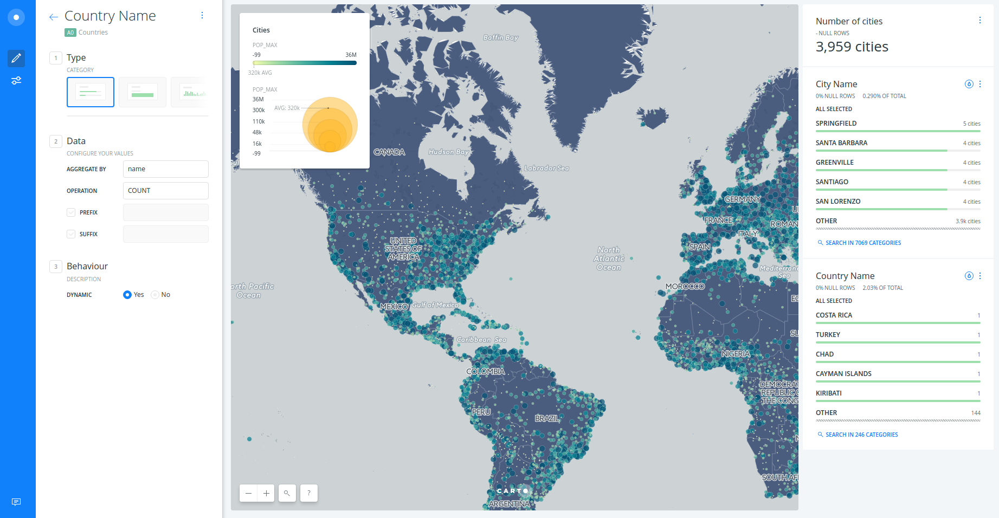

---

* Trainers: Ramiro Aznar · ramiroaznar@carto.com · [@ramiroaznar](http://twitter.com/ramiroaznar)
* November 23th, 2016

## [http://bit.ly/161123-upsociative](http://bit.ly/161123-upsociative)

---

<figcaption>Introduction to CARTO BUILDER</figcaption>

 

## Introduction

### Prerequisites

* Laptop
* A modern browser (Google Chrome would be perfect)

### Resources

You can take a look on those resources if you want to warm up with CARTO

* [**Learn** guides](https://carto.com/learn/guides).
* BUILDER [**Documentation**](https://carto.com/docs/carto-builder/) & [**FAQs**](https://carto.com/docs/carto-builder/faqs/).
* [`New Features` blog posts](https://carto.com/blog/categories/new-features).
* [Other online resources](https://github.com/ramiroaznar/intro-cartodb).

### Support

* Email to **support@carto.com**.
* Some questions could be already anwered at **[GIS Stack Exchange](http://gis.stackexchange.com/questions/tagged/carto)** `carto` tag.

### Contents

1. [Getting started](#getting-started)
* [Create a map](#map)
* [Layers](#layers)
* [Styling](#styling)
* [Widgets](#widgets)
* [Analysis](#analysis)
* [Publish](#publish)

2. [Demo: *Risk Analysis*](#demo)
* [Use case](#usecase)
* [Instructions](#instructions)
* [Result](#result)

### Setting up

* The instructors will provide you a user and passwor to access your account
* Log into your `upsoc-cartoXX` account going to `https://carto.com/login`

----

## 1. Getting started 

### 1.1. Create a map 

* Click on **`NEW MAP`**.
* Clik on **`SEARCH`** and type "world borders".
* Select `world_borders` dataset.
* Click on **`CREATE MAP`**.
* You can rename the map and layer title as "Countries & Cities" and "Countries" respectively, doing double click over them.

 

<figcaption>A view of BUILDER main dashboard</figcaption>

### 1.2. Layers 

* Add a new layer:
  * Click on **`ADD`**.
  * Click on **`SEARCH`** and type "populated places".
  * Select `ne_10m_populated_places_simple` dataset.
  * Click on **`ADD LAYER`**.
* You can rename the title of this new layer as "Cities".
* Click on the layer to show its components: 
  * **`DATA`**
  * **`ANALYSIS`**
  * **`STYLE`**
  * **`POP-UP`**
  * **`LEGEND`**

 

<figcaption>A view of BUILDER layer main menu</figcaption>

### 1.3. Styling 

* Create a bubble (proportional symbols) map:
  * Click on **`STYLE`**.
  * Click on point-size number.
  * Select **`BY VALUE`**.
  * Select `pop_max` column.

 

<figcaption>A view of BUILDER bubble map</figcaption>

 

* Create a chroropleth map:
  * Click on `marker-fill` column.
  * Select **`BY VALUE`**.
  * Select `pop_max` column.
  * You can customize your map further changing (and flipping) a different color palette, the number of buckets and quantification method.

 

<figcaption>A view of BUILDER bubble & choropleth map</figcaption>

 

* To learn more about how this works behind the scenes check out the CartoCSS panel.

### 1.4. Widgets 

* Add widgets to "Cities" layer:
  * Click on **`DATA`**.
  * Select `point count` in order to show the number of cities.
  * Select `name` in order to filter by city name.
  * Click on **`EDIT`** in order to customize both widgets.
* Add widgets to "Countries" layer:
  * Click on **`LAYERS`**.
  * Click on "Countries" layer.
  * Click on **`DATA`**.
  * Select `name` in order to filter by country name.
  * Click on **`EDIT`** in order to customize both widgets.
* Now you can filter and autostyle by country and city name.

 

<figcaption>A view of BUILDER widgets</figcaption>

### 1.5. Analysis 

* Go back to the main menu.
* Click on **`ADD ANALYSIS`** just below "Cities".
* Select **`Filter by layer`** analysis.
* Click on **`ADD ANALYSIS`**.
* Set the parameters as follows:
  * `FILTER BY LAYER`: "Countries".
  * `SOURCE COLUMN`: `sov_a3`.
  * `FILTER COLUMN`: `iso3`.
* Click on **`APPLY`**.
* Now fitering by country, you are also filtering the cities within that country. 

 

<figcaption>A view of BUILDER filtering by layer analysis power</figcaption>

 

- Click on **`+`** to add a new analysis.
- Select **`Create areas of influence`** analysis.
- Click on **`ADD ANALYSIS`**.
- Set parameters as follows:
  - TYPE: "Distance".
  - UNITS: "Km".
  - RADIUS: "50".
  - TRACTS: "2".
  - BOUNDARIES: "Intact"
- Click on **`APPLY`**.

*Bonus: 
- Drag and drop out the "Filter by layer" node in order to get the points back.
- Style the new AOI layer and filter by country using widgets.

 

<figcaption>A view of BUILDER AOI analysis power</figcaption>

### 1.6. Publish 

* Click on **`SHARE`**.
* Set to `LINK` or `PUBLIC`.
* Click on **`PUBLISH`**.
* Now you can share the map as link or embed.

 

<iframe width="100%" height="520" frameborder="0" src="https://team.carto.com/u/ramirocartodb/builder/d1c63734-40ad-4ebb-878a-1bc44eecea2e/embed" allowfullscreen webkitallowfullscreen mozallowfullscreen oallowfullscreen msallowfullscreen></iframe>

---

## 2. Demo: *Risk Analysis* 

### 2.1. Use Case 

* Let's take a look at BUILDER and see how we can use this new tool to power our analysis. In this particular use case we are going to look at risk. How to determine what areas by county in the US have a higher risk for insuring railroad companies.

* We have a freely available dataset that the Department of Transportation publishes that tells me where across the US over the las 4 years there have been railroad accidents and the associated damage or cost of each of these incidences.

* As an insurance company, I may be approached by different railroad companies and they want to understand how much it would be cost to insurance their equipment. So part of our analysis today would be to look at this data and determine the areas of the highest risk across the US.

 

### 2.2. Instructions 

#### Connect dataset

* Copy and paste this url into your browser: `https://builder-demo.carto.com:443/api/v2/sql?q=select * from "builder-demo".dot_rail_safety_data_1&format=gpkg&filename=rail_road_data.gpkg`.
* Wait until the dataset is downloaded.
* Click on `NEW MAP`.
* Click on `CONNECT DATASET`.
* Click on `BROWSE` and select the file (or drag and drop it).
* Click on `CONNECT DATASET`.
* Rename title and layer names.

 

#### Style dots based upon the total damage

* Click on the railroad layer.
* Click on `STYLE`.
* Style dot width based upon `total_damage` value.

 

#### Filter by railroad companies and dates

* Click on `DATA`.
* Add `railroad` and `date` widgets.
* Filter by railroad company and/or date range.

 

#### Add US counties dataset

* Back to the main menu, click on `ADD` (layer).
* Click on `DATA LIBRARY` and type "us counties".
* Select `cb_2013_us_county_500k` and click on `ADD LAYER`.
* Rename the new layer.
* Drag and drop the railroad layer above the counties layer.

 

#### Intersect US counties with railroad accidents

* Click on counties layer.
* Click on `ANALYSIS`.
* Select `Intersect with 2nd layer` analysis.
* Click on `ADD ANALYSIS`.
* Set parameters as follows:
  * Railroad layer as `TARGET LAYER`.
  * `SUM(total_damage)` as `OPERATION`. 
* Click on `APPLY`.
* Back on the main menu, click on `WIDGETS`.
* Click on `HISTOGRAM`.
* Select `sum_total_damage`.
* Click on `CONTINUE`.

 

#### Clustering

* Click on counties layer.
* Click on `ANALYSIS`.
* Select `Detect outliers and clusters` analysis.
* Click on `ADD ANALYSIS`.
* Select `sum_total_damage` as `TARGET COLUMN` and leave the rest of parameters with the default values.
* Click on `APPLY`.
* Back on the main menu, click on `WIDGETS`.
* Select `quads`.
* Click on `CONTINUE`.

 

### 2.3. Result 

<iframe width="100%" height="520" frameborder="0" src="https://builder-demo.carto.com/builder/7d0c3302-2457-40cc-8a06-86113619cf8b/embed" allowfullscreen webkitallowfullscreen mozallowfullscreen oallowfullscreen msallowfullscreen></iframe>

---
