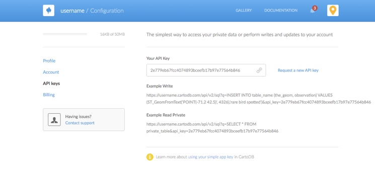
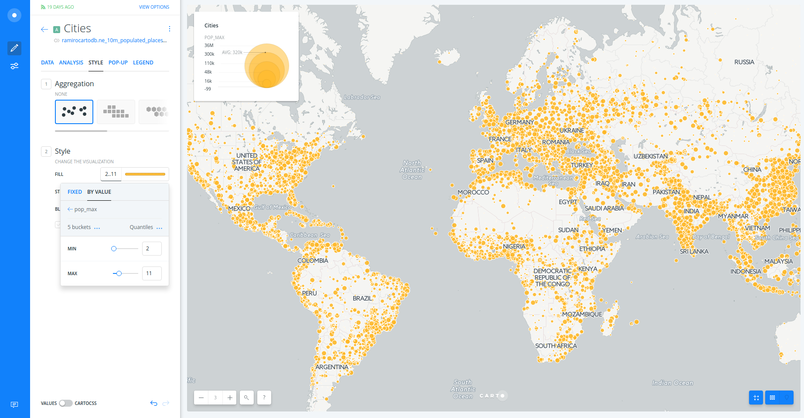

---

* Trainers: Ramiro Aznar · ramiroaznar@carto.com · [@ramiroaznar](http://twitter.com/ramiroaznar)
* November 24th, 2016

## [http://bit.ly/161124-qgis-builder](http://bit.ly/161124-qgis-builder)

---

<figcaption>Introduction to CARTO BUILDER</figcaption>

 

## Introduction

### Prerequisites

* Laptop,
* A modern browser (Google Chrome would be perfect),
* QGIS installed.

### Resources

You can take a look on those resources if you want to warm up with CARTO:

* [**Learn** guides](https://carto.com/learn/guides).
* BUILDER [**Documentation**](https://carto.com/docs/carto-builder/) & [**FAQs**](https://carto.com/docs/carto-builder/faqs/).
* [`New Features` blog posts](https://carto.com/blog/categories/new-features).
* QGIS Plugin [website](https://plugins.qgis.org/plugins/QgisCartoDB/) & [repo](https://github.com/gkudos/qgis-cartodb).
* [Other online resources](https://github.com/ramiroaznar/intro-cartodb).

### Support

* Email to **support@carto.com**.
* Some questions could be already anwered at **[GIS Stack Exchange](http://gis.stackexchange.com/questions/tagged/carto)** `carto` tag.

### Contents

1. [QGIS to CARTO](#qgis)
* [Setting up](#setting-up)
* [QGIS Plugin installation](#install)
* [Connect your CARTO account to QGIS](#connect)
* [Import CARTO layers](#import)
* [Create a map](#map)

2. [Getting started with BUILDER](#builder)
* [Layers](#layers)
* [Styling](#styling)
* [Widgets](#widgets)
* [Analysis](#analysis)
* [Publish](#publish)

----

## 1. QGIS to CARTO 

### 1.1. Setting up 

* The instructors will provide you a user and passwor to access your account
* Log into your `upm-cartoXX` account going to `https://carto.com/login`

 

### 1.2. QGIS Plugin installation 

* Open QGIS
* From the `Plugins` menu -> `Manage and Install Plugins`
* Type "CartoDB Plugin".
* Click `Install Plugin`.

 

### 1.3. Connect your CARTO account to QGIS 

* From the CartoDB toolbox (located on the QGIS Web Toolbar) or from the Layers Toolbar in QGIS, Click `Add Connection`.
* Select `New` from the *Connection Manager*.
* Go back to CARTO dashboard. 
* Go to your account options (at the top right corner) and copy your API Key.

 

<figcaption>CARTO API Key</figcaption>

 

* Enter your CARTO account settings: user name and API Key. 
* Click `Save`.

*Note: a more detailed guide can be found [here](https://github.com/gkudos/qgis-cartodb/wiki/Connect-your-CartoDB-Account-to-QGIS).

 

### 1.4. Import CARTO layers 

* Go back to CARTO dashboard.
* Click on `DATASETS` (at the top left corner).
* Click on `DATA LIBRARY` and search for "populated places" dataset.
* Select `ne_10m_populated_places_simple` and click on `CONNECT DATASET`.
* Go back to QGIS.
* From the CartoDB toolbox, click `Add CartoDB Layer`.
* Select `ne_10m_populated_places_simple` dataset from the list, or search for a table name to filter the list, and click `OK`.

 

<figcaption>CARTO dataset in QGIS</figcaption>

 

*Note: a more detailed guide can be found [here](https://github.com/gkudos/qgis-cartodb/wiki/Add-CartoDB--layer-to-Qgis-Project).

 

### 1.5. Create a map 

* After working with QGIS, you can export your layers into CARTO or create a map.
* From the CartoDB toolbox, click `Create New Map`.
* Type the title and description for your map.
* Click on `Create`.
* Go back to CARTO dashboard.
* Click on `MAPS` (at the top left corner).
* Open the new map you have just created.

 

<figcaption>CARTO BUILDER main menu</figcaption>

 

*Note: a more detailed guide can be found [here](https://github.com/gkudos/qgis-cartodb/wiki/Publish-single-or-multilayer-visualizations#publish-map-on-cartodb).

## 2. Getting started with BUILDER 

### 2.1. Layers 

* You can rename the title of this new layer as "Cities".
* Click on the layer to show its components: 
  * **`DATA`**
  * **`ANALYSIS`**
  * **`STYLE`**
  * **`POP-UP`**
  * **`LEGEND`**

 

### 2.2. Styling 

* Create a bubble (proportional symbols) map:
  * Click on **`STYLE`**.
  * Click on point-size number.
  * Select **`BY VALUE`**.
  * Select `pop_max` column.

 

<figcaption>A view of BUILDER bubble map</figcaption>

 

* Create a chroropleth map:
  * Click on `marker-fill` column.
  * Select **`BY VALUE`**.
  * Select `pop_max` column (a better cartographic practice would be selecting a normalized field).
  * You can customize your map further changing (and flipping) a different color palette, the number of buckets and quantification method.

 

<figcaption>A view of BUILDER bubble & choropleth map</figcaption>

 

*To learn more about how this works behind the scenes check out the CartoCSS panel.

 

### 2.3. Widgets 

* Set styles as default (orange dots).
* Go back to the main menu.
* Click on the layer.
* Add widgets to "Cities" layer:
  * Click on **`DATA`**.
  * Select `point count` in order to show the number of cities.
  * Select `name` in order to filter by city name.
  * Select `adm0name` in order to filter by country name.
  * Click on **`EDIT`** in order to customize these widgets.

 

<figcaption>A view of BUILDER widgets</figcaption>
 

### 2.4. Analysis 

#### Centroids

* Go back to the main menu.
* Click on `LAYERS`.
* Click on `ADD ANALYSIS` below "Cities" layer.
* Select "Find centroid of geometries" analysis.
* Click on `ADD ANALYSIS`.
* Set paramaters as follows:
  * `CATEGORIZE...`: `adm0name`.
  * `WEIGHTED BY`: `pop_max`.
  * `AGGREGATE...`: `SUM(pop_max)`.

 

<figcaption>A view of BUILDER centroid analysis</figcaption>
 

### Connect with lines

* Go back to the main menu.
* Drag and drop out the source layer node.
* Rename `A` node as "Centroids".
* Click on `ADD ANALYSIS` below "Cities" layer.
* Select "Connect with lines" analysis.
* Click on `ADD ANALYSIS`.
* Set paramaters as follows:
  * `TYPE`: `To Source`.
  * `TARGET`: `A1 Centroids`.
  * `CLOSEST`: `All to all`.
  * `GROUP BY`: 
    * `SOURCE COL.`: `adm0name`.
    * `TARGET COL.`: `category`.
* Click on `APPLY`.

 

<figcaption>A view of BUILDER connect with lines analysis</figcaption>
 

* Finally, edit centroid dots based upon `value` and lines based upon `pop_max`.

*Note: to learn more about connect with lines analysis have a look at this [guide](https://carto.com/learn/guides/analysis/connect-with-lines) and [blogpost](http://ramiroaznar.com/2016/11/12/builder-analysis-insights/).

 

### 2.5. Publish 

* Click on **`SHARE`**.
* Set to `LINK` or `PUBLIC`.
* Click on **`PUBLISH`**.
* Now you can share the map as link or embed.

 

<iframe width="100%" height="520" frameborder="0" src="https://team.carto.com/u/ramirocartodb/builder/7ace46a2-b0c6-11e6-b13f-0ecd1babdde5/embed" allowfullscreen webkitallowfullscreen mozallowfullscreen oallowfullscreen msallowfullscreen></iframe>

---
