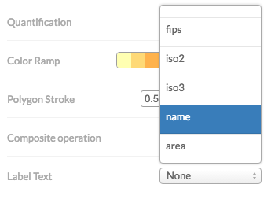
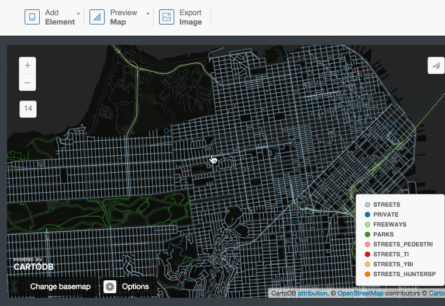

---

<a href="http://www.carto.com/" target='_blank'><center></center></a>

---

* Instructor: Daniel M. Sheehan · danny@carto.com · [@nygeog](http://twitter.com/nygeog)
* January 19th, 2017
* Short url: [http://bit.ly/2ioUffA](http://bit.ly/2ioUffA)
* Full url: [http://cartodb.github.io/training/introductory/skanska-training.html](http://cartodb.github.io/training/introductory/skanska-training.html)
* Full CARTO training materials: [https://github.com/CartoDB/carto-workshop](https://github.com/CartoDB/carto-workshop)

---

<a href="http://www.usa.skanska.com/" target='_blank'><center></center></a>

---

#### About Skanska
Skanska is one of the world's leading construction groups. In the U.S., we are a provider of comprehensive construction services and a developer of public-private partnerships. We apply our expertise to everything from small renovations to billion-dollar projects, using a variety of delivery methods.

---

#### Data: 
[http://www.usa.skanska.com/About-Skanska/Our-geographic-markets/](http://www.usa.skanska.com/About-Skanska/Our-geographic-markets/)

#### Style:

Hex color: `#263F6C`

---


<figcaption>Introduction to CARTO BUILDER</figcaption>

<br>


#### Map Academy, tutorials and other online resources

* [**Map Academy** courses](https://academy.cartodb.com/).
* [**Tutorials**](https://docs.cartodb.com/tutorials/).
* [Other online resources](https://github.com/ramiroaznar/intro-cartodb).

#### Further questions and troubleshooting

* Email to **support@carto.com**.
* Some questions could be already anwered at **[GIS Stack Exchange](http://gis.stackexchange.com/questions/tagged/carto)** `cartodb` tag.

## Contents
- [Importing datasets](#import)
- [Getting your data ready](#dataset)
- [Making a map](#map)

----

## 1. Importing datasets <a name="import"></a>

### 1.1 Supported Geospatial Data Files

CartoDB supports the following geospatial data formats to upload vector data*:

* **`Shapefile`**
* **`KML`**
* **`KMZ`**
* **`GeoJSON`***
* **`CSV`**
* **`Spreadsheets`**
* **`GPX`**
* **`OSM`**

Importing **different geometry types** in the same layer or in a FeatureCollection element (GeoJSON) is not supported. More detailed information [here](http://docs.cartodb.com/cartodb-platform/import-api/geospatial-data-formats/#supported-geospatial-data-formats).

[*] More detailed information about GeoJSON format [here](http://geojson.org/geojson-spec.html), [here](http://geojsonlint.com/) and [here](http://geojson.io/#map=2/20.0/0.0).

### 1.2 Common importing errors

* **Dataset too large**:
  * File size limit: 150 Mb (free).
  * Import row limit: 500,000 rows (free).
  * *Solution*: split your dataset into smaller ones, import them into CartoDB and merge them.
* **Malformed CSV**:
  * *Solution*: check termination lines, header...
* **Encoding**:
  * *Solution*: `Save with Encoding` > `UTF-8 with BOM` in [Sublime Text](https://www.sublimetext.com/), any other decent text editor or [iconv](https://en.wikipedia.org/wiki/Iconv).
* **Shapefile missing files**:
  * Missing any of the following files within the compressed file will produce an importing error:
    * `.shp`: contains the geometry. REQUIRED.
    * `.shx`: contains the shape index. REQUIRED.
    * `.prj`: contains the projection. REQUIRED.
    * `.dbf`: contains the attributes. REQUIRED.
  * Other auxiliary files such as `.sbn`, `.sbx` or `.shp.xml` are not REQUIRED.
  * *Solution*: make sure to add all required files.
* **Duplicated id fields**:
  * *Solution*: check your dataset, remove or rename fields containing the `id` keyword.
* **Format not supported**:
  * URLs -that are not points to a file- are not supported by CartoDB.
  * *Solution*: check for missing url parameters or download the file into your local machine, import it into CartoDB.
* **Non supported SRID**:
  * Solution: try to reproject your resources locally to a well known projection like `EPSG:4326`,`EPSG:3857`,`EPSG:25830` and so on.

Other importing errors and their codes can be found [here](http://docs.cartodb.com/cartodb-platform/import-api/import-errors/).

----

## 2. Getting your data ready <a name="dataset"></a>

### 2.1 Geocoding

If you have a column with longitude coordinates and another with latitude coordinates, CartoDB will automatically detect and covert values into `the_geom`. If this is not the case, CartoDB can help you by turning the named places into best guess of latitude-longitude coordinates:

* **By Lon/Lat Columns**.
* **By City Names**.
* **By Admin. Regions**.
* **By Postal Codes**.
* **By IP Addresses**.
* **By Street Addresses**.

Know more about geocoding in CartoDB [here](http://docs.cartodb.com/tutorials/how_to_georeference/).

### 2.2 Datasets

These are the datasets we are going to use on our workshop. You'll find them all on our [Data Library](https://cartodb.com/data-library):

* **Populated Places** [`ne_10m_populated_places_simple`]: City and town points.
* **World Borders** [`world_borders`]: World countries borders.

### 2.3 Simple SQL operations

#### Selecting all columns:

```sql
SELECT
  *
FROM
  ne_10m_populated_places_simple;
```

#### Selecting some columns:

```sql
SELECT
  cartodb_id,
  name as city,
  adm1name as region,
  adm0name as country,
  pop_max,
  pop_min
FROM
  ne_10m_populated_places_simple
```

#### Selecting distinct values:

```sql
SELECT DISTINCT
  adm0name as country
FROM
  ne_10m_populated_places_simple
```

### 2.4 Filtering


#### Filtering numeric fields:

```sql
SELECT
  *
FROM
  ne_10m_populated_places_simple
WHERE
  pop_max > 5000000;
```

#### Filtering character fields:

```sql
SELECT
  *
FROM
  ne_10m_populated_places_simple
WHERE
  adm0name ilike 'spain'
```

#### Filtering a range:

```sql
SELECT
  *
FROM
  ne_10m_populated_places_simple
WHERE
  name in ('Madrid', 'Barcelona')
AND
  adm0name ilike 'spain'
```

#### Combining character and numeric filters:

```sql
SELECT
  *
FROM
  ne_10m_populated_places_simple
WHERE
  name in ('Madrid', 'Barcelona')
AND
  adm0name ilike 'spain'
AND
  pop_max > 5000000
```

### 2.5 Others:

#### Selecting aggregated values:

**count**

```sql
SELECT
  count(*) as total_rows
FROM
  ne_10m_populated_places_simple
```
**sum**

```sql
SELECT
  sum(pop_max) as total_pop_spain
FROM
  ne_10m_populated_places_simple
WHERE
  adm0name ilike 'spain'
```
**avg**

```sql
SELECT
  avg(pop_max) as avg_pop_spain
FROM
  ne_10m_populated_places_simple
WHERE
  adm0name ilike 'spain'
```

#### Ordering results:

```sql
SELECT
  cartodb_id,
  name as city,
  adm1name as region,
  adm0name as country,
  pop_max
FROM
  ne_10m_populated_places_simple
WHERE
  adm0name ilike 'spain'
ORDER BY
  pop_max DESC
```

#### **Limiting results**:

```sql
SELECT
  cartodb_id,
  name as city,
  adm1name as region,
  adm0name as country,
  pop_max
FROM
  ne_10m_populated_places_simple
WHERE
  adm0name ilike 'spain'
ORDER BY
  pop_max DESC
LIMIT 10
```

----


## 3. Making our first map <a name="map"></a>

### 3.1 Wizard

[Analyzing your dataset...](http://docs.cartodb.com/cartodb-editor/datasets/#analyzing-your-dataset) In some cases, when you connect a dataset and click on the MAP VIEW for the first time, the Analyzing dataset dialog appears. This analytical tool analyzes the data in each column, predicts how to visualize this data, and offers you snapshots of the visualized maps. You can select one of the possible map styles, or ignore the analyzing dataset suggestions.

* **Simple Map**
* **Cluster Map**
* **Category Map**
* **Bubble Map**
* **Torque Map**
* **Heatmap Map**
* **Torque Cat Map**
* **Intensity Map**
* **Density Map**
* **Choropleth Map**:

Know more about chosing the right map to make [here](http://academy.cartodb.com/courses/intermediate-design/which-kind-of-map-should-i-make/).

### 3.2 Styles

The last link in the website referenced above is a great discussion about the different maps CartoDB allows to create.

#### **Simple Map**:

```css
/** simple visualization */

#layer{
  polygon-fill: #FF6600;
  polygon-opacity: 0.7;
  line-color: #FFF;
  line-width: 0.5;
  line-opacity: 1;
}
```

#### **Choropleth Map**:

Before making a choropleth map, we need to **normalize** our target column. For that, we need to divide the population by the area.

```sql
SELECT
  wb.*,
  pop2005/(ST_Area(the_geom::geography)/1000000) AS pop_norm
FROM
  world_borders wb
```

Click on 'create new dataset from query'.

Rename the new dataset to **`world_borders_norm`**


```css
/** choropleth visualization */

#layer{
  polygon-fill: #FFFFB2;
  polygon-opacity: 0.8;
  line-color: #FFF;
  line-width: 0.5;
  line-opacity: 1;
}
#layer [ pop_norm <= 247992435.530086] {
   polygon-fill: #B10026;
}
#layer [ pop_norm <= 4086677.23673585] {
   polygon-fill: #E31A1C;
}
#layer [ pop_norm <= 1538732.3943662] {
   polygon-fill: #FC4E2A;
}
#layer [ pop_norm <= 923491.374542489] {
   polygon-fill: #FD8D3C;
}
#layer [ pop_norm <= 616975.331234902] {
   polygon-fill: #FEB24C;
}
#layer [ pop_norm <= 326396.192958792] {
   polygon-fill: #FED976;
}
#layer [ pop_norm <= 95044.5589361554] {
   polygon-fill: #FFFFB2;
}
```

#### Proportional symbols map

Take a look on this excellent [blog post by Mamata Akella](https://blog.cartodb.com/proportional-symbol-maps/) regarding how to produce proportional symbols maps. The easiest ones being buble maps since it's directly supported by CartoDB wizards. The other type, the graduated symbols where you compute the radius of the symbol to be used later on the CartoCSS* section needs a bit of SQL computation but nothing hard.

```sql
WITH aux AS(
  SELECT
    max(pop2005) AS max_pop
  FROM
    world_borders
  )
SELECT
  cartodb_id,
  pop2005,
  ST_Centroid(the_geom_webmercator) AS the_geom_webmercator,
  5+30*sqrt(pop2005)/sqrt(aux.max_pop) AS size
FROM
  world_borders,
  aux
```
```css
#layer{
  marker-fill-opacity: 0.8;
  marker-line-color: #FFF;
  marker-line-width: 1;
  marker-line-opacity: 1;
  marker-width: [size];
  marker-fill: #FF9900;
  marker-allow-overlap: true;
}
```

[*] Know more about CartoCSS with our [documentation](https://docs.cartodb.com/cartodb-platform/cartocss/) and try our [cartoColors](http://cartodb.github.io/labs-colorscales/#)!

### 3.3 Other elements

#### **Basemaps**:


#### **Options**:


#### **Legend**:


By clicking on the `</>` icon, you would see and edit the source HTML code.

```html
<div class='cartodb-legend choropleth'>
<div class="legend-title">Total Population</div>
<ul>
	<li class="min">
		95044.56
	</li>
	<li class="max">
		247992435.53
	</li>
	<li class="graph count_441">
	<div class="colors">
	<div class="quartile" style="background-color:#FFFFB2"></div>
	<div class="quartile" style="background-color:#FED976"></div>
	<div class="quartile" style="background-color:#FEB24C"></div>
	<div class="quartile" style="background-color:#FD8D3C"></div>
	<div class="quartile" style="background-color:#FC4E2A"></div>
	<div class="quartile" style="background-color:#E31A1C"></div>
	<div class="quartile" style="background-color:#B10026"></div>
	</div>
	</li>
</ul>
</div>
```

#### **Labels**:



Selecting a field in the wizard will produce the following CartoCSS code to render the labels.

```css
#world_borders::labels {
  text-name: [name];
  text-face-name: 'DejaVu Sans Book';
  text-size: 10;
  text-label-position-tolerance: 10;
  text-fill: #000;
  text-halo-fill: #FFF;
  text-halo-radius: 1;
  text-dy: -10;
  text-allow-overlap: true;
  text-placement: point;
  text-placement-type: simple;
}
```

This also shows an important concept for CartoCSS. you can specify more than one rendering pass for your features. This means that using the `#layername::passname` notation you can render more than one symbol on your features. 

#### **Infowindows and tooltip**:


Clicking on the `</>` will also show the source code for the Infowindows.

```html
<div class="cartodb-popup v2">
  <a href="#close" class="cartodb-popup-close-button close">x</a>
  <div class="cartodb-popup-content-wrapper">
    <div class="cartodb-popup-content">
      <h4>country</h4>
      <p>{{name}}</p>
      <h4>population</h4>
      <p>{{pop_norm}}</p>
      <h4>area</h4>
      <p>{{new_area}}</p>
    </div>
  </div>
  <div class="cartodb-popup-tip-container"></div>
</div>
```

#### **Title, text and images**:



### 3.4 Share your map!


#### **Get the link**:

[https://team.cartodb.com/u/cartotraining/viz/36d25ff0-2189-11e6-b39e-0e787de82d45/public_map](https://team.cartodb.com/u/cartotraining/viz/36d25ff0-2189-11e6-b39e-0e787de82d45/public_map)

#### **Embed it**:

```html
<iframe width="100%" height="520" frameborder="0" src="https://team.cartodb.com/u/cartotraining/viz/36d25ff0-2189-11e6-b39e-0e787de82d45/embed_map" allowfullscreen webkitallowfullscreen mozallowfullscreen oallowfullscreen msallowfullscreen></iframe>
```

<iframe width="100%" height="520" frameborder="0" src="https://team.cartodb.com/u/cartotraining/viz/36d25ff0-2189-11e6-b39e-0e787de82d45/embed_map" allowfullscreen webkitallowfullscreen mozallowfullscreen oallowfullscreen msallowfullscreen></iframe>

----

